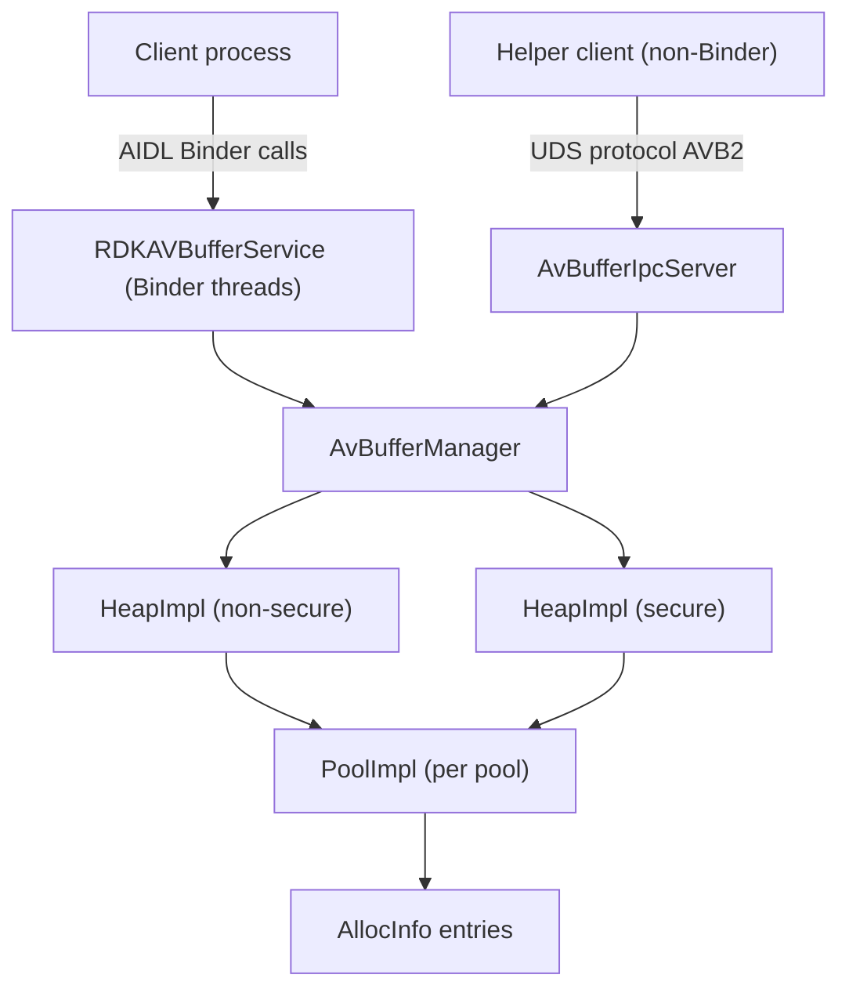
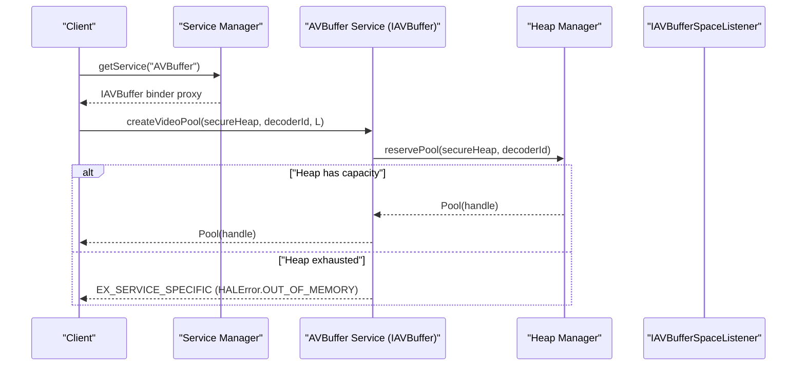
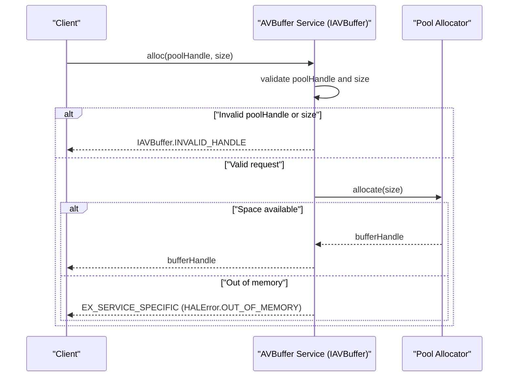
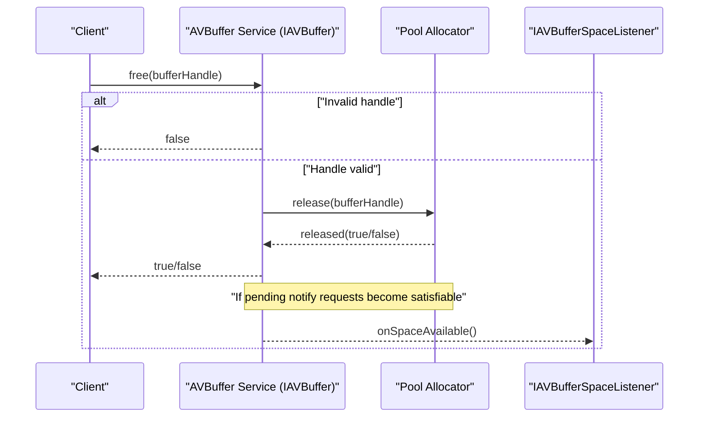
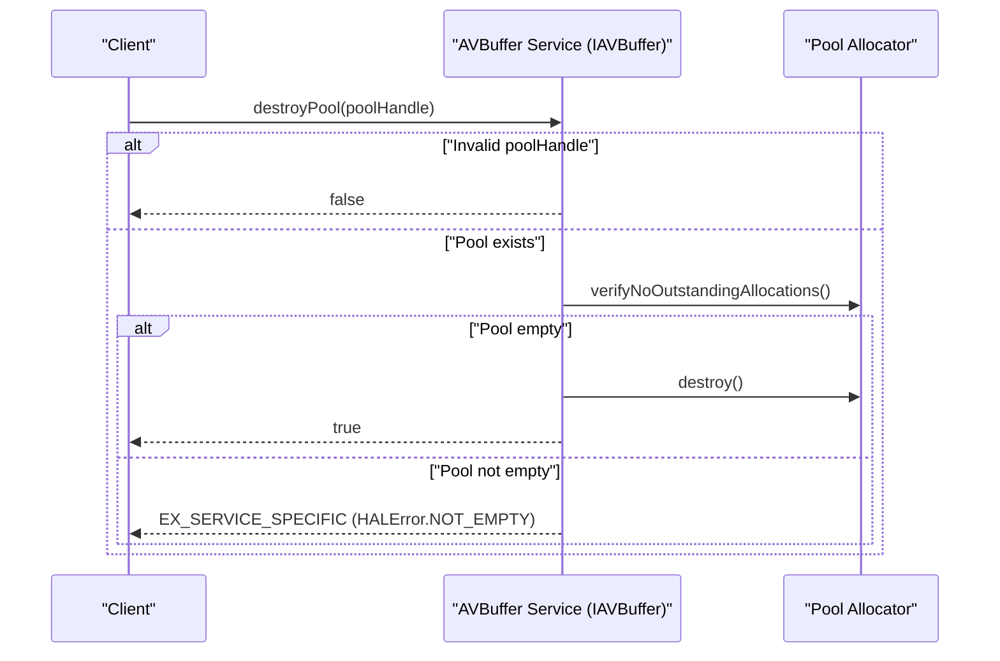
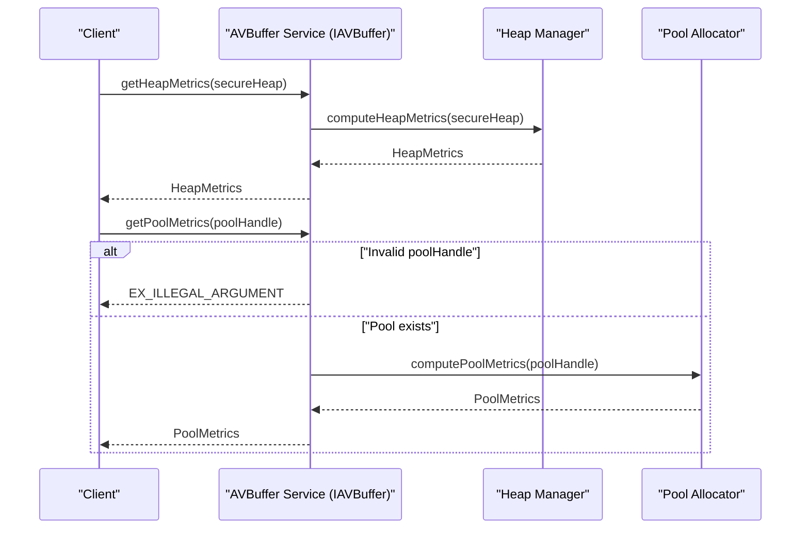
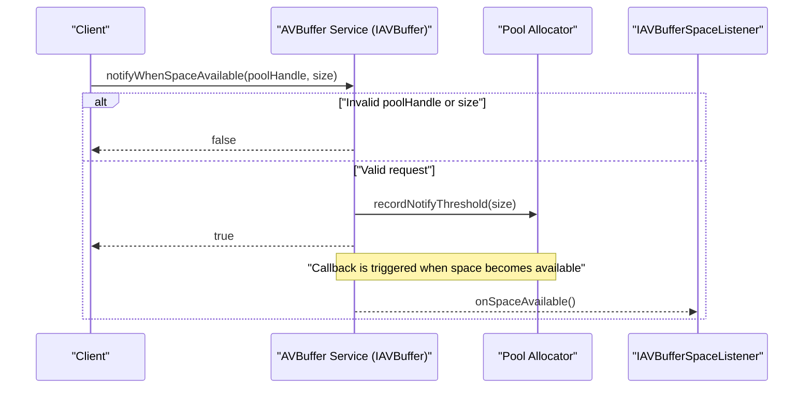

<!--
MongoDB Document Metadata:
- Original File Path: kavia-docs/avbuffer/AVBuffer.md
- Operation: write
- Timestamp: 2026-02-10T09:32:18.377389+00:00
- Restored At: 2026-02-23T05:04:11.251112+00:00
- Task ID: cm219d4578
-->

<!--
MongoDB Document Metadata:
- Original File Path: kavia-docs/CodeWiki/Specs/DetailedDesigns/AVBuffer.md
- Operation: edit
- Timestamp: 2026-01-22T17:19:19.220521+00:00
- Restored At: 2026-02-10T09:03:50.883486+00:00
- Task ID: cm57ecced8
-->

# AVBuffer Design (TEVDevice/src)

## Overview

The TEVDevice AVBuffer subsystem provides a vendor-layer buffer management service intended to satisfy the RDK HALIF AVBuffer AIDL surface. In this repository, the AVBuffer implementation is structured as a Binder service (`RDKAVBufferService`) that exposes an AIDL-defined interface (consumed via generated headers) and manages one or more memory “heaps” subdivided into “pools”, from which clients allocate and free buffer regions.

The design also includes an optional out-of-band (OOB) UNIX domain socket (UDS) IPC helper intended for lightweight queries/operations (for example, offset/size queries for a handle) by non-Binder clients or for latency-sensitive interactions. This IPC surface is explicitly versioned (“AVB2”).

This document focuses on architecture, module responsibilities, interaction patterns, and rationale. It intentionally does not include reference implementation code.

## Components and Responsibilities

### BufferService (process entrypoint)

The service binary is responsible for starting the Binder service and joining the Binder threadpool. Its responsibility is lifecycle/bootstrapping rather than buffer logic.

Key responsibilities include initializing signal behavior appropriate for IPC (for example, ignoring SIGPIPE), publishing the service name defined by the AIDL interface, and then handling requests on Binder threads.

### AvBufferManager (Binder/AIDL service implementation)

`AvBufferManager` is the central coordinator for AVBuffer operations. It is conceptually the “VHI-side” service implementation for buffer management and exposes the AIDL-facing methods such as:

- Heap metrics query (secure vs non-secure heap)
- Pool creation for audio and video clients (secure vs non-secure)
- Pool destruction
- Pool metrics enumeration
- Allocation and free within a pool
- Space-availability notification registration (listener-based)

AvBufferManager is also responsible for:
- Enforcing handle validity and uniqueness constraints across heaps/pools.
- Translating internal error outcomes to Binder/AIDL error semantics (exceptions vs service-specific error codes vs boolean/invalid-handle returns).
- Tracking listener registrations and “notify when space available” intent.

### HeapImpl (heap allocator / backing store owner)

A heap represents a contiguous memory region which is subdivided into pools. The design treats “secure” and “non-secure” heaps as distinct heap instances:

- Non-secure heap: intended to be directly accessible to clients (for example, via shared memory mappings).
- Secure heap: intended to be restricted (for example, handle-only semantics or brokered access).

Heap responsibilities include:
- Owning/initializing the backing store (for example, shared memory vs private heap allocation depending on platform configuration).
- Allocating pool-sized regions by finding free heap offsets.
- Tracking the set of pools that belong to the heap and ordering them deterministically by offset.

### PoolImpl (pool allocator)

A pool represents a subrange of a heap that is dedicated to a client or a decoder instance. A pool is identified by a small handle value (AIDL-facing). Pool responsibilities include:
- Maintaining the allocation list for that pool.
- Finding free space within the pool for new allocations.
- Maintaining per-pool “space available” listener state.
- Tracking pool usage statistics (total/used bytes, allocation counts and maxima).

Pools are the unit of isolation for allocation failures and space notification, and they are the unit of ownership for listeners.

### AllocInfo (allocation metadata)

Each allocation created from a pool has associated metadata, conceptually:
- Pool-relative offset
- Requested size (client-visible)
- Allocated size (which may include padding/alignment)
- Opaque handle token (client uses this for free/isValid and for helper queries)
- Pointer/mapping metadata (depending on backing-store mode)

This metadata is used for metrics and for validating frees.

### AvBufferIpcServer (OOB UDS helper)

This subsystem provides a versioned IPC protocol over a UNIX domain socket, intended to support operations such as:
- Allocate/free via helper path (optional)
- Retrieve offset for a buffer handle
- Retrieve size for a buffer handle

The protocol design includes:
- A fixed magic number to reject invalid clients
- A protocol version to allow evolution
- Typed opcodes
- Explicit payload sizing for forward compatibility

The AvBufferIpcServer runs an accept loop thread and spawns a per-client thread for request dispatching.

### BufferControl (frame-pool / shared-memory control plane)

The repository also contains a `BufferControl` abstraction intended for frame allocator pools (separate from the heap/pool allocator described above). It suggests a design where:
- Frame allocator buffers are tracked via a shared “control block” (`GlobalControl`) and an array of buffer statuses.
- Buffer handles include a pool identifier that encodes media type and security properties.

This functionality is present in the codebase as a parallel strategy for fixed-size frame pools, but it is not fully integrated end-to-end with the heap/pool allocator path in TEVDevice/src.

### HAL utilities (logging and misc)

The AVBuffer modules use internal HAL logging helpers for consistent formatting and optional verbosity control. Performance instrumentation hooks are also present (via an `RDKPerf` wrapper that can be enabled/disabled at build time).

## Key Interfaces and Types (AIDL-facing)

This implementation consumes the AIDL interface surface via generated headers (included by name in the project). The primary AIDL-facing concepts as used by TEVDevice/src are:

### IAVBuffer

The AVBuffer HAL interface supports:
- Creating pools for different client classes (video decoder and audio decoder), with a “secureHeap” selector and a required listener.
- Destroying a pool.
- Allocating and freeing memory from a pool using an opaque 64-bit handle.
- Querying heap-level and pool-level metrics.
- Registering interest in being notified when space becomes available in a pool.

The service name for registration/publishing is taken from the AIDL-generated interface.

### Pool

A pool handle is a small integer value carried in a `Pool` parcelable. The design treats a special value as “invalid” (used for input validation and failure returns). In this repository, Pool handles are intended to be globally unique across both heaps.

### PoolMetrics and HeapMetrics

Metrics types are used to report:
- Total bytes and used bytes at the pool level
- Total bytes and used bytes at the heap level

The TEVDevice design distinguishes between:
- Heap “used bytes” as capacity reserved for pools, and
- Pool “used bytes” as sum of client-requested allocation sizes (as opposed to alignment/padding overhead)

This distinction is important for interpreting metrics in tests and for reasoning about fragmentation.

### IAVBufferSpaceListener

A listener is supplied during pool creation and is used to notify a client when sufficient space becomes available. The TEVDevice design supports registering multiple “space thresholds” per pool as intent, and a later triggering mechanism is expected to invoke the listener callback when conditions are met.

### HALError (service-specific error concept)

The service maps internal failures to:
- Binder exception codes (for invalid arguments or null outputs), and/or
- Service-specific error codes using the HALError conceptual space (for example, out-of-memory or not-empty)

Exact values are AIDL-defined, but in TEVDevice/src the mapping is structured so that resource exhaustion and pool-not-empty conditions become service-specific errors rather than generic exceptions.

## Module Interactions

The AVBuffer subsystem is layered to separate responsibilities:

- The Binder-facing API layer (AvBufferManager) validates inputs and translates outputs/errors.
- HeapImpl provides heap-level space discovery and pool membership.
- PoolImpl provides pool-level allocation, per-pool state, and listener coordination.
- AvBufferIpcServer optionally provides a non-Binder, versioned control plane for helper operations.

The intended runtime topology is:

## Sequence Flows

This section provides implementation-agnostic sequence diagrams for the main `IAVBuffer` operations. The lifelines represent roles (client, service, heap, pool) rather than specific classes or thread implementations.

### Service discovery and pool creation (createAudioPool / createVideoPool)

The client discovers the service via the platform Service Manager using the service name defined by the AIDL interface. Pool creation reserves a region from the selected heap type and associates the pool with the listener used for subsequent `onSpaceAvailable()` callbacks. If the heap cannot satisfy the request, the AIDL contract specifies `EX_SERVICE_SPECIFIC` with `HALError.OUT_OF_MEMORY`.

### Allocation flow (alloc)

A successful allocation returns a buffer handle that can later be freed by any entity holding that handle. When the request is invalid (for example, the pool handle is invalid or the size is out of range), the contract specifies returning `IAVBuffer.INVALID_HANDLE` rather than throwing an exception. When the request is valid but cannot be satisfied due to insufficient space, the contract specifies `EX_SERVICE_SPECIFIC` with `HALError.OUT_OF_MEMORY`.

### Free and notification trigger flow (free + onSpaceAvailable)

Freeing a buffer is a boolean-returning operation. Implementations typically treat unknown handles as non-fatal and return `false`. When a free operation results in enough space to satisfy one or more prior `notifyWhenSpaceAvailable()` requests, the service may invoke `IAVBufferSpaceListener.onSpaceAvailable()` asynchronously.

### Destroy flow (destroyPool)

Destroying a pool returns `false` for an invalid pool handle. If the pool exists but has outstanding allocations, the contract specifies failing with `EX_SERVICE_SPECIFIC` and `HALError.NOT_EMPTY`. On success, the pool’s reserved space in the heap becomes available for reuse and any associated notification state is cleared.

### Metrics query flow (getHeapMetrics / getPoolMetrics)

Metrics calls allow a client to observe usage at heap and pool level. The AIDL contract specifies `EX_ILLEGAL_ARGUMENT` for invalid pool handles in `getPoolMetrics()` and `getAllocList()`. `getAllPoolMetrics()` is intended to succeed and return an empty list when no pools exist.

### Notify flow (notifyWhenSpaceAvailable)

Notification requests allow clients to avoid polling when allocations fail due to insufficient space. The callback is delivered to the listener provided at pool creation time, and implementations should avoid holding allocator locks while performing the callback to prevent lock re-entrancy problems.

## Thread Safety

### Concurrency model

The design uses a layered locking approach:

- Service-wide coordination lock: AvBufferManager operations are serialized with a global recursive mutex to ensure consistent heap/pool state, especially for allocation list updates and pool lifecycle actions.
- Per-pool lock: PoolImpl uses a per-pool recursive mutex to protect listener-related state (listener reference and notify threshold state). This separation avoids coupling listener lifecycle tightly to allocator operations and reduces lock contention in common paths.

### Thread sources

The system has multiple thread sources:
- Binder threadpool threads for AIDL calls into AvBufferManager.
- AvBufferIpcServer accept thread for new UDS connections.
- AvBufferIpcServer per-client threads for dispatch loops.

### Thread-safety implications

- Allocation list mutations must be synchronized by the manager-level lock to avoid list corruption and inconsistent free-space computations.
- Listener callbacks should be invoked carefully to avoid deadlocks. A recommended pattern is to capture the listener reference under lock and invoke callbacks after releasing allocator locks, so that client-side Binder transactions do not re-enter allocator code under the same lock.

## Error Semantics

The TEVDevice AVBuffer service distinguishes between:

### Binder exception-style errors (argument/contract violations)

These correspond conceptually to:
- Null output parameters
- Invalid arguments (for example, invalid decoder IDs or invalid pool handles where the AIDL contract expects an exception)

These errors should be used when the client violates the interface contract rather than when the system is resource-constrained.

### Service-specific errors (resource/state failures)

These correspond conceptually to HALError-style codes and cover:
- Out-of-memory / no space available in heap or pool
- Pool not empty on destroy

These errors are appropriate when the client request is valid, but cannot be satisfied due to current system state.

### Non-exceptional “boolean/invalid handle” results

Some methods are designed to return:
- A boolean indicating success/failure, or
- A special invalid handle sentinel to indicate failure

This is used where the AIDL contract favors simple failure reporting without exceptions, especially for “handle validity” and “allocation outcome” queries that may be frequent in tests.

## Error Mapping

The `IAVBuffer` contract intentionally mixes binder exceptions, service-specific error codes (`com.rdk.hal.HALError`), and non-exceptional return values. The mapping below is intended to be implementation-agnostic and follows the normative behavior described in:

- `rdk-halif-aidl-17/avbuffer/current/com/rdk/hal/avbuffer/IAVBuffer.aidl`
- `rdk-halif-aidl-17/common/current/com/rdk/hal/HALError.aidl`

Implementations should treat these outcomes as part of the observable contract so clients can implement deterministic recovery logic.

### Per-API error mapping

| API | Failure condition (as observed by the service) | Client-visible outcome | Notes |
|---|---|---|---|
| `createVideoPool(...)` / `createAudioPool(...)` | The decoder ID is invalid for the platform resource set. | `EX_ILLEGAL_ARGUMENT` | This indicates a contract violation by the caller. |
| `createVideoPool(...)` / `createAudioPool(...)` | The requested heap cannot satisfy pool creation due to resource exhaustion. | `EX_SERVICE_SPECIFIC` with `HALError.OUT_OF_MEMORY` | This indicates a valid request that cannot be satisfied due to current system state. |
| `createVideoPool(...)` / `createAudioPool(...)` | Any non-exceptional failure where no pool can be created. | Returned `Pool.handle == Pool.INVALID_POOL` | The AIDL documentation describes this as the return value on failure; clients should treat it as failure even if no exception is thrown. |
| `destroyPool(pool)` | The pool handle is invalid or does not exist. | Returns `false` | The contract uses a boolean return rather than an exception for invalid pool handles. |
| `destroyPool(pool)` | The pool still has outstanding allocations. | `EX_SERVICE_SPECIFIC` with `HALError.NOT_EMPTY` | This prevents use-after-free across processes/clients. |
| `getPoolMetrics(pool)` / `getAllocList(pool)` | The pool handle is invalid. | `EX_ILLEGAL_ARGUMENT` | The contract specifies exceptions for invalid pool handles in these APIs. |
| `alloc(pool, size)` | Invalid pool handle or invalid size (for example, `size <= 0` or `size > pool size`). | Returns `IAVBuffer.INVALID_HANDLE` | This is a non-exceptional failure mode by contract; clients should not treat it as resource exhaustion. |
| `alloc(pool, size)` | Allocation fails due to insufficient space in the pool/heap. | `EX_SERVICE_SPECIFIC` with `HALError.OUT_OF_MEMORY` | Clients may follow up with `notifyWhenSpaceAvailable(pool, size)` to avoid polling. |
| `notifyWhenSpaceAvailable(pool, size)` | Invalid pool handle or invalid size. | Returns `false` | This indicates a contract violation (or stale pool handle) without an exception. |
| `notifyWhenSpaceAvailable(pool, size)` | Request accepted. | Returns `true` and later `IAVBufferSpaceListener.onSpaceAvailable()` callback | The callback is delivered to the listener provided when the pool was created. |
| `trimSize(handle, newSize)` | The handle or the requested size is invalid. | Returns `false` | This is a non-exceptional failure mode by contract. |
| `trimSize(handle, newSize)` | The handle is not the most recently allocated buffer in its pool. | `EX_ILLEGAL_STATE` | This indicates a state conflict; callers should not retry without changing state. |
| `free(handle)` | Invalid buffer handle. | Returns `false` | The contract describes `free()` as boolean success/failure. |
| `isValid(handle)` | Handle validity check. | Returns `true` or `false` | This API is intended to be exception-free under normal conditions. |
| `calculateSHA1(handle)` | The buffer handle is invalid. | `EX_ILLEGAL_ARGUMENT` | The contract uses exceptions for invalid handles here. |
| `calculateSHA1(handle)` | The feature is not implemented in a given build. | `EX_UNSUPPORTED_OPERATION` | The contract explicitly permits this outcome. |

### Notes on `HALError` usage

The common `HALError` enum is shared across HALs and includes values beyond those explicitly referenced by `IAVBuffer`. If an implementation uses additional `HALError` values (for example, `INVALID_RESOURCE` or `INVALID_ARGUMENT`) for internal failures, it should do so consistently and document the specific trigger conditions so clients can reason about retry vs fail-fast behavior.

## Configuration and Build Considerations

### Build targets and linkage

TEVDevice builds AVBuffer into:
- A shared library containing the Binder/AIDL service implementation pieces.
- A shared helper library containing heap/pool utilities and logging.
- A service executable that links the above and the Binder runtime libraries.

The build depends on:
- Generated AIDL headers (either from a sysroot or produced under the repository build directory).
- `hal_aidl` runtime library.
- Binder, utils, and log shared libraries.
- `librt` (needed for POSIX shared memory usage).

### AIDL generation and availability

This repository expects AIDL headers to be generated as part of the build pipeline (for example via the `build.sh` workflow). The AVBuffer service sources include the generated headers by their installed include names (for example `com/rdk/hal/...`), meaning the include search path must be configured correctly for either:
- A sysroot-based build (cross-compilation / Yocto-like environment), or
- A local build directory where generated headers are staged.

### Runtime configuration

- The UDS helper uses a fixed socket path under `/tmp`, and expects the service process to have permission to create/unlink that socket file.
- The logging subsystem can be configured to increase verbosity via environment variable or the presence of a marker file under `/opt` (intended for device/VM environments).
- Heap backing store selection (shared memory vs private heap) is a platform policy decision; shared memory improves cross-process access but adds lifecycle and cleanup requirements.

## Known Risks and Gaps (current repository state)

This section highlights repository-observable gaps that affect completeness of the architecture:

### Secure heap behavior is incomplete

The design clearly distinguishes secure vs non-secure heaps, but the secure heap backend is not fully realized in TEVDevice/src. This means secure pool creation and secure allocation semantics may not be functionally available in all environments, despite being part of the interface surface.

### Notification triggering policy is not fully implemented

The repository records notification intent (thresholds), but the “space becomes available” trigger path is not yet wired end-to-end. This limits the practical usefulness of IAVBufferSpaceListener callbacks.

### OOB IPC helper is present but not fully wired

The AvBufferIpcServer protocol and threading model exist, but the linkage from opcodes to manager operations appears incomplete. This creates a risk of divergence between the intended multi-IPC architecture and actual runtime behavior.

### Frame allocator (BufferControl) integration is incomplete

BufferControl suggests a design for managing frame pools via shared control structures and special handle encodings. However, the integration between this path and the main heap/pool allocator path is not fully established, which can confuse onboarding and makes it unclear which path is authoritative for a given client class.

### Client lifecycle cleanup (binder death) needs completion

AvBufferManager includes a death-recipient role and tracks client-to-pool associations, implying a design that automatically cleans up pools when a client dies. The necessary cleanup actions on binder death are not fully implemented in the current codebase, which can lead to leaked pools or stale listener references.

## Future Work

### Complete secure heap model

Implement a secure heap backend consistent with the vDevice security model. Options include:
- Broker process owning secure memory with handle passing.
- Controlled copy-in/copy-out primitives for secure transitions.
- Deterministic failure injection toggles for VTS-oriented testing.

### Implement deterministic notification triggers

Define and implement a clear trigger policy, such as:
- Evaluate thresholds after each `free()`.
- Optionally add background “maintenance” ticks for fragmentation mitigation and threshold reevaluation.
- Guarantee “at most once per threshold registration” vs “edge-triggered” semantics.

### Finalize OOB IPC API surface

Decide which operations must be supported by the UDS helper (offset/size lookup, allocation, free, mapping hints), then:
- Ensure robust input validation (magic/version/payload sizing).
- Document compatibility guarantees for protocol versioning.

### Unify allocator strategies (pool allocator vs frame allocator)

Clarify ownership and intended use cases:
- Use the pool allocator for variable-size allocations.
- Use BufferControl-style allocator for fixed-size frame pools only, with explicit initialization/configuration flow.

### Expand conformance and tests

Add repository-local tests that validate:
- Metrics consistency (heap vs pools; requested vs allocated size).
- Handle uniqueness guarantees under concurrent clients.
- Listener callback behavior under controlled free-space transitions.
- Cross-process mapping correctness when using shared memory.

Task completed: Added a comprehensive AVBuffer design document for TEVDevice/src (architecture, components, data flow, concurrency, error semantics, and build/runtime considerations) without including implementation code.
