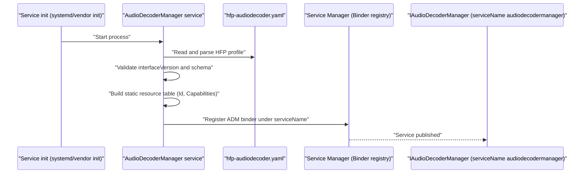
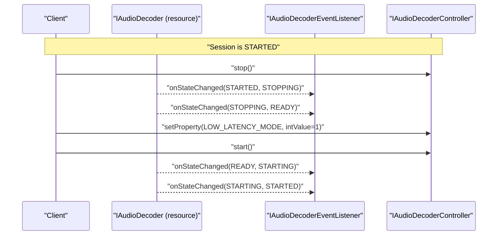
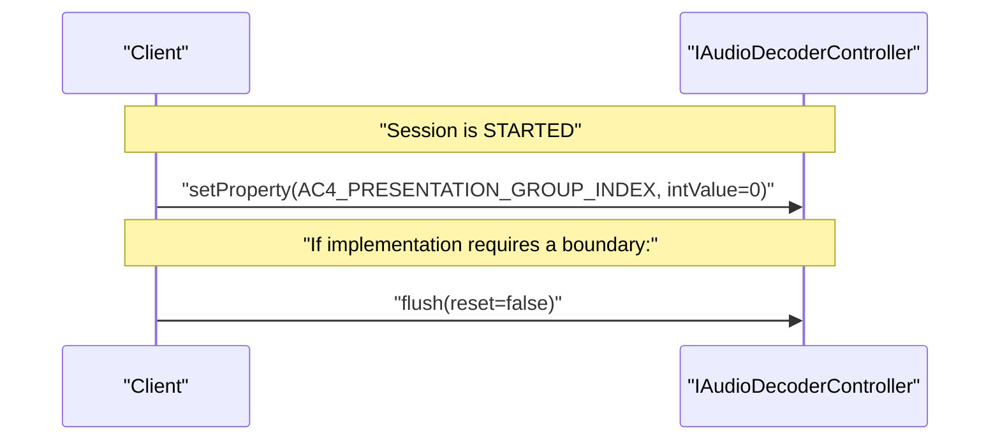

<!--
MongoDB Document Metadata:
- Original File Path: kavia-docs/decoder/audiodecoder-current-aidl-api-and-ffmpeg-plan.md
- Operation: write
- Timestamp: 2026-02-10T09:29:33.589293+00:00
- Restored At: 2026-02-23T05:04:11.250636+00:00
- Task ID: cm219d4578
-->

<!--
MongoDB Document Metadata:
- Original File Path: kavia-docs/CodeWiki/Specs/DetailedDesigns/audiodecoder-current-aidl-api-and-ffmpeg-plan.md
- Operation: edit
- Timestamp: 2026-02-08T09:09:14.875144+00:00
- Restored At: 2026-02-10T09:03:50.890327+00:00
- Task ID: cm57ecced8
-->

# Audio Decoder (current) AIDL API Inventory and FFmpeg Implementation Plan

## Purpose and scope

This document inventories the APIs defined by every AIDL file under `audiodecoder/current` and proposes an implementation plan for each API using FFmpeg (libavcodec and optional libswresample) as the decoding engine.

The plan is written to align with the normative behavioral requirements and operational semantics described in the repository documentation for the Audio Decoder HAL, including session state management, listener callback behavior, buffer ownership rules, and secure-audio considerations.

## Primary references

The behaviors and constraints documented here are derived from the following repository sources:

## Related architecture diagrams

The following detailed-design documents provide architecture diagrams that complement this plan and summarize the decoder pipeline from different viewpoints:

See: [Component architecture](./decoder-pipeline-components.md)

See: [Data flow (encoded AVBuffer to PCM to Audio Sink)](./decoder-pipeline-data-flow.md)

See: [Control flow and state model](./decoder-pipeline-control-flow.md)

See: [Typical playback sequence](./decoder-pipeline-sequence.md)

See: [AVBuffer and metadata lifecycle](./decoder-pipeline-buffer-lifecycle.md)

## Configuration-driven startup and runtime reconfiguration

This section augments the FFmpeg implementation plan with a configuration-driven bootstrap flow and a clear, AIDL-compliant reconfiguration protocol. In this repository, `rdk-halif-aidl-17/audiodecoder/current/hfp-audiodecoder.yaml` is the only Audio Decoder “HAL Feature Profile” (HFP) YAML file, and it is therefore treated as the source of truth for the static inventory of decoder resources and their capability envelopes.

It is important to distinguish “capability configuration” (what the service *can* do and how many resources exist) from “session configuration” (what a *particular open session* is doing right now). The current HFP schema for the Audio Decoder only describes the former.

### Source of truth: what `hfp-audiodecoder.yaml` does and does not define

The current `hfp-audiodecoder.yaml` describes:
- The interface version for the module (`interfaceVersion: current`).
- A static list of `IAudioDecoder` resources (identified by integer keys `0`, `1`, …).
- For each resource, the codec capability list (`supportedCodecs`) and whether SAP is supported (`supportsSecure`).

The current file does not define per-session or per-stream defaults such as a “default codec”, sample rate, channel count, PCM bit depth, DRC parameters, latency targets, sink routing, buffer sizing, or an explicit tunnelled/non-tunnelled selection flag. In the AIDL design as checked into this repository, those aspects are either:
- Determined by the elementary stream and the decode output itself, and/or
- Constrained by downstream platform capabilities, particularly the Audio Sink platform mixer requirements (see `rdk-halif-aidl-17/audiosink/current/hfp-audiosink.yaml`), and/or
- Controlled via AIDL session APIs and properties (`open`, `setProperty`, `parseCodecSpecificData`, `flush`, `stop`, `signalEOS`, `signalDiscontinuity`).

Event/listener “endpoints” are also not configured via YAML in this design. They are Binder callback interfaces supplied by clients at runtime (`IAudioDecoderControllerListener` passed to `open()`, and `IAudioDecoderEventListener` registered via `registerEventListener()`), and the service endpoint is the Binder service name constant `IAudioDecoderManager.serviceName = "audiodecodermanager"`.

### YAML key mapping to the Audio Decoder AIDL API surface

The following table defines the concrete mapping from the current HFP YAML keys to the AIDL data returned by the service.

| YAML path | Meaning | AIDL surface | Notes / validation |
|---|---|---|---|
| `audiodecoder.interfaceVersion` | Module interface version selector | Implementation chooses `audiodecoder/current` AIDL set | In this repository the value is `current`. A robust service should reject other values unless it explicitly supports them. |
| `audiodecoder.IAudioDecoder.<n>` | Declares one decoder resource with numeric ID `n` | Appears in `IAudioDecoderManager.getAudioDecoderIds()` as `IAudioDecoder.Id{ value = n }` and in `IAudioDecoder.getProperty(RESOURCE_ID)` | The AIDL requires the list to be static and stable between calls. |
| `audiodecoder.IAudioDecoder.<n>.supportedCodecs[]` | Codecs supported by resource `n` | `IAudioDecoder.getCapabilities().supportedCodecs[]` | Entries must correspond to `com.rdk.hal.audiodecoder.Codec` enum names. Unknown strings should be treated as invalid configuration. |
| `audiodecoder.IAudioDecoder.<n>.supportsSecure` | Secure audio path support for resource `n` | `IAudioDecoder.getCapabilities().supportsSecure` and `IAudioDecoder.open(codec, secure=true, ...)` behavior | If `supportsSecure=false`, `open(..., secure=true, ...)` must return `null` (per `IAudioDecoder.aidl`). |

For output PCM format constraints, the Audio Decoder documentation requires output PCM to match Audio Sink platform mixer requirements (HAL requirement `HAL.AUDIODECODER.11`). In the HFP YAML examples present in this repo, that information comes from Audio Sink HFP YAML rather than Audio Decoder HFP YAML:

- `audiosink.platformCapabilities.systemMixerSampleRateHz`
- `audiosink.platformCapabilities.systemMixerPCMFormat`
- `audiosink.platformCapabilities.supportsPlanarFormat`
- `audiosink.platformCapabilities.supportsLowLatency`

A FFmpeg-based Audio Decoder implementation should treat these as downstream constraints when choosing whether resampling/reformatting (via `libswresample`) is required.

### Startup bootstrap flow (config-driven)

A configuration-driven `IAudioDecoderManager` should treat the HFP YAML as the authoritative declaration for resource inventory and capabilities and should materialize the AIDL-visible objects accordingly.



Validation and fallback rules at startup should align with AIDL contracts that require stability:
- If the YAML is missing, unreadable, or invalid, the safest behavior is fail-fast and do not publish the service. Publishing a service with a partially initialized or changing resource set tends to violate the “static list” requirement in `IAudioDecoderManager.aidl`.
- If YAML lists a codec string that is not a valid `Codec` enum, the service should treat the profile as invalid rather than silently advertising a capability that cannot be represented in AIDL.
- If YAML declares `supportsSecure=true` but the effective platform cannot preserve a secure path with the chosen backend (for example, a non-trusted FFmpeg userspace process cannot map secure buffers), the service should downgrade to `supportsSecure=false` in the computed `Capabilities`, and log the reason. This preserves correctness relative to `IAudioDecoder.open(secure=true)` semantics.

### Cold start versus warm reconfiguration (what is safely reconfigurable)

In this AIDL design, some “configuration” is immutable by construction, and other configuration is explicitly exposed as runtime properties or lifecycle methods.

Cold-start changes (require service restart and/or new resource objects):
- The set of resources (`getAudioDecoderIds()` results) and each resource’s `Capabilities` should be treated as fixed for the lifetime of the service instance, because the AIDL requires stability between calls.
- Changes to `supportedCodecs` and `supportsSecure` in HFP YAML therefore should be applied by restarting the service (or by otherwise ensuring that existing clients never observe capability changes from the same resource object).

Warm reconfiguration within a session (AIDL-driven):
- Codec selection and secure mode are chosen at `open(codec, secure, ...)` time and require a close/re-open to change, because `open()` is only valid in `State.CLOSED` and produces a controller bound to a single session.
- `Property.LOW_LATENCY_MODE` and `Property.AV_SOURCE` are writable only in `READY`, which means a typical “in-place” reconfigure requires `stop()` (if started), then `setProperty(...)`, then `start()` again.
- AC-4 override properties are writable in all states per `Property.aidl`. A robust implementation may apply them immediately, or may apply them at the next safe boundary (for example, after a `flush(reset=false)`), but in all cases it must remain consistent about when the new setting takes effect and when metadata is updated.

### Reconfiguration protocol (AIDL sequences) and error reporting

The Audio Decoder AIDL intentionally separates:
- Synchronous programming errors (reported via Binder exceptions, such as `EX_ILLEGAL_STATE` or `EX_ILLEGAL_ARGUMENT`), and
- Asynchronous decode-time failures (reported via `IAudioDecoderEventListener.onDecodeError(ErrorCode, vendorErrorCode)`).

It also uses `decodeBuffer()` returning `false` as the explicit backpressure mechanism, not an error event.

#### Warm reconfigure example: toggling low latency mode

This is the recommended sequence for changing `LOW_LATENCY_MODE` during playback, consistent with the property’s “Write in states: READY” requirement.



If a client attempts to set `LOW_LATENCY_MODE` while `STARTED`, the server should reject the call with a Binder illegal-state exception (as described in `Property.aidl`), rather than attempting a hidden stop/restart, because hidden transitions would violate client expectations and state timing requirements in `hal_session_state_management.md`.

#### Warm reconfigure example: AC-4 override changes while started

AC-4 override properties are documented as writable in all states. For an FFmpeg-based backend, these may be informational (stored and reflected in `getProperty`) unless the backend supports AC-4 presentation selection. Even in that case, a vendor should clearly define whether applying the change requires `flush()`.



#### Mapping “configure/start/pause/drain/flush/stop” to the current AIDL

Because the current Audio Decoder AIDL does not have explicit `configure()` or `pause()` methods, the recommended mapping is:
- Configure: `open(codec, secure, ...)` + `setProperty(...)` calls while in `READY` + `parseCodecSpecificData(...)` (in `STARTED` but before first `decodeBuffer()`).
- Start: `start()`.
- Pause: either `stop()` (stateful pause with buffer freeing) or “pause by throttling” (stop feeding `decodeBuffer()`, as described in the pipeline control-flow doc).
- Drain: `signalEOS()` and wait for `FrameMetadata.endOfStream=true`.
- Flush: `flush(reset)`; choose `reset=true` when a full decoder reset is required.
- Stop: `stop()`.

### Persistence, versioning, and applying updates to HFP YAML

The HFP YAML includes `interfaceVersion`, which is the primary version selector for the profile-to-AIDL binding. In the current repository state, the value is `current` and the AIDL definitions live under `audiodecoder/current`.

If a vendor chooses to support updates to `hfp-audiodecoder.yaml` after deployment, it should do so in a way that preserves the AIDL stability requirements:
- The simplest compliant model is “read once at startup”: any HFP updates only take effect after a service restart.
- A hot-reload model is possible but must ensure that once an `IAudioDecoder` object is constructed, its `getCapabilities()` and the manager’s `getAudioDecoderIds()` remain stable for the lifetime of that service instance. In practice, this tends to require a controlled restart (or parallel instance) rather than in-place mutation.

This repository does not define a standardized environment-variable override mechanism for selecting an alternate HFP YAML path. If an implementation adds overrides (for example, for vDevice testing), it should document the override points in its own vendor-layer documentation and ensure that overrides do not result in capability instability during runtime.

### Example HFP fragments (as checked into this repository)

The current Audio Decoder HFP profile is capability-focused:

```yaml
audiodecoder:
  interfaceVersion: current
  IAudioDecoder:
    - 0:
        supportedCodecs:
          - AAC_LC
          - HE_AAC
          - HE_AAC2
          - DOLBY_AC3
          - DOLBY_AC3_PLUS
          - DOLBY_AC3_PLUS_JOC
          - DOLBY_AC4
          - X_HE_AAC
        supportsSecure: true
```

The Audio Sink HFP profile in this repository shows how platform mixer output constraints are declared:

```yaml
audiosink:
  interfaceVersion: current
  platformCapabilities:
    supportsLowLatency: false
    systemMixerSampleRateHz: 48000
    systemMixerPCMFormat: S32BE
    supportsPlanarFormat: false
```

The Audio Decoder HAL behavior and requirements are described in `rdk-halif-aidl-17/docs/halif/audio_decoder/current/audio_decoder.md`.

The Audio Decoder HAL interfaces are defined by the AIDLs under `rdk-halif-aidl-17/audiodecoder/current/com/rdk/hal/audiodecoder/`.

AV buffer ownership and handle semantics are defined by `rdk-halif-aidl-17/avbuffer/current/com/rdk/hal/avbuffer/IAVBuffer.aidl` and the AV Buffer documentation `rdk-halif-aidl-17/docs/halif/av_buffer/current/av_buffer.md`.

The buffer mapping helper contract is captured in `rdk-halif-aidl-17/avbuffer/current/avbufferhelper.h`.

The PCM format requirements for mixing are derived from Audio Sink platform capability fields in `rdk-halif-aidl-17/audiosink/current/com/rdk/hal/audiosink/PlatformCapabilities.aidl` which imports `com.rdk.hal.audiodecoder.PCMFormat`.

## AIDL files covered (audiodecoder/current)

The current audio decoder interface comprises the following AIDL files:

| AIDL file | Kind | Purpose in the HAL |
|---|---|---|
| `IAudioDecoderManager.aidl` | interface | Service entry point that enumerates audio decoder resources and returns `IAudioDecoder` instances. |
| `IAudioDecoder.aidl` | interface + nested parcelable | Per-resource interface; provides capabilities/state, opens a session returning `IAudioDecoderController`, and manages event listeners. Defines `IAudioDecoder.Id`. |
| `IAudioDecoderController.aidl` | interface | Per-session control plane; manages properties and decoding flow (start/stop/flush, buffer submission, EOS/discontinuity, CSD). |
| `IAudioDecoderControllerListener.aidl` | oneway interface | Callbacks from controller to the controlling client (`onFrameOutput`). |
| `IAudioDecoderEventListener.aidl` | oneway interface | Events from decoder resource to any registered clients (state changes and decode errors). |
| `Capabilities.aidl` | parcelable | Resource capability declaration (supported codecs, secure support). |
| `Codec.aidl` | enum | Codec identifiers used for open/capability negotiation. |
| `CSDAudioFormat.aidl` | enum | Codec-specific-data (CSD) formats accepted by `parseCodecSpecificData`. |
| `ErrorCode.aidl` | enum | Decoder error codes reported via `onDecodeError`. |
| `Property.aidl` | enum | Property keys for `getProperty`/`setProperty` and metrics. |
| `State.aidl` | enum | Audio decoder session states (Audio Decoder specific state machine). |
| `FrameType.aidl` | enum | Output frame type (PCM vs proprietary). |
| `FrameMetadata.aidl` | parcelable | Output metadata accompanying decoded frames (including PCM metadata and flags). |
| `PCMMetadata.aidl` | parcelable | Details of decoded PCM frames (channels, format, sample rate, planar/interleaved). |
| `PCMFormat.aidl` | enum | PCM sample format identifiers shared with Audio Sink and Mixer requirements. |
| `ChannelType.aidl` | enum | Per-channel type identifiers for decoded PCM metadata. |

## FFmpeg-based implementation overview

### Component boundary and responsibilities

A vendor implementation of this HAL typically consists of:

A long-lived `IAudioDecoderManager` Binder service which reads platform configuration and exposes a static set of audio decoder resources.

A set of `IAudioDecoder` resource objects, one per declared decoder ID, each of which enforces the “single controlling client per resource” rule while allowing multiple event listeners.

A per-session `IAudioDecoderController` object created by `IAudioDecoder.open()`, holding the FFmpeg decoder instance and decode pipeline state for exactly one stream.

An AV Buffer integration layer that turns incoming AV buffer handles into a byte view for FFmpeg input packets and allocates output PCM buffers (in non-tunnelled mode) from a vendor-managed audio frame pool whose handles remain globally freeable through `IAVBuffer.free()`.

### Decoding pipeline outline

In a FFmpeg-based design, the per-session pipeline typically follows this flow:

1. `open(codec, secure, controllerListener)` selects an FFmpeg decoder and creates an `AVCodecContext`.
2. `start()` transitions to `STARTED` and starts a worker thread (or activates an existing worker) to drain an input queue.
3. `parseCodecSpecificData(format, data)` (in `STARTED`) stores/derives `extradata` for the FFmpeg decoder context if required by the codec.
4. `decodeBuffer(ptsNs, bufferHandle, trimStartNs, trimEndNs)` enqueues input work. The worker:
   1. Reads bytes from the AV buffer handle (respecting secure rules).
   2. Wraps bytes into an `AVPacket` with PTS derived from `ptsNs`.
   3. Calls `avcodec_send_packet`/`avcodec_receive_frame` to obtain decoded samples.
   4. Resamples/reformats to the platform’s required mixer format when needed (typically via `libswresample`).
   5. Emits output by either allocating an AV buffer handle (non-tunnelled) and calling `onFrameOutput`, or by delivering the PCM internally in tunnelled mode.
   6. Frees the input AV buffer handle after FFmpeg no longer needs it.
5. `signalDiscontinuity()` marks that the next output metadata must set `FrameMetadata.discontinuity=true` and may optionally reset FFmpeg internal state depending on policy.
6. `signalEOS()` triggers a drain of FFmpeg internal buffers and finally emits an `endOfStream=true` metadata event after output is complete.
7. `flush(reset)` drops queued input buffers and resets internal decoder state; if `reset=true` it additionally resets FFmpeg decoder state and counters to “opened” conditions.
8. `stop()` drops queued/held buffers, transitions back to `READY`, and stops the worker.
9. `close(controller)` tears down the controller and returns the resource to `CLOSED`.

### Threading model (recommended)

To keep Binder calls responsive and to manage latency deterministically, `decodeBuffer()` should not perform decode work on the Binder thread. A practical approach is:

A bounded MPSC queue (Binder threads as producers, single decode worker as consumer) per controller.

A worker thread that performs FFmpeg decode and output callback dispatch. Since `IAudioDecoderControllerListener` is declared `oneway`, callback calls are asynchronous, but they still consume binder resources, so it is beneficial to serialize them from the worker to preserve order.

A separate mutex-protected state machine that controls transitions and prevents operations in the wrong state (consistent with AIDL preconditions).

### Buffer lifecycle constraints (from documentation)

The Audio Decoder documentation states that once a buffer handle is submitted via `decodeBuffer()`, the caller must not modify or free it, and the decoder must eventually release it back to the AV Buffer Manager. This implies:

The controller becomes the owner of the input `bufferHandle` once `decodeBuffer()` returns `true`.

Input handles that were accepted must be freed even on stop/flush/error paths, including transitory states `FLUSHING` and `STOPPING`, where the documentation explicitly requires the decoder to free any AV buffers it is holding.

In non-tunnelled mode, decoded output buffers must be freed by the downstream pipeline (typically Audio Sink). In tunnelled mode, the vendor pipeline must free output buffers internally if it allocates them at all.

### Secure audio path (SAP) note

The documentation requires that a secure-capable audio decoder must accept secure buffers and, if the input is secure, the output must remain secure (either secure output buffers or secure tunnelling).

A pure FFmpeg decoder running in a non-secure userspace process cannot, by itself, guarantee SAP if it requires mapping secure memory. Therefore, an FFmpeg-based SAP implementation must either:

Run in a privileged/trusted process environment that is permitted to access secure buffer contents by handle, or

Use a platform-specific secure mapping/copy mechanism such that the cleartext is never exposed to unprivileged processes, or

Declare `supportsSecure=false` in capabilities and return `null` from `open()` when `secure=true` is requested, which is explicitly allowed by `IAudioDecoder.open()`.

## Per-AIDL API inventory and FFmpeg implementation plan

This section is organized by AIDL file. For each AIDL, the “API inventory” captures every declared method, callback, field, and constant, and the “implementation plan” describes how a vendor HAL could implement it, assuming FFmpeg is used for decoding.

### IAudioDecoderManager.aidl

#### API inventory

Service constant:

```aidl
const @utf8InCpp String serviceName = "audiodecodermanager";
```

Methods:

```aidl
IAudioDecoder.Id[] getAudioDecoderIds();
@nullable IAudioDecoder getAudioDecoder(in IAudioDecoder.Id decoderResourceId);
```

#### FFmpeg-oriented implementation plan

The manager service should load the static list of audio decoder resources at process start. In a vDevice-style environment, `hfp-audiodecoder.yaml` provides an explicit example of declaring multiple `IAudioDecoder` resources, each with `supportedCodecs` and `supportsSecure`. On a physical target, equivalent data may come from platform configuration, driver probing, or a capability registry.

The service must publish itself using the binder service name `IAudioDecoderManager.serviceName` as described in the Audio Decoder documentation. The API is required to be stable over time, so `getAudioDecoderIds()` must return a list that does not change between calls. A straightforward implementation stores an in-memory vector of `IAudioDecoder.Id` values constructed at startup.

`getAudioDecoder(decoderResourceId)` must return `null` for an invalid resource ID. When valid, it should return a binder object representing that resource’s `IAudioDecoder` interface. Returning the same binder object for the same ID across calls helps clients cache and compare instances and also supports consistent event listener management.

### IAudioDecoder.aidl

#### API inventory

Nested parcelable:

```aidl
@VintfStability
parcelable Id {
  const int UNDEFINED = -1;
  int value;
}
```

Methods:

```aidl
Capabilities getCapabilities();
@nullable PropertyValue getProperty(in Property property);
State getState();
@nullable IAudioDecoderController open(in Codec codec, in boolean secure, in IAudioDecoderControllerListener audioDecoderControllerListener);
boolean close(in IAudioDecoderController audioDecoderController);
boolean registerEventListener(in IAudioDecoderEventListener audioDecoderEventListener);
boolean unregisterEventListener(in IAudioDecoderEventListener audioDecoderEventListener);
```

#### FFmpeg-oriented implementation plan

This interface represents a single decoder *resource* (not a decode session). It must enforce the “only one controlling client can open and control a resource” requirement while allowing multiple event listeners.

A robust implementation keeps three disjoint concepts:

The resource identity (the `Id.value` and read-only `Property.RESOURCE_ID`).

The resource’s static capabilities (returned by `getCapabilities()`).

The resource’s current session controller (created by `open()` and destroyed by `close()` or by client death).

For FFmpeg-based decoding, the `IAudioDecoder` object does not itself own FFmpeg state; it creates and owns it indirectly via the per-session `IAudioDecoderController` returned by `open()`.

##### getCapabilities()

The Audio Decoder AIDL explicitly states that returned capabilities are not allowed to change between calls. The implementation should therefore compute capabilities once (at service start or resource construction) and cache them.

For a FFmpeg backend, “supported codecs” should be derived as the intersection of:

The product/platform configuration (for example, from HFP YAML).

The FFmpeg build’s available decoders (`avcodec_find_decoder`/`avcodec_find_decoder_by_name` results).

Any licensing or policy gating (for example, Dolby decode might be excluded on unlicensed builds).

`supportsSecure` should be `true` only if the HAL process can accept secure AV buffers and can preserve a secure path to output (either secure output buffers or secure tunnelling). If FFmpeg is only available in a non-secure userspace context, `supportsSecure` should be `false`.

##### getProperty(property)

`getProperty` returns a `com.rdk.hal.PropertyValue` union wrapper or `null` if the key is unknown. The Audio Decoder’s `Property.aidl` enumerates keys and documents expected types and mutability. The implementation should:

Return `null` only for keys it truly does not recognize, not for recognized-but-unset keys. For recognized keys without an assigned value, return a `PropertyValue` whose `value` is `null`.

Enforce property type. For example, `Property.RESOURCE_ID` must return an integer (`PropertyValue.Value.intValue`).

Return properties in any state (the property AIDL notes all properties can be read in any state).

For resource-level properties, the natural implementation is to delegate to the active controller if present (for session-scoped properties) or to the resource itself (for immutable properties like resource ID and secure-open mode).

##### getState()

This returns the current resource/session state from `com.rdk.hal.audiodecoder.State` (the audio decoder’s module-specific state enum). A practical design is to have the resource own the state machine, but allow the controller to drive transitions. `getState()` must be thread-safe.

State transitions should trigger `IAudioDecoderEventListener.onStateChanged(oldState, newState)` callbacks to all registered event listeners, in the sequences described by the documentation (for example `CLOSED -> OPENING -> READY` on open, `READY -> STARTING -> STARTED` on start, and so on).

##### open(codec, secure, controllerListener)

The AIDL contract and documentation impose several constraints:

The call is only valid when the resource is in `State.CLOSED`. Otherwise, it must throw an illegal state exception.

Only one controlling client may be active at a time; if another client calls `open` while a controller exists, the call should fail with `EX_ILLEGAL_STATE` rather than returning a second controller.

If `secure=true` is requested but `Capabilities.supportsSecure=false`, the call must return `null`.

If the requested `codec` is not supported, the call must return `null`.

When successful, the implementation should:

Transition to `OPENING`, create a new `IAudioDecoderController` binder object, and transition to `READY`. These transitions must be broadcast via `IAudioDecoderEventListener.onStateChanged`.

Capture the controlling client identity and install a death recipient. The documentation requires that if the controlling client crashes, `stop()` and `close()` are implicitly applied. In binder terms, link-to-death should be established on a binder object owned by the client (typically the `IAudioDecoderControllerListener` passed to `open()`). On death, the resource should synchronously (or on an internal executor) transition through stopping/closing paths and free any held buffers.

Create the FFmpeg decode context in the controller (not on the binder thread if that is expensive), including selecting an `AVCodec` appropriate to the requested `Codec` enum.

Initialize session properties (for example, set `LOW_LATENCY_MODE` default to off as noted in the property documentation).

Reset per-session metrics counters that are specified to reset on `open()` (for example, decoded frames, decode errors, dropped frames).

##### close(controller)

The close operation is only permitted in `State.READY` per the AIDL comment. It should:

Validate that the passed-in controller binder matches the currently open controller. If it does not, return `false` (and/or treat it as invalid argument).

Transition the state `READY -> CLOSING -> CLOSED`, broadcast `onStateChanged` events, and destroy controller resources.

Release the controlling client association and any death recipient.

Ensure all queued/held AV buffers are freed (even though READY should not have inflight decode buffers in a well-behaved pipeline).

Return `true` when successful.

##### registerEventListener(listener) / unregisterEventListener(listener)

The audio decoder documentation requires that multiple clients may register for events. The AIDL additionally states that a listener can only be registered once and subsequent registrations should fail.

A typical implementation maintains a set keyed by binder identity. Registration returns `false` if already present. Unregister returns `false` if not present.

Because listeners are `oneway`, delivery is asynchronous, but the implementation still needs to handle binder dead objects. It is recommended to install death recipients for each registered event listener and automatically remove listeners when their process dies to avoid unbounded growth.

Event listener callbacks include:

`onStateChanged(oldState, newState)` on every state transition.

`onDecodeError(errorCode, vendorErrorCode)` when a decode error occurs during asynchronous processing.

The `vendorErrorCode` should be a stable vendor/implementation value; for an FFmpeg backend it is practical to pass the raw negative `AVERROR_*` code from FFmpeg as the vendor code.

### IAudioDecoderController.aidl

#### API inventory

Methods:

```aidl
boolean setProperty(in Property property, in PropertyValue propertyValue);
void start();
void stop();
boolean decodeBuffer(in long nsPresentationTime, in long bufferHandle, in int trimStartNs, in int trimEndNs);
void flush(in boolean reset);
void signalDiscontinuity();
void signalEOS();
boolean parseCodecSpecificData(in CSDAudioFormat csdAudioFormat, in byte[] codecData);
```

#### FFmpeg-oriented implementation plan

The controller is the per-session object that owns the FFmpeg codec instance, decode queue, and output mode policy. It is also the natural home for session-scoped properties such as low-latency mode and stream source.

A minimal but robust controller should maintain:

A state variable (mirroring the resource state) to validate method preconditions.

A bounded input queue of “decode jobs” containing `{ptsNs, inputHandle, trimStartNs, trimEndNs, discontinuityMarker?}`.

A worker thread that drains the queue and performs FFmpeg decode and output callbacks in-order.

A cached “current output stream metadata” so that `FrameMetadata` is only sent when required (first frame after `start`/`flush` or when changed), matching `HAL.AUDIODECODER.10` and the doc section “Frame Metadata”.

An output policy that chooses tunnelled vs non-tunnelled behavior for the session. Because there is no explicit API to select tunnelled mode, the controller must implement the vendor policy described in the documentation (for example, tunnelled when passthrough is active or for codecs that require a vendor-integrated decode/mix path).

##### setProperty(property, propertyValue)

`setProperty` is the write side of the property mechanism. The `Property.aidl` comments document which keys are writable and in which states.

The implementation should:

Validate the key and the expected type (for example, integer vs string). If the union type does not match, throw `EX_ILLEGAL_ARGUMENT`.

Enforce state constraints documented on each property. For example `LOW_LATENCY_MODE` is writable in `READY` only; attempts to set it while started should fail with `EX_ILLEGAL_STATE`.

Update internal fields that will later influence output metadata. For example:

When `LOW_LATENCY_MODE` is set to 1, and if the platform supports low latency audio (as indicated by Audio Sink `PlatformCapabilities.supportsLowLatency`), then subsequent `FrameMetadata.lowLatency` should be set to `true`.

When `AV_SOURCE` is set, the controller should include the corresponding `AVSource` value in the next metadata emission.

For AC-4 override properties (presentation group and language preferences), a FFmpeg-only backend may not be able to implement MS12-style presentation selection. A practical approach is to accept and store these properties, reflect them via `IAudioDecoder.getProperty`, and if the FFmpeg AC-4 decoder supports any analogous selection mechanism, apply it. Otherwise, the properties remain informational in this backend.

##### start()

`start()` is valid only in `READY`. The implementation should:

Transition `READY -> STARTING -> STARTED` and publish transitions via `IAudioDecoderEventListener`.

Start the decode worker thread (or unpause it) and reset the “metadata sent” latch so that the next successfully output frame will include non-null metadata.

If a codec requires codec-specific data (CSD), the controller should permit `parseCodecSpecificData` to be called after `start` and before first `decodeBuffer`. The AIDL for CSD requires `STARTED`, so clients must call `start()` first.

##### stop()

`stop()` is valid only in `STARTED`. The documentation states that stop enters `STOPPING` and frees any queued but not-yet-decoded input buffers, effectively a flush, then returns to `READY`.

The implementation should:

Transition to `STOPPING`.

Drain the input queue, freeing each AV buffer handle via `IAVBuffer.free(handle)` (or an internal equivalent). This is required to satisfy the rule that buffers passed for decode but not yet decoded are freed automatically on stop.

Call `avcodec_flush_buffers(codecCtx)` to reset FFmpeg’s internal decode state.

Stop or pause the decode worker.

Transition back to `READY` and publish events.

Reset any “CSD present” and “EOS signaled” latches for the next start.

##### decodeBuffer(nsPresentationTime, bufferHandle, trimStartNs, trimEndNs)

This method is valid only in `STARTED`.

Its key requirements are:

It must accept an AV buffer handle that contains *one* coded audio frame with a presentation timestamp.

If the internal decode queue is full (or output buffers are exhausted such that backpressure is required), it must return `false` to indicate “buffer full”.

The buffer must be freed once processing is complete, and the caller must not free it after submission.

The recommended implementation is:

On the Binder thread, validate the state and the handle value (for example, non-negative). If invalid, throw `EX_ILLEGAL_ARGUMENT`.

Try to enqueue a decode job into a bounded queue. If the queue is full, return `false` and do not take ownership of the handle.

If enqueued, return `true` and treat the handle as owned by the controller.

On the decode worker thread, for each job:

Obtain access to the buffer contents. For non-secure handles, use the AV buffer helper mapping API (conceptually `IAVBufferHelper.mapHandle(handle, &size)` and `unmapHandle`). For secure handles, only proceed if the vendor can safely access the data in a trusted context; otherwise the resource must not advertise secure support.

Copy or wrap the coded bytes into an `AVPacket`. A conservative implementation copies bytes into FFmpeg-owned packet memory so that the AV buffer handle can be freed early. A lower-latency implementation can avoid a copy by keeping the mapping alive until FFmpeg returns from `avcodec_send_packet`, but care is needed because the handle must not be unmapped while FFmpeg still references the data.

Call `avcodec_send_packet` then `avcodec_receive_frame` in a loop to obtain 0..N decoded frames (some codecs may output multiple frames per input packet, depending on framing). For each decoded `AVFrame`, convert to platform PCM if required (see `PCMFormat.aidl` mapping section below).

Apply trimming. The AIDL API supplies `trimStartNs` and `trimEndNs`. In a FFmpeg pipeline this should be implemented by dropping samples at the start/end of the decoded audio buffer. Because trimming is specified in nanoseconds, it must be converted to a sample count using the output sample rate: `trimSamples = (trimNs * sampleRate) / 1e9`. The implementation must clamp trims so it does not underflow the sample range.

Emit output:

In non-tunnelled mode, allocate an output AV buffer handle from a vendor-managed audio frame pool, write PCM bytes into the buffer, construct `FrameMetadata` (with `PCMMetadata` filled), and call `IAudioDecoderControllerListener.onFrameOutput(ptsNs, frameHandle, metadataOrNull)`.

In tunnelled mode, deliver the PCM to the vendor audio pipeline (for example, directly to an audio mixer component) and only call `onFrameOutput` when metadata must be emitted. When calling for metadata-only purposes, pass `frameBufferHandle=-1` as required by the listener AIDL comment.

Free the input `bufferHandle` after it is fully consumed and no longer needed by FFmpeg, using `IAVBuffer.free(bufferHandle)`.

Update metrics: increment frames decoded; on errors, increment decode errors and potentially frames dropped.

##### flush(reset)

Flush is valid only in `STARTED`. It is required to free all input buffers that have been submitted but not yet decoded. The documentation also states the internal decoder state is optionally reset.

Implementation details:

Transition to `FLUSHING` and publish an `onStateChanged(STARTED, FLUSHING)` event.

Drain the input queue and free all enqueued input handles.

Optionally, if `reset=true`, also clear codec-specific state that should revert to “opened” conditions, including clearing any cached CSD extradata, resetting FFmpeg via `avcodec_flush_buffers`, and resetting “metadata sent” latches. If `reset=false`, it may still be appropriate to flush FFmpeg decode state to guarantee that no pre-flush frames are output after the flush boundary.

Transition back to `STARTED` (the Audio Decoder documentation’s sequence diagram shows flush returning to STARTED) and publish state changes accordingly.

Ensure that the *next* output after flush includes metadata (non-null) in non-tunnelled mode, per the documentation.

##### signalDiscontinuity()

This method marks a discontinuity in PTS continuity. The next output metadata must have `FrameMetadata.discontinuity=true` (the doc states: for the first input frame passed after discontinuity, the next output metadata should indicate discontinuity).

Implementation:

Set a “pending discontinuity” flag on the controller. The next metadata emission should set `discontinuity=true` and then clear the flag.

Optionally reset FFmpeg decode state if the discontinuity implies a new segment and frame dependencies may be broken. Whether to flush FFmpeg depends on codec behavior; for AAC and MPEG audio, discontinuity often only affects timestamps, so flushing is not always necessary. A safe option in a test-oriented environment is to call `avcodec_flush_buffers` when discontinuity is signaled.

##### signalEOS()

This method indicates no more input buffers will arrive until a flush/stop cycle. The documentation requires that the decoder continues processing held frames and ultimately emits a callback where `FrameMetadata.endOfStream=true` after all audio frames have been output.

Implementation:

Record that EOS has been signaled. The worker should, after draining the input queue, also drain FFmpeg internal buffers by sending a null packet: `avcodec_send_packet(codecCtx, nullptr)` and reading frames until `AVERROR_EOF` or `EAGAIN` is reached.

After the last output frame is emitted, send one final `onFrameOutput` callback with `FrameMetadata.endOfStream=true`. In non-tunnelled mode this can accompany the last decoded frame’s buffer handle (with metadata non-null). In tunnelled mode (no PCM buffers returned), it should be a metadata-only callback using `frameBufferHandle=-1`.

The `nsPresentationTime` for the EOS signal should be the last known presentation time, or 0 if no frames were output.

##### parseCodecSpecificData(csdAudioFormat, codecData)

The AIDL requires `STARTED` and notes that some formats require CSD before frames are decoded. The implementation should:

Validate `codecData` is non-empty; return `false` for empty data.

Validate that the CSD format is compatible with the current session codec (for example, `MP4_AUDIO_SPECIFIC_CONFIG` for AAC family).

Translate `codecData` into FFmpeg codec context extradata when appropriate. For AAC, the AudioSpecificConfig can be copied into `AVCodecContext.extradata`/`extradata_size` (with `AV_INPUT_BUFFER_PADDING_SIZE` bytes of padding). For other formats (EAC3/AC4) the codecData may need to be used as `extradata` depending on FFmpeg decoder expectations. If the provided bytes are container-box payloads rather than codec-private payloads, a minimal implementation may still store the bytes and leave decode behavior to FFmpeg if it can parse them; otherwise it may fail gracefully by returning `false`.

If CSD is successfully set, ensure it is applied before any packets are sent to FFmpeg. If packets already flowed, either reject the call (`EX_ILLEGAL_STATE`) or flush and reinitialize the codec context.

### IAudioDecoderControllerListener.aidl

#### API inventory

Callback:

```aidl
oneway interface IAudioDecoderControllerListener {
  void onFrameOutput(in long nsPresentationTime,
                     in long frameBufferHandle,
                     in @nullable FrameMetadata metadata);
}
```

#### FFmpeg-oriented implementation plan

This callback is the controller-to-client delivery mechanism for decoded output in non-tunnelled mode and for metadata changes in both modes.

The documentation requires the metadata to be sent:

With the first decoded frame after `start()`.

With the first decoded frame after `flush()`.

Whenever frame metadata changes.

It must not be sent on every frame if unchanged.

Implementation guidance:

Maintain a cached “last sent metadata fingerprint” (for example, the tuple of `{sampleRate, format, numChannels, channelTypes, planarFormat, lowLatency, source, type, isDolbyAtmos}` plus discontinuity and EOS flags). Only include non-null metadata in `onFrameOutput` when the fingerprint changes or when a “force next metadata” latch is set due to `start` or `flush`.

In tunnelled mode, the AIDL comment states that `frameBufferHandle=-1` and metadata may be null. The Audio Decoder documentation further states that if there is no metadata to deliver in tunnelled mode, no `onFrameOutput` call should be made. Therefore, the tunnelled-mode policy should be:

Do not call `onFrameOutput` for regular frames unless metadata must be sent.

When metadata must be sent, call `onFrameOutput(ptsNs, -1, metadata)`.

When EOS must be reported, call `onFrameOutput(lastPts, -1, metadataWithEndOfStreamTrue)`.

### IAudioDecoderEventListener.aidl

#### API inventory

Callbacks:

```aidl
oneway interface IAudioDecoderEventListener {
  void onDecodeError(in ErrorCode errorCode, in int vendorErrorCode);
  void onStateChanged(in State oldState, in State newState);
}
```

#### FFmpeg-oriented implementation plan

`onStateChanged` should be invoked for every state transition initiated by `open`, `start`, `flush`, `stop`, and `close`, matching the sequences in the Audio Decoder documentation.

`onDecodeError` should be invoked when asynchronous decode work fails. It should not be used for synchronous programming errors (invalid arguments, illegal state), which should be reported via binder exceptions as documented in the AIDL comments.

A FFmpeg-based implementation can map errors as follows:

Use `ErrorCode.INVALID_CODEC` when FFmpeg reports decoder not found or unsupported bitstream.

Use `ErrorCode.OUT_OF_MEMORY` for allocation failures (for example, `AVERROR(ENOMEM)`).

Use `ErrorCode.OUT_OF_BOUNDS` for malformed trimming parameters or frame size mismatches that are clearly out of supported bounds.

Use `ErrorCode.INVALID_ARGUMENT` for invalid buffer handles detected during processing.

Use `vendorErrorCode` to carry the FFmpeg `AVERROR_*` code (typically negative).

The implementation should also decide whether to drop the affected frame or transition the decoder into a safer state. A test-oriented HAL often drops the frame, increments dropped metrics, reports an error event, and continues decoding subsequent frames, unless errors are persistent.

### Capabilities.aidl

#### API inventory

```aidl
parcelable Capabilities {
  Codec[] supportedCodecs;
  boolean supportsSecure;
}
```

#### FFmpeg-oriented implementation plan

`Capabilities` is a pure data contract. Its values should be computed once per resource and remain stable. For a FFmpeg-based backend, `supportedCodecs` should only include codecs for which the implementation can provide correct behavior, including any required tunnelling behavior and any secure-path constraints.

If the implementation is intended to run in a non-secure test environment, it is acceptable to declare `supportsSecure=false` even if the AIDL supports secure buffers.

### Codec.aidl

#### API inventory

```aidl
enum Codec {
  PCM = 0,
  AAC_LC = 1,
  HE_AAC = 2,
  HE_AAC2 = 3,
  AAC_ELD = 4,
  DOLBY_AC3 = 5,
  DOLBY_AC3_PLUS = 6,
  DOLBY_AC3_PLUS_JOC = 7,
  DOLBY_AC4 = 8,
  DOLBY_MAT = 9,
  DOLBY_MAT2 = 10,
  DOLBY_TRUEHD = 11,
  MPEG2 = 12,
  MP3 = 13,
  FLAC = 14,
  VORBIS = 15,
  DTS = 16,
  OPUS = 17,
  WMA = 18,
  REALAUDIO = 19,
  USAC = 20,
  X_HE_AAC = 21,
  SBC = 22,
  AVS = 23
}
```

#### FFmpeg-oriented implementation plan

The implementation should define a mapping from `Codec` values to FFmpeg decoder selection. A typical mapping uses `AVCodecID` constants and, where necessary, decoder names.

The following table is a recommended starting point, but the implementation must verify actual FFmpeg build support:

| HAL Codec | Typical FFmpeg `AVCodecID` | Notes |
|---|---:|---|
| `AAC_LC`, `HE_AAC`, `HE_AAC2`, `AAC_ELD`, `X_HE_AAC`, `USAC` | `AV_CODEC_ID_AAC` | HE-AAC variants usually decode via AAC core decoder; USAC may require `AV_CODEC_ID_USAC` if available. |
| `MPEG2` | `AV_CODEC_ID_MP2` | Represents MPEG-1/2 Layer II audio. |
| `MP3` | `AV_CODEC_ID_MP3` | |
| `FLAC` | `AV_CODEC_ID_FLAC` | |
| `VORBIS` | `AV_CODEC_ID_VORBIS` | |
| `OPUS` | `AV_CODEC_ID_OPUS` | |
| `DOLBY_AC3` | `AV_CODEC_ID_AC3` | Licensing/policy gating may apply. |
| `DOLBY_AC3_PLUS`, `DOLBY_AC3_PLUS_JOC` | `AV_CODEC_ID_EAC3` | Atmos/JOC signaling may require extra metadata handling. |
| `DOLBY_AC4` | `AV_CODEC_ID_AC4` | Decoder availability varies; MS12 behavior is not equivalent to FFmpeg decode. |
| `DOLBY_TRUEHD` | `AV_CODEC_ID_TRUEHD` | If supported. |
| `DTS` | `AV_CODEC_ID_DTS` | If supported and licensed. |
| `WMA` | `AV_CODEC_ID_WMAV2` or other | Depends on stream. |
| `REALAUDIO` | varies | Not always supported; best treated as optional. |
| `SBC` | `AV_CODEC_ID_SBC` | Often used for Bluetooth but may not be routed through this HAL. |
| `PCM` | none | The Audio Decoder documentation states PCM bypasses the decoder HAL; this codec should typically not be advertised. |

If a codec is not supported by FFmpeg or is intentionally excluded (policy/licensing), it should not appear in `Capabilities.supportedCodecs`, and `open()` must return `null` when requested.

### CSDAudioFormat.aidl

#### API inventory

```aidl
enum CSDAudioFormat {
  MP4_AUDIO_SPECIFIC_CONFIG = 0,
  ALS_SPECIFIC_CONFIG = 1,
  ALAC_SPECIFIC_CONFIG = 2,
  EAC3_SPECIFIC_CONFIG = 3,
  AC4_SPECIFIC_CONFIG = 4
}
```

#### FFmpeg-oriented implementation plan

This enum defines how `parseCodecSpecificData` should interpret the provided bytes. For FFmpeg, CSD is typically applied as codec extradata. The implementation plan per value is:

`MP4_AUDIO_SPECIFIC_CONFIG`: store bytes as AAC `AudioSpecificConfig` extradata and set `codecCtx->extradata`.

`ALS_SPECIFIC_CONFIG`, `ALAC_SPECIFIC_CONFIG`: store bytes and apply to the codec context if using ALS/ALAC decoders.

`EAC3_SPECIFIC_CONFIG`, `AC4_SPECIFIC_CONFIG`: store and apply as extradata if the chosen FFmpeg decoder expects it. If FFmpeg cannot interpret the provided representation (for example, if it is an ISOBMFF box structure rather than codec private bytes), return `false` rather than misconfiguring the decoder.

### ErrorCode.aidl

#### API inventory

```aidl
enum ErrorCode {
  SUCCESS = 0,
  BUFFER_FULL = 1,
  INVALID_RESOURCE = 2,
  INVALID_CODEC = 3,
  DEFERRED = 4,
  OUT_OF_MEMORY = 5,
  OUT_OF_BOUNDS = 6,
  NOT_EMPTY = 7,
  INVALID_ARGUMENT = 8
}
```

#### FFmpeg-oriented implementation plan

`ErrorCode` is used only for `IAudioDecoderEventListener.onDecodeError`. The implementation should choose a consistent mapping from internal failure conditions (FFmpeg return codes, buffer pool exhaustion, invalid handles) to these values. The `vendorErrorCode` parameter should then carry the underlying FFmpeg or platform-specific error value.

In addition, `decodeBuffer()` uses a boolean return for “buffer full” behavior. When the decode queue is full, the preferred behavior is to return `false` from `decodeBuffer()` (rather than emitting `BUFFER_FULL` errors), because that is the explicit API affordance for backpressure.

### Property.aidl

#### API inventory

Key properties (read-only / read-write as documented in the AIDL comments):

```aidl
enum Property {
  RESOURCE_ID = 0,
  LOW_LATENCY_MODE = 1,
  AV_SOURCE = 3,
  SECURE_AUDIO = 4,
  AC4_PRESENTATION_GROUP_INDEX = 200,
  AC4_PREFERRED_LANG1 = 201,
  AC4_PREFERRED_LANG2 = 202,
  AC4_ASSOCIATED_TYPE = 203,
  AC4_AUTO_SELECTION_PRIORITY = 204,
  AC4_MIXER_BALANCE = 205,
  AC4_ASSOCIATED_AUDIO_MIXING_ENABLE = 206,
  METRIC_FRAMES_DECODED = 1000,
  METRIC_DECODE_ERRORS = 1001,
  METRIC_FRAMES_DROPPED = 1002
}
```

#### FFmpeg-oriented implementation plan

Properties fall into three categories:

Immutable resource properties: `RESOURCE_ID` should always reflect the `IAudioDecoder.Id.value` and never change.

Session mode properties: `SECURE_AUDIO` reflects whether the session was opened with `secure=true`. This should be read-only and stable for the life of the controller.

Tuning and metrics: `LOW_LATENCY_MODE`, `AV_SOURCE`, AC-4 override properties, and metrics counters.

The key implementation behaviors are:

`LOW_LATENCY_MODE`: store integer 0/1. Only writable in `READY` per the AIDL comment. When enabled and the platform supports low latency audio, set `FrameMetadata.lowLatency=true` on output. A low-latency policy can also reduce internal queue depth to minimize buffering.

`AV_SOURCE`: store an integer corresponding to the `AVSource` enum. Use it to populate `FrameMetadata.source` when emitting metadata.

AC-4 properties: accept and store values at any state (the AIDL comment says “writable in states: All”). Apply them only if the backend supports presentation selection. If not supported, these should still be returned via `getProperty` so that middleware can observe what it set.

Metrics: implement as integer counters reset on `open()` and `flush()` (as stated in the property comments). Even though the AIDL allows returning -1 to indicate “not implemented”, a FFmpeg backend can implement these cheaply and deterministically.

### State.aidl (Audio Decoder module)

#### API inventory

```aidl
enum State {
  UNKNOWN = 0,
  CLOSED = 1,
  OPENING = 2,
  READY = 3,
  STARTING = 4,
  STARTED = 5,
  FLUSHING = 6,
  STOPPING = 7,
  CLOSING = 8
}
```

#### FFmpeg-oriented implementation plan

This state machine must be implemented and externally observable through both `IAudioDecoder.getState()` and `IAudioDecoderEventListener.onStateChanged()`.

The FFmpeg backend should treat state transitions as the guard rails for resource correctness. For example, FFmpeg contexts should only be created during open and only used during started/flush. Any queued buffers must be freed on entry to `FLUSHING` and `STOPPING`, consistent with the Audio Decoder documentation.

### FrameType.aidl

#### API inventory

```aidl
enum FrameType {
  PCM = 0,
  SOC_PROPRIETARY = 1
}
```

#### FFmpeg-oriented implementation plan

A FFmpeg backend naturally produces decoded PCM, so `FrameType.PCM` should be used for emitted frames. `SOC_PROPRIETARY` is a platform-specific option used when a decoder and sink share an opaque format; it should not be used by an FFmpeg implementation unless the vendor explicitly implements such a path.

### FrameMetadata.aidl

#### API inventory

```aidl
parcelable FrameMetadata {
  FrameType type;
  Codec sourceCodec;
  boolean isDolbyAtmos;
  int trimStartNs;
  int trimEndNs;
  boolean lowLatency;
  boolean endOfStream;
  boolean discontinuity;
  AVSource source;
  @nullable PCMMetadata metadata;
  byte[] SoCPrivate;
  ParcelableHolder extension;
}
```

#### FFmpeg-oriented implementation plan

`FrameMetadata` is the primary contract between the decoder and downstream pipeline for decoded output characterization. For FFmpeg output:

`type`: set to `PCM`.

`sourceCodec`: set to the session codec passed to `open()`.

`isDolbyAtmos`: set to `true` only when the implementation can confidently signal Atmos presence. A conservative FFmpeg implementation can set it to `true` for `DOLBY_AC3_PLUS_JOC` and `false` otherwise.

`trimStartNs` and `trimEndNs`: set to the values used for trimming the output samples for that frame so that downstream elements can observe the applied trims.

`lowLatency`: reflect whether low latency mode is enabled *and* supported by the platform policy.

`endOfStream`: set to `true` only on the final EOS notification metadata.

`discontinuity`: set to `true` on the first metadata emitted after `signalDiscontinuity`.

`source`: reflect the `AV_SOURCE` property, defaulting to `AVSource.UNKNOWN` per `Property.aidl`.

`metadata`: for PCM frames, populate with `PCMMetadata` at least on the first output after start/flush and whenever PCM characteristics change. Otherwise pass `null`.

`SoCPrivate`: for FFmpeg PCM output, this should generally be an empty array. It is intended for opaque vendor metadata in `SOC_PROPRIETARY` cases.

### PCMMetadata.aidl

#### API inventory

```aidl
parcelable PCMMetadata {
  int numChannels;
  ChannelType[] channelTypes;
  int sampleRate;
  PCMFormat format;
  boolean planarFormat;
  ParcelableHolder extension;
}
```

#### FFmpeg-oriented implementation plan

The audio decoder documentation requires that output PCM matches the platform mixer requirements (Audio Sink `PlatformCapabilities.systemMixerSampleRateHz` and `systemMixerPCMFormat`). Therefore, the FFmpeg backend should resample/reformat to those values, and then fill `PCMMetadata` accordingly.

Channel mapping requires deriving `channelTypes` from the FFmpeg channel layout. A practical approach is:

Use `AVFrame.ch_layout` (newer FFmpeg) or `channel_layout` (older) to infer the role of each channel.

Map common layouts to the `ChannelType` enum. For stereo, use `FRONT_LEFT` and `FRONT_RIGHT`. For mono, use `MONO`. For 5.1, include `FRONT_CENTER` and `LFE` and side/back channels accordingly.

If the exact mapping is unknown, the implementation should still set `numChannels` correctly and provide a best-effort channel type array.

`planarFormat` should reflect the final output buffer layout. If the platform does not support planar (`PlatformCapabilities.supportsPlanarFormat=false`), the FFmpeg backend should output interleaved PCM and set `planarFormat=false`.

### PCMFormat.aidl (Audio Decoder module)

#### API inventory

This AIDL defines the PCM sample formats that the platform mixer may require (for example `S16LE`, `S32LE`, `F32LE`, and others).

#### FFmpeg-oriented implementation plan

The FFmpeg backend must define a mapping from HAL `PCMFormat` to FFmpeg `AVSampleFormat` and byte packing rules. A recommended subset mapping is:

| HAL PCMFormat | FFmpeg sample format | Notes |
|---|---|---|
| `S16LE` | `AV_SAMPLE_FMT_S16` | Common mixer format. |
| `S32LE` | `AV_SAMPLE_FMT_S32` | |
| `F32LE` | `AV_SAMPLE_FMT_FLT` | |
| `F64LE` | `AV_SAMPLE_FMT_DBL` | |
| `U8` | `AV_SAMPLE_FMT_U8` | |

Endianness variants should only be used when the platform requires them. On little-endian targets, `*LE` formats are the natural choice.

For formats like `S24LE` or `S24_32LE`, FFmpeg may represent them as 32-bit samples with padding, and the vendor must pack/unpack as required. If the platform can accept `S32LE`, it may be preferable to negotiate that as the mixer PCM format and avoid 24-bit packing complexity.

### ChannelType.aidl

#### API inventory

```aidl
enum ChannelType {
  MONO = 0,
  FRONT_LEFT = 1,
  FRONT_RIGHT = 2,
  FRONT_CENTER = 3,
  LFE = 4,
  SIDE_LEFT = 5,
  SIDE_RIGHT = 6,
  UP_LEFT = 7,
  UP_RIGHT = 8,
  BACK_LEFT = 9,
  BACK_RIGHT = 10,
  BACK_CENTER = 11
}
```

#### FFmpeg-oriented implementation plan

`ChannelType` is used only inside `PCMMetadata` to describe channel semantics to downstream components. For FFmpeg output, map the decoded channel layout to these values. If the decoded channel layout includes channels that are not representable (for example, multiple height channels), the implementation can map to the closest available types (for example, `UP_LEFT`/`UP_RIGHT`) and preserve the channel count and order.

## Cross-cutting considerations (FFmpeg backend)

### Capability negotiation and “static list” requirements

The Audio Decoder documentation and the AIDL comments require that decoder lists and capabilities be stable between calls. Therefore:

The manager should build decoder resources once at startup.

Each `IAudioDecoder` should compute and cache capabilities once.

Codec support should be derived from both configuration (for example HFP YAML) and actual FFmpeg availability. If configuration includes a codec that FFmpeg does not support, the vendor should either exclude it from `supportedCodecs` or provide a non-FFmpeg path.

### Buffer lifecycle, ownership, and freeing

The critical rule is that once `decodeBuffer()` accepts a handle (returns `true`), the decoder is responsible for freeing it.

The FFmpeg backend should adopt a strict “free-once” discipline:

If a job is enqueued, the worker frees the input handle exactly once after it is no longer needed.

If a job is not enqueued (queue full), ownership remains with the caller and the controller must not free it.

On stop/flush, any queued input handles must be freed immediately, even if they were not decoded.

For decoded output in non-tunnelled mode, allocate output buffers from a vendor-managed pool whose handles are compatible with `IAVBuffer.free()`, because downstream components will free them.

### Threading, ordering, and latency

Because the timestamp and metadata ordering matter for A/V sync, the output callback order should match input order. A single decode worker per controller simplifies ordering.

Latency management should be treated as:

A bounded queue depth to prevent unbounded buffering.

A “low latency mode” policy that reduces buffering and chooses smaller output chunk sizes when enabled, but only when the platform advertises support.

### Error handling strategy

Synchronous API misuse (illegal state, invalid args) should be reported using binder exceptions as described in the AIDL comments.

Asynchronous decode failures should be reported via `IAudioDecoderEventListener.onDecodeError`. The implementation should also decide whether to continue decoding or stop the session. In a deterministic test environment, continuing and counting dropped frames is often preferable.

### Secure audio path behavior

If `supportsSecure=true` is advertised, then:

The controller must be able to accept secure AV buffer handles and decode without exposing cleartext to untrusted components.

The output must remain secure: either by allocating secure output buffers or by tunnelling securely.

If these conditions cannot be met with FFmpeg in the target environment, `supportsSecure` must be set to `false` and `open(secure=true)` must return `null`.

### Audible start/stop artifacts (click/pop)

The Audio Decoder documentation includes a requirement that starting/stopping shall not produce audible clicks or pops. In an FFmpeg pipeline, the decoder alone may not be sufficient to guarantee this because the output is typically mixed downstream. However, the controller can contribute by:

Ensuring that stop/flush does not emit partial frames with abrupt discontinuities unless explicitly required.

Optionally applying a very short fade-in/fade-out window at start/stop boundaries in non-tunnelled mode to reduce abrupt waveform discontinuities. This must be done carefully to avoid violating latency requirements and should be controlled by vendor policy.

## Summary

The AIDL surface for `audiodecoder/current` defines a resource-oriented, session-controlled decode service with explicit backpressure (`decodeBuffer` boolean), deterministic state transitions, and a metadata delivery contract optimized to reduce callback overhead.

A FFmpeg-based implementation fits naturally into this model when decoding is performed asynchronously on a worker thread, AV buffer ownership is strictly managed, and PCM output is resampled/reformatted to match the platform mixer requirements exposed by the Audio Sink HAL.
