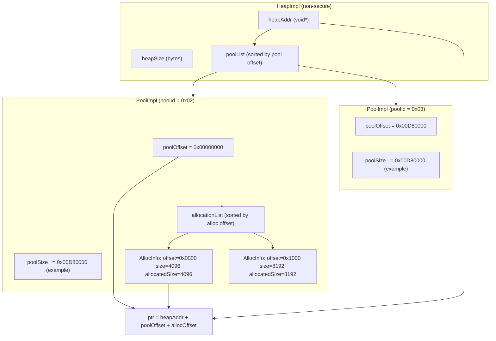

<!--
MongoDB Document Metadata:
- Original File Path: kavia-docs/CodeWiki/Specs/DetailedDesigns/avbuffer-manager-design.md
- Operation: write
- Timestamp: 2026-01-27T11:40:10.870112+00:00
- Restored At: 2026-02-23T05:04:11.247874+00:00
- Task ID: cm219d4578
-->

# AVBuffer Manager Design (TEVDevice)

## Scope and intent

This document describes the current AVBuffer Manager implementation in the `10002556%2FTEVDevice` container, focusing on how pools and allocations are created, tracked, and freed. It is written to match the code as it exists today, not as a generic allocator design.

The design is centered around `AvBufferManager`, which exposes the AIDL AVBuffer service methods and backs them with:

1. A heap allocator (`HeapImpl`) that provides large heap regions (non-secure and “secure”, although secure heap is not implemented).
2. A pool allocator (`PoolImpl`) that carves pools from a heap and performs allocation within each pool.
3. A frame-pool path (`BufferControl`) used for “frame allocator pools” identified by pool-id bit flags; in this repo, these attachment methods are currently stubs.

## Key files

The core implementation referenced by this document is in the following files.

### Public service API surface

`include/avbuffer/AvBufferManager.h` declares `AvBufferManager` as a Binder service implementing `BnAVBuffer` (AIDL interface), including methods such as `createVideoPool`, `createAudioPool`, `alloc`, `free`, `destroyPool`, and metrics APIs.

### Service implementation

`src/aidl/AvBufferManager.cpp` contains the service logic including:
- heap creation in the constructor
- pool creation with handle selection and heap offset search
- allocation handle encoding and allocation bookkeeping
- `free` routing between heap-backed allocations and frame-pool allocations

### Heap and pool implementations

- `include/avbuffer/heapHal.h` + `src/utility/heapHal.cpp` implement `HeapImpl`.
- `include/avbuffer/poolHal.h` + `src/utility/poolHal.cpp` implement `PoolImpl` and `AllocInfo`.

### Frame pool implementation (separate path)

- `include/avbuffer/BufferControl.h` + `src/utility/BufferControl.cpp` implement `BufferControl` for frame allocator pools (identified by pool-id bit flags).

## Data model overview

### HeapImpl

A `HeapImpl` represents a large contiguous region of memory:
- Non-secure heap uses POSIX shared memory by default (`shm_open` + `mmap`) with name `AVBufferSharedMemory` and size `AVBUFFER_SHARED_MEMORY_SIZE` (27 MiB).
- Secure heap is constructed but logs `NOT SUPPORTED` and typically has `GetHeapAddr() == nullptr`.

A heap tracks pools with:
- `_poolList`: `std::list<PoolImpl*>`, sorted by pool offset.

Heap-level allocation is only for pools, not for individual allocations.

### PoolImpl

A `PoolImpl` represents a subrange of a heap:
- `PoolImpl(offset, size, heapAddr, poolID)` stores:
  - `_offset`: pool offset within the heap
  - `_size`: pool size
  - `_heapAddr`: base heap address
  - `handle` (poolID): a `uint8_t` pool handle value
- `_allocationList`: `std::list<AllocInfo*>`, sorted by allocation offset (ascending)

Allocation policy is “first-fit-ish” over gaps:
- If empty: allocate at offset 0.
- Else: attempt tail fit, then head fit, then scan gaps.

Alignment and minimum allocation sizing:
- `PoolImpl::minAllocSize` and `PoolImpl::byteAllignment` are initialized to `alignof(max_align_t)`.
- `PoolImpl::FindFreeSpace()`:
  - bumps `requestedAllocSize` up to at least `minAllocSize`
  - aligns `requestedAllocSize` to `byteAllignment`
  - returns an offset in the pool’s address space (offset relative to pool base)

### AllocInfo

`AllocInfo` records both:
- the client requested size (`size`)
- the actual allocated size (`allocatedSize`) which includes:
  - pool “padding” (`PoolImpl::_allocationPadding`) added in `AvBufferManager::alloc()`
  - alignment/min allocation expansion performed by `PoolImpl::FindFreeSpace()`

It also stores:
- `offset` relative to the pool base
- `handle` (a 64-bit allocation handle)
- `ptr` computed as `heapAddr + poolOffset + allocOffset`

## Concurrency model

The service uses a single global recursive mutex:
- `_avb_lock` in `AvBufferManager.cpp`
- Almost all public AIDL methods take this lock via `SCOPED_LOCK(_avb_lock)`.

Within a pool, listener state is protected by a per-pool recursive mutex:
- `PoolImpl::_lock` protects `_listener` and `_notifyWhenSpaceAvailable`.
- Allocation list is not protected by `PoolImpl::_lock` and is expected to be protected by the global manager lock.

## Allocation handle encoding

Allocations created via `AvBufferManager::alloc()` (heap-backed pools) are assigned a 64-bit handle:

- The top byte encodes the pool ID:
  - `handle[63:56] = poolId`
- The remaining 56 bits are a monotonically increasing sequence:
  - `handle[55:0] = seq & 0x00FFFFFFFFFFFFFF`

In code:
- `handle = (uint64_t(poolId) << 56) | (seq & 0x00FFFFFFFFFFFFFFULL);`

This encoding is important because `free()` uses the pool ID extracted from the handle to route to the correct pool.

Frame allocator handles use a different convention and are identified by pool-id bit flags (see “Frame allocator pool path”).

## Pool handle rules and selection

Pool handles are `int8_t` in AIDL but treated as `uint8_t` internally:
- `Pool::INVALID_POOL` is `-1`, which corresponds to `0xFF` (`INVALID_POOL_ID`).

When creating pools (`createVideoPool` / `createAudioPool`), the implementation selects a globally unique pool ID in range `0..127`, scanning for an unused value across both heaps. This avoids collisions and keeps handles non-negative when interpreted as signed.

## Box-and-pointer diagram (heap, pools, allocations)

The following diagram shows how pointers and offsets relate in the heap-backed path. Addresses are illustrative.

The key invariant used by `PoolImpl::AddAllocInfo()` is:

`AllocInfo.ptr = (uint8_t*)heapAddr + (poolOffset + allocOffset)`

## Algorithm trace: create pool then alloc/free

This section traces the major steps taken by the code paths, in the order they occur.

### 1) Service startup

`src/service/BufferService.cpp` runs:

- `AvBufferManager::publishAndJoinThreadPool();`

During `AvBufferManager` construction (`AvBufferManager::AvBufferManager()`):

- Creates `_nonSecureHeap = new HeapImpl(HEAP_NON_SECURE, NON_SECURE_HEAP_SIZE)`
- Creates `_secureHeap = new HeapImpl(HEAP_SECURE, SECURE_HEAP_SIZE)`
  - In `HeapImpl`, secure heap logs “NOT SUPPORTED” and does not create a usable backing region.
- Creates `_avbIPC = new AvBufferIpcServer(this)` and calls `_avbIPC->init()`

### 2) createVideoPool / createAudioPool

Given `(secureHeap, decoderId, listener)`:

1. Validate:
   - output parameter non-null
   - listener non-null
   - decoderId in expected range (video) or allow UNDEFINED (audio) with range checks otherwise
2. Choose heap:
   - `HeapImpl* heap = secure ? _secureHeap : _nonSecureHeap`
   - require `heap->GetHeapAddr() != nullptr` and `heap->GetSize() != 0`
3. Determine requested pool size:
   - `requestedPoolSize = heap->GetSize() / MAX_ALLOWED_DECODER_ID`
4. Choose poolId in `0..127`:
   - scan across both heaps’ pool lists for collisions
5. Find free heap region for the pool:
   - `heap->FindFreeSpace(requestedPoolSize, offset)`
6. Create pool object:
   - `PoolImpl(offset, requestedPoolSize, heap->GetHeapAddr(), poolId)`
7. Store listener on pool:
   - `pool->SetListener(listener)`
8. Register pool in heap:
   - `heap->AddPool(pool)`
9. Return pool handle:
   - `_aidl_return->handle = poolId`

### 3) alloc(poolHandle, size)

Given `(poolHandle, size)`:

1. Validate out-param and input:
   - invalid pool handle => return `INVALID_HANDLE` without exception
   - non-positive size => return `INVALID_HANDLE`
2. Locate pool:
   - scan both heaps’ pool lists for poolId match
3. Validate `requestedSize <= poolSize`
4. Apply pool padding policy:
   - `allocSize = requestedSize + pool->GetPadding()`
5. Find space inside pool:
   - `pool->FindFreeSpace(allocSize, offset)`
   - note: `FindFreeSpace` may increase `allocSize` due to min/allocation alignment
6. Create allocation handle:
   - `handle = (uint64_t(poolId) << 56) | (seq & 0x00FFFFFFFFFFFFFF)`
7. Create `AllocInfo`:
   - `AllocInfo(offset, requestedSize, allocSize, false, handle)`
8. Add allocation to pool:
   - `pool->AddAllocInfo(info)`
   - this sets `info->ptr` to `heapAddr + poolOffset + allocOffset`
   - and sorts allocation list by `offset`
9. Return handle

### 4) free(bufferHandle)

Given `(bufferHandle)`:

1. If `bufferHandle == INVALID_HANDLE`: return `false`
2. Extract poolId via `HandleGenerator::GetPoolID()`
3. If `isFrameAllocatorPool(poolId)`:
   - route to `freeFrame(handle)` which calls `BufferControl::removeBuffer()`
4. Else (heap-backed):
   - Determine secure/non-secure heap via `HandleGenerator::IsSecurePool(poolId)`
   - Find pool in that heap via `heap->FindPool(poolId)`
   - Find allocation via `pool->FindAllocInfo(handle)`
   - Remove it via `pool->RemoveAllocInfo(allocInfo)` (delete + remove from list)
   - Return `true`

## Concrete alloc/free example (with real handle math)

This example uses the actual handle encoding logic in `AvBufferManager::alloc()`.

Assumptions for the example:
- A pool was created with poolId = `0x02` (decimal 2).
- The global sequence counter returns `seq = 0x0000000000000001` for the next allocation.
- Client requests `size = 1000` bytes.
- Pool padding is 0, and alignment rounds `allocSize` up to 1008 (example; actual alignment is `alignof(max_align_t)` on the platform).

### Allocation

1. The manager calculates `handle`:

- `handle = (0x02 << 56) | 0x0000000000000001`
- `handle = 0x0200000000000001`

2. The pool finds an offset, for example `offset = 0x00000000` for the first allocation.

3. `AllocInfo` stored:
- `offset = 0x00000000`
- `size = 1000`
- `allocatedSize = 1008`
- `handle = 0x0200000000000001`
- `ptr = heapAddr + poolOffset + 0`

### Free

When the client calls `free(0x0200000000000001)`:

1. `poolId = (handle & 0xFF00000000000000) >> 56 = 0x02`
2. This is not a frame allocator pool (top bit is not set).
3. Manager locates poolId `0x02` in the appropriate heap.
4. `pool->FindAllocInfo(handle)` returns the allocation.
5. `pool->RemoveAllocInfo(allocInfo)` deletes and removes it from the allocation list.

## Frame allocator pool path (BufferControl)

The codebase includes a second path for “frame pools”:
- `HandleGenerator::isFrameAllocatorPool(poolId)` returns true when `(poolId & 0x80) == 0x80`.

In `AvBufferManager::free()` and `AvBufferManager::isValid()`, frame allocator handles are routed to a `BufferControl` instance returned by `getFramePool()`.

However, in the current implementation:
- `attachToVideoFramePool()` and `attachToAudioFramePool()` are stubs returning false/0.
- This means frame pool operations are not fully wired up in this container as-is.

## Known limitations and implementation notes

The following behaviors are visible in the code and are important for correct expectations:

1. The secure heap is not implemented in `HeapImpl`. Calls requesting secure heap pools will return out-of-memory semantics because `GetHeapAddr()` is null.
2. Allocation compaction is not implemented. `PoolImpl` performs gap finding but does not move allocations.
3. `trimSize()` is implemented as an in-place metadata change (shrink-only) and does not relocate allocations.
4. Space availability notification (`notifyWhenSpaceAvailable`) records intent and stores thresholds, but a triggering policy is not implemented in the code shown here.

## PDF export

This repository snapshot does not contain a dedicated documentation build pipeline for PDF export in the `10002556%2FTEVDevice` container. To export this markdown file to PDF, use a markdown-to-PDF tool in your environment (for example, Pandoc) and point it at this file.

If a future agent is expected to automate PDF export in-repo, the first step should be to check whether the workspace includes a docs toolchain (e.g., MkDocs, Pandoc, or CI scripts) and then add a non-interactive build target that converts this markdown file to a PDF artifact.
