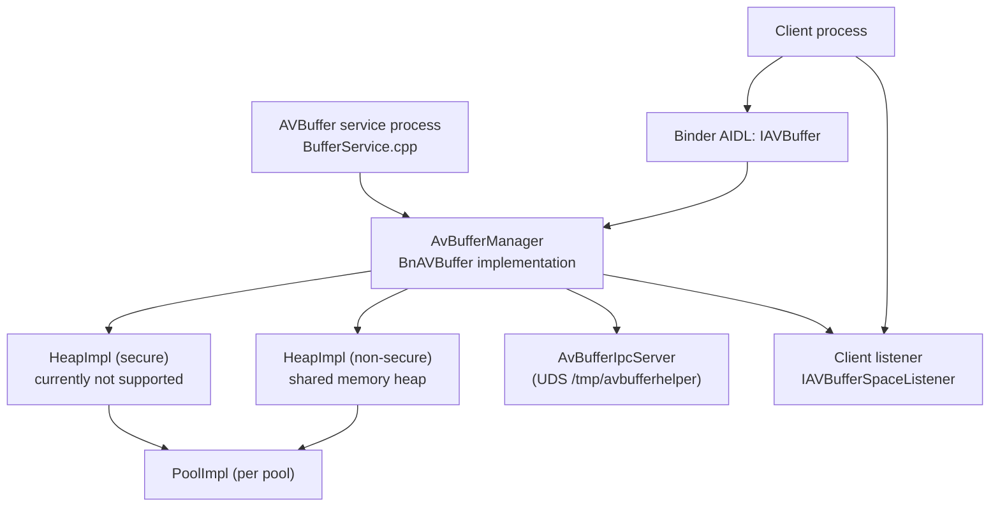

<!--
MongoDB Document Metadata:
- Original File Path: kavia-docs/CodeWiki/Specs/ArchitectureSpecs/avbuffer.md
- Operation: write
- Timestamp: 2026-01-22T16:08:46.237775+00:00
- Restored At: 2026-02-23T05:04:11.242689+00:00
- Task ID: cm219d4578
-->

# AVBuffer Design (Current Reference Implementation)

## Purpose and scope

This document describes the AVBuffer subsystem as it exists in the current workspace, focusing on the AVBuffer AIDL interface contract (`IAVBuffer`) and the TEVDevice reference implementation of that service. It summarizes the architecture, core components, public APIs, handle/pool semantics, lifecycle, integration points, and error semantics.

The content here is derived from the current code and interface definitions in:
- `rdk-halif-aidl-17/avbuffer/current/...` (AIDL interfaces and parcelables)
- `10002556%2FTEVDevice/...` (binder service implementation, heap/pool implementation, and OOB IPC server)

This document intentionally does not describe features that are not implemented in the current code (for example, secure heap support is represented in the API but is not fully implemented in the reference heap).

## System overview

AVBuffer provides a vendor-layer memory management service used by media components (notably audio/video decoders) to allocate, free, and query memory buffers from pools carved out of a heap. The primary goals are:
1. Provide a stable allocation API using handles (`long`) and pool handles (`Pool`).
2. Allow pool-level monitoring and asynchronous “space available” notification via a callback interface (`IAVBufferSpaceListener`).
3. Support client-side mapping of non-secure buffers through a helper abstraction, with an out-of-band IPC path intended for translating handles to offsets/sizes for shared-memory mapping.

At runtime, AVBuffer is a Binder service named `AVBuffer` that implements `com.rdk.hal.avbuffer.IAVBuffer`.

## Key public interfaces

### AIDL: `IAVBuffer`

The binder interface is defined in:

- `rdk-halif-aidl-17/avbuffer/current/com/rdk/hal/avbuffer/IAVBuffer.aidl`

It defines:
- Service name constant: `IAVBuffer.serviceName = "AVBuffer"`
- Invalid buffer handle constant: `IAVBuffer.INVALID_HANDLE = -1`

#### Heap metrics
- `HeapMetrics getHeapMetrics(boolean secureHeap)`

The returned `HeapMetrics` is defined in:
- `rdk-halif-aidl-17/avbuffer/current/com/rdk/hal/avbuffer/HeapMetrics.aidl`

Fields:
- `boolean secure`
- `int bytesUsed` (bytes reserved by pools in the heap, in the current TEVDevice implementation)
- `int bytesTotal` (heap storage size)

#### Pool lifecycle
- `Pool createVideoPool(boolean secureHeap, IVideoDecoder.Id videoDecoderId, IAVBufferSpaceListener listener)`
- `Pool createAudioPool(boolean secureHeap, IAudioDecoder.Id audioDecoderId, IAVBufferSpaceListener listener)`
- `boolean destroyPool(Pool poolHandle)`

Pool handle type:
- `rdk-halif-aidl-17/avbuffer/current/com/rdk/hal/avbuffer/Pool.aidl`
- `Pool.handle` is `byte` and invalid value is `Pool.INVALID_POOL = -1`

Pool metrics:
- `PoolMetrics getPoolMetrics(Pool poolHandle)`
- `PoolMetrics[] getAllPoolMetrics(boolean secureHeap)`

Pool metrics type:
- `rdk-halif-aidl-17/avbuffer/current/com/rdk/hal/avbuffer/PoolMetrics.aidl`
- `PoolMetrics.bytesUsed` is defined as “Total bytes used by allocations created inside the pool”.
- `PoolMetrics.bytesTotal` is defined as “Total bytes of pool storage”.

#### Allocation and free
- `long alloc(Pool poolHandle, int size)`
- `boolean free(long bufferHandle)`
- `boolean isValid(long bufferHandle)`
- `long[] getAllocList(Pool poolHandle)`
- `boolean trimSize(long bufferHandle, int newSize)`
- `byte[] calculateSHA1(long bufferHandle)`

#### Space-available notification
- `boolean notifyWhenSpaceAvailable(Pool poolHandle, int size)`

Callback interface:
- `rdk-halif-aidl-17/avbuffer/current/com/rdk/hal/avbuffer/IAVBufferSpaceListener.aidl`
- `oneway void onSpaceAvailable()`

### Common error codes: `HALError`

Service-specific error semantics use `com.rdk.hal.HALError`:
- `rdk-halif-aidl-17/common/current/com/rdk/hal/HALError.aidl`

Codes relevant to AVBuffer in the current implementation:
- `SUCCESS = 0`
- `INVALID_RESOURCE = 2`
- `OUT_OF_MEMORY = 5`
- `NOT_EMPTY = 7`
- `INVALID_ARGUMENT = 8`

## Reference implementation architecture (TEVDevice)

### Major components

The reference implementation is primarily in TEVDevice:

- Binder service + API implementation:
  - `10002556%2FTEVDevice/include/avbuffer/AvBufferManager.h`
  - `10002556%2FTEVDevice/src/aidl/AvBufferManager.cpp`

- Service entry point (process main):
  - `10002556%2FTEVDevice/src/service/BufferService.cpp`

- Heap implementation:
  - `10002556%2FTEVDevice/include/avbuffer/heapHal.h`
  - `10002556%2FTEVDevice/src/utility/heapHal.cpp`

- Pool implementation:
  - `10002556%2FTEVDevice/include/avbuffer/poolHal.h`
  - `10002556%2FTEVDevice/src/utility/poolHal.cpp`

- Frame-pool / shared control structures (partially implemented):
  - `10002556%2FTEVDevice/include/avbuffer/BufferControl.h`
  - `10002556%2FTEVDevice/src/utility/BufferControl.cpp`

- Out-of-band IPC server (Unix domain socket):
  - `10002556%2FTEVDevice/include/avbuffer/AvBufferIpcServer.h`
  - `10002556%2FTEVDevice/src/aidl/AvBufferIpcServer.cpp`

- Helper API surface (interface only in this workspace):
  - `rdk-halif-aidl-17/avbuffer/current/avbufferhelper.h`

### High-level interactions

The main runtime interaction patterns are:

1. AVBuffer service process starts (`BufferService.cpp`) and publishes the binder service (`AvBufferManager::publishAndJoinThreadPool()`).
2. Clients obtain `IAVBuffer` binder service by name `"AVBuffer"` and call pool creation APIs.
3. Pool creation carves heap storage into `PoolImpl` regions, each with a `Pool` handle.
4. `alloc()` creates an allocation handle, stores allocation metadata (`AllocInfo`), and returns the handle to the client.
5. `free()` removes allocation metadata and releases the region for reuse.
6. Clients optionally use an external helper abstraction to map/unmap handles; the service includes an OOB UDS server intended to support handle-to-offset/size translation and frame allocation, but the dispatch methods currently contain commented-out calls.

### Component diagram

## Memory model

### Heaps

`HeapImpl` represents a heap from which pools are carved. In the reference code:

- Heap sizing constant:
  - `10002556%2FTEVDevice/include/avbuffer/heapHal.h`
  - `AVBUFFER_SHARED_MEMORY_SIZE = 27 * 1024 * 1024` (27 MiB)
  - `NON_SECURE_HEAP_SIZE` and `SECURE_HEAP_SIZE` are both defined as `AVBUFFER_SHARED_MEMORY_SIZE` in `AvBufferManager.h`, but secure is not actually implemented.

- Non-secure heap backing:
  - `HeapImpl` uses POSIX shared memory by default (`static bool s_bUseSharedMemory = true`):
    - `shm_open(AVBUFFER_SHARED_MEMORY_NAME, O_CREAT | O_EXCL | O_RDWR, 0666)`
    - `ftruncate(fd, size)`
    - `mmap(..., MAP_SHARED, ...)`

- Secure heap backing:
  - `HeapImpl` logs that secure heap is not supported (`"Error secure heap NOT SUPPORTED"`), and does not create a backing mapping.

### Pools

A pool is a contiguous region inside a heap described by:
- pool offset within heap (`PoolImpl::_offset`)
- pool size (`PoolImpl::_size`)
- base heap address (`PoolImpl::_heapAddr`)

Pool handles are `uint8_t` in the TEVDevice implementation (matching the AIDL `Pool.handle` as `byte`), with invalid pool ID `0xFF` matching `Pool.INVALID_POOL`.

Handle uniqueness:
- The pool handle selection logic in `AvBufferManager.cpp` explicitly attempts to select a pool ID in `[0..127]` that is not currently in use in either heap.
- It uses a shared counter (`SharedCounter`) to pick a starting candidate and scans for a free ID.

## Handle semantics

### Pool handles

- AIDL: `Pool.handle` is a `byte`, with `Pool.INVALID_POOL = -1`.
- Implementation uses `uint8_t` internally and treats `0xFF` as invalid.

Important behavioral detail:
- `destroyPool()` returns `false` (without throwing) when the pool handle is invalid, per the AIDL contract.

### Buffer allocation handles

Allocation handles are 64-bit (`uint64_t` / AIDL `long`).

For heap-backed pools created via `createAudioPool` and `createVideoPool`, allocation handles in `AvBufferManager::alloc()` are encoded as:
- Top byte: pool ID (`poolId << 56`)
- Lower 56 bits: monotonically increasing sequence number (`seq & 0x00FFFFFFFFFFFFFF`)

This encoding is visible in:
- `10002556%2FTEVDevice/src/aidl/AvBufferManager.cpp` (`alloc()`)

Frame allocator handles:
- There is separate frame-pool logic using `BufferControl` and `HandleGenerator`, but most of this path is not fully implemented in the current `AvBufferManager` (many helper methods return placeholder values). The `free()` method includes special routing for “frame allocator pools” (`_handleGenerator.isFrameAllocatorPool(poolID)`), calling `freeFrame()` for those handles.

## API behavior and error semantics (current state)

This section documents the behavior of the TEVDevice `AvBufferManager` implementation relative to the AIDL contract.

### `getHeapMetrics(secureHeap)`

Implementation: `AvBufferManager::getHeapMetrics()`.

Behavior:
- Validates the out-parameter; returns `EX_NULL_POINTER` if null.
- Reports:
  - `bytesTotal = heap->GetSize()`
  - `bytesUsed = sum(pool->GetSize())` across pools created in that heap
- If heap is null, heap size is 0, or heap address is null, it returns success with zeros.

Semantics note:
- `bytesUsed` here reflects “heap capacity reserved for pools”, not “sum of allocated bytes”.

### `createVideoPool(secureHeap, videoDecoderId, listener)`

Implementation: `AvBufferManager::createVideoPool()`.

Behavior:
- If out-param is null: `EX_NULL_POINTER`.
- Initializes return to `Pool.INVALID_POOL` on entry.
- Validates:
  - `videoDecoderId.value` must be in `[0..MAX_ALLOWED_DECODER_ID-1]` (currently `MAX_ALLOWED_DECODER_ID = 2`), otherwise `EX_ILLEGAL_ARGUMENT`.
  - `listener` must be non-null, otherwise `EX_ILLEGAL_ARGUMENT`.
- If heap missing or not backed (`GetHeapAddr()==nullptr` or `GetSize()==0`): `EX_SERVICE_SPECIFIC` with `HALError::OUT_OF_MEMORY`.
- Pool size policy: `heap->GetSize() / MAX_ALLOWED_DECODER_ID` (reference policy).
- Chooses unique pool handle ID in `[0..127]` not used in either heap.
- Finds a free region (`HeapImpl::FindFreeSpace()`); if none: `EX_SERVICE_SPECIFIC` with `HALError::OUT_OF_MEMORY`.
- Creates `PoolImpl` and assigns listener; returns pool handle.

### `createAudioPool(secureHeap, audioDecoderId, listener)`

Implementation: `AvBufferManager::createAudioPool()`.

Behavior:
- If out-param is null: `EX_NULL_POINTER`.
- Initializes return to `Pool.INVALID_POOL` on entry.
- Validates:
  - Listener must be non-null or returns `EX_ILLEGAL_ARGUMENT`.
  - `audioDecoderId.value` is allowed to be `IAudioDecoder::Id::UNDEFINED`, otherwise must satisfy the same range policy as video. Invalid => `EX_ILLEGAL_ARGUMENT`.
- Heap backing missing => `EX_SERVICE_SPECIFIC` with `HALError::OUT_OF_MEMORY`.
- Pool sizing and handle selection are the same as video pools.

### `destroyPool(poolHandle)`

Implementation: `AvBufferManager::destroyPool()`.

Behavior:
- If out-param is null: `EX_NULL_POINTER`.
- Returns `false` (no exception) for invalid pool handle (`0xFF`).
- Searches both heaps for pool handle (pool IDs are globally unique).
- If not found: returns `false` (no exception).
- If pool has outstanding allocations (`!pool->GetAllocList().empty()`):
  - Returns `EX_SERVICE_SPECIFIC` with `HALError::NOT_EMPTY` (matches AIDL doc).
- Removes any pending notify request state for that pool and removes listener (best effort).
- Removes pool from owning heap and deletes pool; returns `true`.

### `getPoolMetrics(poolHandle)`

Implementation: `AvBufferManager::getPoolMetrics()`.

Behavior:
- If out-param is null: `EX_NULL_POINTER`.
- If pool handle invalid or not found: `EX_ILLEGAL_ARGUMENT`.
- Returns:
  - `bytesTotal = pool->GetSize()`
  - `bytesUsed = sum(AllocInfo::size)` (requested sizes, not aligned/padded allocated sizes)

### `getAllPoolMetrics(secureHeap)`

Implementation: `AvBufferManager::getAllPoolMetrics()`.

Behavior:
- If out-param is null: `EX_NULL_POINTER`.
- If heap missing/unavailable: returns empty list success.
- Returns per-pool metrics in deterministic order (sorted by pool handle ascending).

### `alloc(poolHandle, size)`

Implementation: `AvBufferManager::alloc()`.

Behavior:
- If out-param is null: `EX_NULL_POINTER`.
- Returns `INVALID_HANDLE` (no exception) when:
  - Pool handle is invalid (`0xFF`)
  - Pool does not exist
  - Size <= 0
  - Requested size > pool size
- Returns `EX_SERVICE_SPECIFIC` with `HALError::OUT_OF_MEMORY` when:
  - Allocation cannot be satisfied due to lack of space in the pool (`PoolImpl::FindFreeSpace()` fails)
  - (Also defensively on overflow of allocation sizing)
- Stores allocation metadata:
  - `AllocInfo.offset` is within the pool
  - `AllocInfo.size` is the requested size
  - `AllocInfo.allocatedSize` is the aligned/padded allocated size
  - `AllocInfo.ptr` is a pointer into the heap mapping (`heapAddr + poolOffset + allocOffset`)

Padding/alignment notes:
- `PoolImpl` supports a per-pool padding value (`PoolImpl::_allocationPadding`), which the manager includes in the “actual allocated size” computation.
- `PoolImpl::FindFreeSpace()` enforces a minimum allocation size (`BYTE_ALIGNMENT`) and aligns allocations to `alignof(max_align_t)`.

### `notifyWhenSpaceAvailable(poolHandle, size)`

Implementation:
- Native helper: `bool AvBufferManager::notifyWhenSpaceAvailable(const Pool&, int size)`
- AIDL wrapper: `Status AvBufferManager::notifyWhenSpaceAvailable(const Pool&, int32_t size, bool* out)`

Behavior:
- Returns `false` when:
  - size <= 0
  - pool handle invalid
  - pool not found in either heap
- Records the requested notification size in:
  - `AvBufferManager::_pendingSpaceRequestsByPool[poolId]` (a set of sizes)
  - also stores the size in `PoolImpl::_notifyWhenSpaceAvailable` via `pool->SetNotifyWhenSpaceAvailable(size)`
- Trigger policy is not currently implemented in TEVDevice code; i.e., there is no background monitor that calls `listener->onSpaceAvailable()` when enough space becomes available.

Practical implication:
- Clients can request notification, but the callback may not fire because the policy/worker to evaluate availability is not present in the current implementation.

### `free(bufferHandle)`

Implementation: `AvBufferManager::free()`.

Behavior:
- Returns `false` (no exception) for invalid buffer handle (`-1` / `INVALID_HANDLE`).
- Routes the free based on pool ID extracted from the handle:
  - If the pool ID indicates a “frame allocator pool”, it calls `freeFrame()` and returns based on result.
  - Otherwise it uses `HandleGenerator` helper methods to determine whether to route to the secure or non-secure heap, finds the pool, finds the allocation, and removes it.
- In heap-backed path, failures return `false` (no exception), including:
  - heap not created
  - pool not found
  - allocation not found

Semantics note:
- The AIDL contract describes `free()` as a boolean success/failure API with no exceptions for invalid handles; TEVDevice follows this general pattern.

### Other APIs with placeholder or not-implemented behavior

The following methods exist on the interface and are present in `AvBufferManager`, but are currently stubs or return “not implemented” behavior:

- `trimSize(...)`: currently returns `Status::ok()` without implementing trimming logic.
- `isValid(...)`: currently returns `Status::ok()` without setting output.
- `getAllocList(...)`: currently returns `Status::ok()` without setting output.
- `calculateSHA1(...)`: returns `EX_UNSUPPORTED_OPERATION` (allowed by the AIDL contract).

## Out-of-band IPC server (Unix domain socket)

The TEVDevice service constructs an OOB IPC server:
- `AvBufferManager` constructor creates: `_avbIPC = new AvBufferIpcServer(this);` then `_avbIPC->init();`

Protocol definition:
- `10002556%2FTEVDevice/include/avbuffer/AvBufferIpcServer.h`

Key details:
- Socket path: `"/tmp/avbufferhelper"` (in `AvBufferIpcServer.cpp`)
- Magic/version header:
  - `AVB_IPC_MAGIC = 0x41564232` (`"AVB2"`)
  - `AVB_IPC_VERSION = 2`
- Opcodes:
  - `GET_OFFSET`, `GET_SIZE`, `ALLOCATE`, `FREE`

Current implementation status:
- The dispatch cases in `AvBufferIpcServer.cpp` include commented-out calls to an `AvBufferManager` API for:
  - frame allocation
  - frame free
  - handle offset lookup
  - handle allocation size lookup
- As written, several response fields (for example `rsp.handle`) are not actually assigned by a live call, so this IPC path is not functionally complete in the current snapshot.

Relationship to helper API:
- The helper interface exists as `IAVBufferHelper` in `rdk-halif-aidl-17/avbuffer/current/avbufferhelper.h`.
- This workspace does not include a concrete implementation of `IAVBufferHelper`; it only contains the interface + factory declaration `getAVBufferHelperInstance()`.

## Threading and synchronization

The AVBuffer reference implementation uses coarse-grained locking at the manager level and a smaller per-pool lock for listener state:

- `AvBufferManager` uses a global `static std::recursive_mutex _avb_lock` and wraps most public methods with a lock guard (`SCOPED_LOCK(_avb_lock)`).
- `PoolImpl` uses an internal `std::recursive_mutex _lock` to guard:
  - `_listener`
  - `_notifyWhenSpaceAvailable`
  - and listener manipulation helpers (`SetListener`, `GetListener`, `RemoveListener`)
- Allocation list (`PoolImpl::_allocationList`) is explicitly documented as being protected by a higher-level manager lock, not the per-pool lock.

## Integration points

### Video/audio decoder integration

The AIDL surface requires decoder IDs from:
- `com.rdk.hal.videodecoder.IVideoDecoder.Id`
- `com.rdk.hal.audiodecoder.IAudioDecoder.Id`

The reference implementation currently enforces a simple range policy (`MAX_ALLOWED_DECODER_ID = 2`) rather than querying actual decoder managers.

### Control plane / YAML config integration (workspace-level)

This workspace includes UT Control tooling that parses “avbuffer” config sections from YAML:
- `ut-control-17/src/ut_controller_yaml_parser.c`
- Supports extraction of fields like:
  - buffer size
  - max latency
  - stream id
  - format

TEVDevice includes a stub header for applying HPF YAML to AVBuffer:
- `10002556%2FTEVDevice/include/service/avbuffer_config_applier.h`
- `tev_avbuffer_apply_hpf_yaml_stub(...)` is explicitly described as a stub.

Practical implication:
- The scaffolding for “profile-driven configuration” exists at the tooling level (YAML parsing), but the actual application of that configuration to the AVBuffer service is not implemented in the current code.

## Lifecycle and resource ownership rules

### Expected client lifecycle

A correct client lifecycle, per the AIDL contract and current implementation constraints, is:

1. Obtain `IAVBuffer` service.
2. Create pools (audio/video) with a non-null `IAVBufferSpaceListener`.
3. Allocate buffers with `alloc()`.
4. Free all allocated buffer handles with `free()` before destroying the pool.
5. Destroy pools with `destroyPool()`.

### Pool destruction constraints

`destroyPool()` enforces that the pool is empty:
- If allocations remain: returns `EX_SERVICE_SPECIFIC` + `HALError::NOT_EMPTY`.

### Listener lifecycle constraints

The listener is stored on the `PoolImpl`. In the TEVDevice implementation:
- The listener must be non-null at pool creation time.
- The pool retains a strong reference to the listener until it is removed during pool destruction.
- Notification triggering logic is not implemented, so the listener may never be called in practice.

## Known gaps / mismatches vs AIDL contract (current code state)

The following are observable gaps in the current repository state:

1. Secure heap is represented by the API but not actually supported by `HeapImpl` (`heapHal.cpp` logs that secure heap is not supported and does not establish a backing mapping).
2. `notifyWhenSpaceAvailable()` records interest but does not trigger callbacks because there is no worker/policy that evaluates pool free space and calls `IAVBufferSpaceListener.onSpaceAvailable()`.
3. Several AIDL APIs are stubbed:
   - `trimSize()`, `isValid()`, `getAllocList()` are not implemented in `AvBufferManager.cpp`.
4. The OOB IPC server exists and defines a v2 protocol, but dispatch currently contains commented-out calls and is not wired to functional manager methods, so it does not provide usable handle translation yet.
5. The helper interface `IAVBufferHelper` exists as a header, but there is no implementation of `getAVBufferHelperInstance()` in this workspace snapshot.

These gaps are important when assessing whether client behavior described in other documentation (or prior expectations) is achievable with the current code.

## References

### AIDL interfaces
- `rdk-halif-aidl-17/avbuffer/current/com/rdk/hal/avbuffer/IAVBuffer.aidl`
- `rdk-halif-aidl-17/avbuffer/current/com/rdk/hal/avbuffer/IAVBufferSpaceListener.aidl`
- `rdk-halif-aidl-17/avbuffer/current/com/rdk/hal/avbuffer/Pool.aidl`
- `rdk-halif-aidl-17/avbuffer/current/com/rdk/hal/avbuffer/PoolMetrics.aidl`
- `rdk-halif-aidl-17/avbuffer/current/com/rdk/hal/avbuffer/HeapMetrics.aidl`
- `rdk-halif-aidl-17/common/current/com/rdk/hal/HALError.aidl`

### TEVDevice reference implementation
- `10002556%2FTEVDevice/src/service/BufferService.cpp`
- `10002556%2FTEVDevice/include/avbuffer/AvBufferManager.h`
- `10002556%2FTEVDevice/src/aidl/AvBufferManager.cpp`
- `10002556%2FTEVDevice/include/avbuffer/heapHal.h`
- `10002556%2FTEVDevice/src/utility/heapHal.cpp`
- `10002556%2FTEVDevice/include/avbuffer/poolHal.h`
- `10002556%2FTEVDevice/src/utility/poolHal.cpp`
- `10002556%2FTEVDevice/include/avbuffer/AvBufferIpcServer.h`
- `10002556%2FTEVDevice/src/aidl/AvBufferIpcServer.cpp`

### Related design note (client perspective)
- `kavia-docs/avbuffer-reference-code-flow-client-perspective.md`
