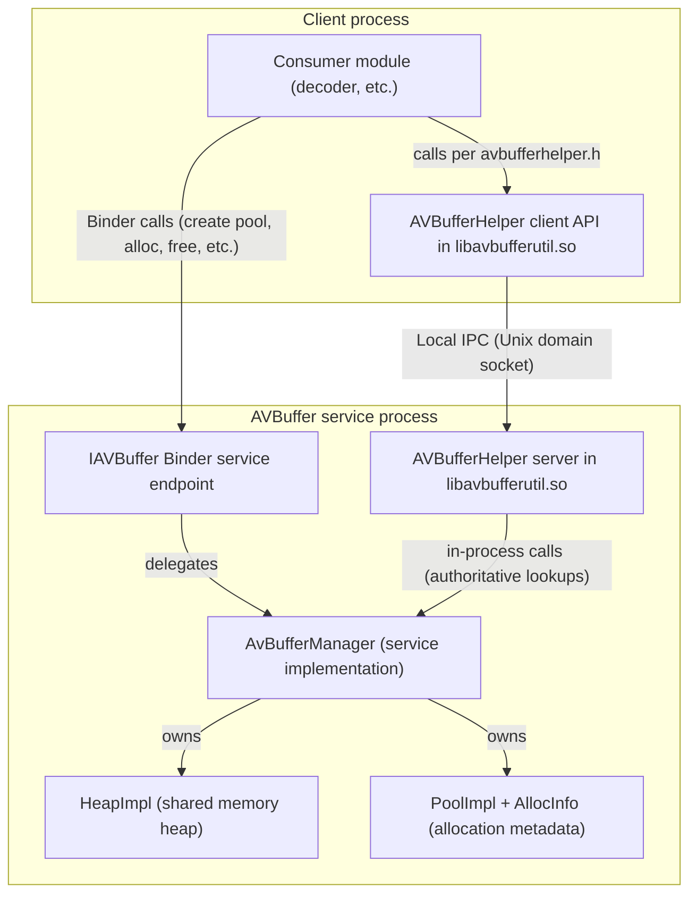
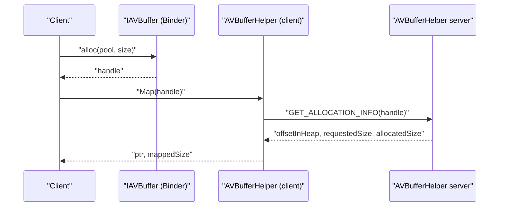

<!--
MongoDB Document Metadata:
- Original File Path: kavia-docs/CodeWiki/Specs/ArchitectureSpecs/avbufferhelper-client-server-design.md
- Operation: edit
- Timestamp: 2026-02-20T10:13:56.528658+00:00
- Restored At: 2026-02-23T05:04:11.254505+00:00
- Task ID: cm219d4578
-->

# AVBufferHelper Client/Server Design (libavbufferutil.so)

## Overview

This document describes a concrete design for implementing **AVBufferHelper** using a **client/server mechanism** where both the client and the server are implemented inside **`libavbufferutil.so`**. Other modules (for example, audio/video decoders) access AVBufferHelper functionality exclusively through the **client API defined by `avbufferhelper.h`** (referenced upstream at https://github.com/rdkcentral/rdk-halif-aidl/blob/0.13.1/avbuffer/current/avbufferhelper.h).

In the current design, the AVBuffer HAL is implemented as a Binder service (`IAVBuffer`) with heap/pool/allocation tracking implemented in `AvBufferManager`, `HeapImpl`, and `PoolImpl`. The AVBufferHelper layer is intended to provide a client-friendly way to translate an `IAVBuffer` allocation handle (a 64-bit integer) into enough information to safely access the underlying memory of that allocation from the client process. Because the required helper methods are not part of the `IAVBuffer` AIDL contract, this design proposes an auxiliary client/server mechanism implemented as an internal facility of `libavbufferutil.so`.

This design follows the broader **client/server** principles captured in the project definition, where a centralized service exposes interfaces and routes requests while keeping internal state authoritative, while also meeting the additional constraint that **both sides of the helper mechanism ship together in the same shared object**.

## Goals

The AVBufferHelper client/server design must achieve the following goals.

First, it must provide a stable way for a client to derive the information needed to access a buffer allocation from its `bufferHandle` value returned by `IAVBuffer.alloc()`. This includes determining the allocation’s offset and size, and identifying which backing heap it belongs to (secure vs non-secure).

Second, it must preserve the HAL boundary: the server remains the authoritative owner of heap/pool state, and the helper does not require direct access to internal service memory structures.

Third, it must be safe with respect to concurrency and binder callback behavior. The AVBuffer Binder service already uses a global recursive lock to serialize most operations, and it tries to avoid invoking binder callbacks while holding that lock. The helper server must follow similar guidelines so that client requests cannot deadlock the system or cause re-entrancy hazards.

Fourth, it must satisfy the packaging constraint that the **client and server implementations both live in `libavbufferutil.so`**, so that modules that want helper functionality only need to link against `libavbufferutil.so` and include `avbufferhelper.h`.

Finally, it should be implementable incrementally without requiring changes to the upstream HALIF AIDL contract (because the mapping information is not part of `IAVBuffer.aidl`), and it should work in a local Linux development environment where TEVDevice is built with `linux_binder_idl`.

## Relationship to `avbufferhelper.h` (API contract)

The upstream header `avbufferhelper.h` is treated as the public API contract for helper functionality. This repository snapshot does not currently vendor that header, so this design document does not reproduce its full contents. Instead, it specifies a client/server architecture that is intended to back the functions and data described by `avbufferhelper.h`.

When implementing this design, `libavbufferutil.so` should provide:

1. The exported symbols that match the client-facing declarations in `avbufferhelper.h`.
2. A private internal server implementation that those client-facing calls delegate to (via local IPC), so that state remains authoritative and centrally validated.

## Non-goals

This design does not attempt to define or implement secure heap mapping, secure video, or DRM-grade isolation. The current TEVDevice AVBuffer implementation rejects secure pool creation (`createVideoPool(true, ...)` / `createAudioPool(true, ...)`), so secure mapping cannot be meaningfully supported until the secure heap is implemented.

This design also does not attempt to change the public AIDL interfaces in `rdk-halif-aidl-17`. Instead, it defines an auxiliary client/server mechanism that can evolve independently.

## Current codebase baseline (what exists today)

### AVBuffer service entrypoint

The service process is started by:

- `rdk-halif-aidl-vcomponent-avbuffer/src/service/vcomponent_BufferService.cpp`

It validates that a configuration file path is provided, checks it is readable, sets `AvBufferManager::_avbufferHFPPath`, and publishes the binder service using:

- `com::rdk::hal::avbuffer::AvBufferManager::publishAndJoinThreadPool()`

### Binder service implementation and allocation handles

The Binder service implementation is:

- `rdk-halif-aidl-vcomponent-avbuffer/include/avbuffer/vcomponent_AvBufferManager.h`
- `rdk-halif-aidl-vcomponent-avbuffer/src/aidl/vcomponent_AvBufferManager.cpp`

The key behavior that matters for the helper is that `alloc()` returns a 64-bit handle (`int64_t`) constructed such that the **pool ID is encoded in the top byte**:

- `handle = (static_cast<uint64_t>(poolId) << 56) | (seq & 0x00FFFFFFFFFFFFFFULL);`

The service maintains allocation metadata using `PoolImpl` and `AllocInfo`:

- `rdk-halif-aidl-vcomponent-avbuffer/include/avbuffer/vcomponent_PoolHal.h`

`AllocInfo` includes (at minimum) the fields:

- `offset` (allocation offset within the pool)
- `size` (requested size; this is what `getPoolMetrics` uses)
- `allocatedSize` (actual size including padding/alignment)
- `handle` (64-bit handle)

This is sufficient server-side data to answer helper requests like “what is the offset and size for handle X?”.

### Shared memory heap implementation

The heap implementation is:

- `rdk-halif-aidl-vcomponent-avbuffer/include/avbuffer/vcomponent_HeapHal.h`
- `rdk-halif-aidl-vcomponent-avbuffer/src/utility/vcomponent_HeapHal.cpp`

The exact shared memory name and mapping approach is implemented there, and should be treated as an internal detail owned by the service. The helper design should not require clients to reach into heap internals directly.

## Design summary

The AVBufferHelper design introduces a **side-channel server** that lives in (or alongside) the AVBuffer service process and exposes a small request/response protocol over a local IPC mechanism.

The client-side AVBufferHelper library connects to this server and provides functions such as:

- `GetOffset(handle)` and `GetSize(handle)` to retrieve mapping metadata.
- `Map(handle)` and `Unmap(handle)` as a convenience layer around platform-specific shared memory mapping behavior, when applicable.

The server is responsible for validating the handle against current allocations and returning the correct metadata. Because the service is authoritative, the server can implement “handle is valid” checks without duplicating state on the client.

## Architecture

### Component relationships

In the common deployment model, `HelperServer` runs in the same process as the AVBuffer Binder service so that it can translate allocation handles to authoritative allocation metadata. The important packaging constraint is that **the server code is part of `libavbufferutil.so`**, even though the server is instantiated by (and runs inside) the service process.

### Rationale for a side-channel server

The HALIF `IAVBuffer` interface does not provide methods for clients to query mapping metadata such as “allocation offset” and “allocation size as stored in AllocInfo”. In TEVDevice, the buffer handle is opaque to the client; the service may apply padding and alignment, and the client cannot reliably infer internal offsets.

A side-channel server solves this without requiring a change to AIDL. It also keeps client/server responsibilities clean: the server remains authoritative for handle validation and translation, while the client remains a consumer.

## Client/server mechanism options

Two viable mechanisms can be used in this repository context.

### Option A: Unix domain socket request/response server (recommended)

A Unix domain socket is a straightforward local IPC mechanism that works well in the Linux host build environment. The server listens on a well-known filesystem path (for example under `/tmp/`), accepts connections, and processes simple binary messages.

The server implementation can live in the AVBuffer service process so it can directly call into `AvBufferManager` methods to look up allocation information under the same global lock used by Binder calls.

This option aligns with the current repository’s “services and tooling” orientation and does not require generating new AIDL code.

### Option B: Secondary Binder service (not recommended for initial TEVDevice implementation)

A second Binder service such as `IAVBufferHelper` could be added and published alongside `IAVBuffer`. This is more consistent with Android-centric patterns, but it adds complexity to build integration (additional AIDL, additional stub/proxy generation, and service manager coordination). For TEVDevice’s Linux environment, a Unix domain socket is typically simpler.

This document specifies Option A in detail.

## Server design (Unix domain socket)

### Server lifecycle

The helper server should be started during AVBuffer service initialization. In TEVDevice terms, there are two common approaches:

1. The service entrypoint starts it before publishing Binder, or
2. `AvBufferManager` starts it in its constructor after heap initialization.

Because `AvBufferManager` already owns the heap/pool state, starting the helper server from the manager simplifies access control and ensures it is not running without a valid manager instance.

### Concurrency model

The helper server must be thread-safe with respect to the AVBuffer manager’s heap/pool structures. The service code uses a global recursive mutex (`_avb_lock`) around most operations. The helper server should follow these rules:

1. When answering metadata queries, it must acquire the same `_avb_lock` (or use manager methods that do so).
2. It must avoid calling binder callbacks while holding the lock. The helper server itself does not need to invoke binder callbacks, so this is mainly an implementation discipline: do not introduce helper paths that call `IAVBufferSpaceListener` while holding locks.
3. It should not block for long while holding `_avb_lock`. The request handlers should compute results quickly and release the lock.

### Handle lookup algorithm

The server needs to translate `handle` into `(poolId, allocOffset, allocSizeRequested, allocSizeAllocated, heapType, poolOffset)`.

A robust algorithm based on existing structures is:

1. Extract `poolId` from handle: `poolId = (handle >> 56) & 0xFF`.
2. Find the corresponding `PoolImpl` by scanning heap pool lists:
   - Look in `_nonSecureHeap->GetPoolList()` for a pool with `pool->GetHandle() == poolId`.
   - Optionally also search `_secureHeap` if supported.
3. Inside that pool, find the `AllocInfo*` using `pool->FindAllocInfo(handle)`.
4. If found, compute:
   - `allocationOffsetInHeap = pool->GetOffset() + allocInfo->offset`
   - `requestedSize = allocInfo->size`
   - `allocatedSize = allocInfo->allocatedSize`
5. Return the requested response.

This is consistent with the service’s existing behavior (where `PoolImpl` owns the allocation list and `AllocInfo` stores both requested and allocated size).

### Request/response protocol

The protocol should be intentionally small and versioned.

#### Message header

All messages begin with:

- `uint32_t magic` (fixed value such as `0x41564248` for "AVBH")
- `uint16_t version` (start at 1)
- `uint16_t type` (request/response type)
- `uint32_t payloadLength` (number of bytes following the header)

All integer fields should be little-endian for simplicity in the Linux environment.

#### Request types

At minimum:

1. `GET_ALLOCATION_INFO`
   - Payload: `uint64_t handle`
   - Response payload:
     - `int32_t status` (0 success, negative error codes)
     - `uint8_t heapType` (0 non-secure, 1 secure)
     - `uint32_t offsetInHeap`
     - `uint32_t requestedSize`
     - `uint32_t allocatedSize`
     - `uint8_t poolId`

2. `PING`
   - No payload
   - Response payload: `uint32_t serverPid` and `uint32_t serverVersion`

#### Error codes

Suggested error codes (negative):

- `-1` invalid request
- `-2` unknown handle
- `-3` unsupported (e.g., secure heap requested but not available)
- `-4` internal error

### Access control and safety

Because the helper server exposes metadata that can be used to access shared memory, it should implement basic local-only protections:

- Bind the Unix domain socket in a directory with restrictive permissions (e.g., `/tmp` but with `chmod 0600` on the socket file).
- Optionally validate the connecting process credentials using `SO_PEERCRED` (Linux) and allow only expected UIDs in test environments.

Even with these controls, in a typical developer environment the threat model is minimal; the primary concern is correctness and avoiding accidental exposure to unrelated processes.

## Client-side helper design

### API surface

The helper library should provide a small, stable C/C++ API. For example, in C++:

- `bool AvBufferHelper::GetAllocationInfo(int64_t handle, AllocationInfo& out);`
- `void* AvBufferHelper::Map(int64_t handle, size_t& mappedSize);`
- `bool AvBufferHelper::Unmap(void* addr, size_t mappedSize);`

Where `AllocationInfo` includes:

- heap type (secure vs non-secure)
- offset in heap
- requested size
- allocated size
- pool id

### Mapping strategy

The helper must map the same underlying shared memory object that the service uses for non-secure heap allocations.

Because the heap implementation details are not fully specified in this design doc, the helper should be implemented such that:

1. It queries `GET_ALLOCATION_INFO(handle)` from the helper server to obtain the offset and size.
2. It maps the shared memory object by name (or via another helper-server call if the service wants to hide the name).
3. It computes a pointer to the allocation region by applying `offsetInHeap`.
4. It returns a pointer and size to the client.

If the shared memory name is considered an internal detail, the protocol can be extended with a `GET_HEAP_DESCRIPTOR` request returning the shm name and heap size for the heap type. This provides better encapsulation.

### Client lifecycle and error handling

The client must treat any mapping metadata as short-lived. A handle can become invalid after `free(handle)` or after pool destruction. Therefore:

- If `GetAllocationInfo` returns “unknown handle”, the helper must not attempt to map.
- If mapping succeeds but later operations fail, the helper should re-query metadata rather than caching permanently.
- In test scenarios, the helper should support reconnecting to the helper server across service restarts.

## Sequence flows

### Allocation then map (happy path)

### Free then notify (interaction consideration)

The current service implementation includes `notifyWhenSpaceAvailable()` and triggers callbacks after operations that free space (for example `trimSize()` and potentially after `free()` depending on where it is invoked). The helper server must not interfere with these operations. It should remain a read-only translator for handle metadata.

## Integration points in TEVDevice

### Packaging model: client and server in `libavbufferutil.so`

In this design, `libavbufferutil.so` contains both:

1. The public **client entry points** (matching `avbufferhelper.h`) that consumer modules link against.
2. The **server implementation** (socket accept loop, request handlers, handle translation logic) that is instantiated by the AVBuffer service process.

This arrangement keeps deployment simple for consumers: they only need the header and the shared library. It also keeps the authoritative logic close to the service that owns allocation state.

### Server instantiation placement (TEVDevice)

Although the server implementation lives in `libavbufferutil.so`, it must be instantiated by the AVBuffer service process. In TEVDevice terms, there are two practical instantiation points:

1. The service entrypoint starts it before publishing Binder, or
2. `AvBufferManager` starts it in its constructor after heap initialization.

The recommended approach is to start the helper server from the manager once heaps are initialized, because it prevents the server from running without a valid manager instance and allows direct access to pool/allocation state under `_avb_lock`.

In code-layout terms, this typically means:

- The helper server class is implemented in the `libavbufferutil.so` sources.
- The AVBuffer service (for example `vcomponent_BufferService.cpp` / `AvBufferManager`) calls a `libavbufferutil.so` “start server” entry point at initialization time.

### Configuration and discovery

The helper server socket path should be configurable for test environments:

- Environment variable such as `AVBUFFER_HELPER_SOCKET=/tmp/avbufferhelper`
- Default path if unset

The service entrypoint already uses configuration mechanisms (`AVBUFFER_HFP_PATH` or argv). A similar approach can be used for the helper.

## Testing strategy

Testing should cover:

1. Valid handle query returns correct offset and size.
2. Freed handle query returns “unknown handle”.
3. Pool destruction removes allocations and invalidates handles.
4. Concurrent allocations and helper queries do not deadlock under `_avb_lock`.
5. Service restart behavior: client helper reconnect works and old handles are rejected.

A minimal integration test can be created by:

- Starting the service (`vcomponent_BufferService`) and a client that:
  - creates a pool
  - allocates a buffer
  - queries mapping metadata via the helper socket server
  - frees the buffer and verifies the helper now reports invalid

## Known constraints and open issues

### Secure heap is currently unsupported

The current TEVDevice AVBuffer service rejects secure pool creation. The helper protocol should include `heapType` for forward compatibility, but the server should return “unsupported” for secure heap queries until secure heaps are implemented.

### Handle routing vs scanning

The server can use the poolId encoded in the handle to route quickly to the correct pool, but it still must validate that the allocation exists in that pool. This prevents stale handle reuse from causing incorrect translations.

### Encapsulation of shared memory details

If the heap implementation’s shared memory name and size are considered internal, the helper protocol should be extended to provide a heap descriptor. This design keeps that as an extension point rather than a requirement.

## Sources

This design is derived from the repository’s current AVBuffer implementation and project definition information:

- `rdk-halif-aidl-vcomponent-avbuffer/src/service/vcomponent_BufferService.cpp`
- `rdk-halif-aidl-vcomponent-avbuffer/include/avbuffer/vcomponent_AvBufferManager.h`
- `rdk-halif-aidl-vcomponent-avbuffer/src/aidl/vcomponent_AvBufferManager.cpp`
- `rdk-halif-aidl-vcomponent-avbuffer/include/avbuffer/vcomponent_PoolHal.h`
- `rdk-halif-aidl-vcomponent-avbuffer/include/avbuffer/vcomponent_HeapHal.h`
- Project definition chunk: `doc__Control Plane - RDK Hardware Porting Kit.pdf__pages_1_3`
- Existing repo docs used as context:
  - `kavia-docs/avbuffer-aidl-contract-and-mapping.md`
  - `kavia-docs/tevdevice-avbuffer-implementation-design.md`
  - `kavia-docs/avbuffer-reference-code-flow-client-perspective.md`

The public API contract referenced by this task is the upstream header:

- https://github.com/rdkcentral/rdk-halif-aidl/blob/0.13.1/avbuffer/current/avbufferhelper.h

That header is not currently present in this workspace snapshot, so it is treated as an external reference rather than a local source file.
