<!--
MongoDB Document Metadata:
- Original File Path: kavia-docs/decoder/decoder-pipeline-buffer-lifecycle.md
- Operation: write
- Timestamp: 2026-02-10T09:31:12.676273+00:00
- Restored At: 2026-02-23T05:04:11.251042+00:00
- Task ID: cm219d4578
-->

<!--
MongoDB Document Metadata:
- Original File Path: kavia-docs/CodeWiki/Specs/DetailedDesigns/decoder-pipeline-buffer-lifecycle.md
- Operation: edit
- Timestamp: 2026-02-08T09:10:01.671645+00:00
- Restored At: 2026-02-10T09:03:50.890695+00:00
- Task ID: cm57ecced8
-->

# Audio Decoder Pipeline - AVBuffer and FrameMetadata Lifecycle

## Purpose

This document describes the lifecycle of AV buffer handles (`IAVBuffer` allocations) as they pass through the Audio Decoder pipeline, and how timestamps and metadata are carried alongside those handles. It is intended to help implementers and reviewers reason about ownership transfer, exactly-once freeing, and where the pipeline’s time and metadata information is sourced.

## What carries timestamps and what carries bytes

The AV Buffer HAL provides memory handles for audio/video bytes but does not attach timestamps to those handles. Instead, timestamps are carried in AIDL method parameters and callbacks.

The encoded input handle is paired with the timestamp when the client calls `IAudioDecoderController.decodeBuffer(nsPresentationTime, bufferHandle, trimStartNs, trimEndNs)`.

The decoded output handle is paired with the timestamp when the decoder invokes `IAudioDecoderControllerListener.onFrameOutput(nsPresentationTime, frameBufferHandle, metadata)`.

The PCM handle is handed off to Audio Sink using `IAudioSinkController.queueAudioFrame(nsPresentationTime, bufferHandle, metadata)`.

## Buffer handle ownership rules (narrative)

The AV Buffer documentation and the Audio Decoder documentation together imply a strict ownership transfer rule: once `decodeBuffer(...)` returns `true`, the controller owns the encoded input handle and the client must not free or modify it. The controller must then free it exactly once after it is fully consumed, even if decoding is interrupted by `flush()` or `stop()`.

In non-tunnelled mode, the controller allocates decoded PCM output handles from a vendor-managed frame pool, but the handles must remain globally freeable via `IAVBuffer.free(handle)` so that downstream components can release them. In practical pipelines, the client treats the output handle as an opaque token and passes it to Audio Sink, which takes ownership and frees it after mixing.

In tunnelled mode, the controller does not return a decoded PCM handle to the client, and it is the vendor pipeline’s responsibility to manage any internal output buffers. When metadata still needs to be delivered (first frame after start/flush, changes, EOS), the controller uses `frameBufferHandle = -1`.

## Configuration-driven aspects of buffers and metadata

In the current repository state, the Audio Decoder HFP YAML (`rdk-halif-aidl-17/audiodecoder/current/hfp-audiodecoder.yaml`) configures only the static resource inventory and the capability envelope (supported codecs and secure support). That configuration affects which sessions can be opened (`open(codec, secure, ...)`) and whether secure AV buffers may be accepted, but it does not change the fundamental buffer ownership rules captured in this document.

Runtime “reconfiguration” that impacts buffers and metadata is expressed through AIDL state transitions and properties. For example:
- Entering `FLUSHING` or `STOPPING` requires the decoder to free any AV buffers it is holding, which directly constrains how internal queues and in-flight jobs are managed.
- Toggling `LOW_LATENCY_MODE` (READY-only) or `AV_SOURCE` (READY-only) changes the expected `FrameMetadata` fields when metadata is next emitted, but it does not alter ownership semantics. The typical pattern is to stop (returning to READY), apply the property, then restart.
- AC-4 override properties are writable in all states, but whether they require a boundary such as `flush(reset=false)` to take effect is implementation-defined. In either case, output metadata must reflect the effective session configuration at the time metadata is emitted.

For the explicit YAML-to-AIDL key mapping and validation/fallback rules, see the “Configuration-driven startup and runtime reconfiguration” section in `audiodecoder-current-aidl-api-and-ffmpeg-plan.md`.

## Buffer lifecycle diagram (Mermaid source)

```mermaid
flowchart LR
  AllocIn["Client allocates encoded input AVBuffer handle via IAVBuffer.alloc()"]
  FillIn["Client writes encoded bytes into handle (non-secure via map/unmap helper)"]
  Submit["Client calls IAudioDecoderController.decodeBuffer(ptsNs, inputHandle, trimStartNs, trimEndNs)"]
  Accepted{"decodeBuffer returns true?"}
  Retain["Client retains ownership; may retry or free inputHandle"]
  OwnIn["Controller owns inputHandle (exactly-once free required)"]
  Decode["Vendor decode worker consumes bytes and decodes (FFmpeg)"]
  FreeIn["Controller frees inputHandle via IAVBuffer.free(inputHandle)"]

  OutMode{"Non-tunnelled output?"}
  AllocOut["Controller allocates PCM output handle from vendor audio frame pool (IAVBuffer-freeable)"]
  MetaEmit["Controller decides whether to include FrameMetadata (first after start/flush or change)"]
  OutputCb["Controller calls onFrameOutput(ptsNs, pcmHandle, metadataOrNull)"]
  Queue["Client calls IAudioSinkController.queueAudioFrame(ptsNs, pcmHandle, metadata)"]
  SinkOwn["Audio Sink owns pcmHandle after queueAudioFrame succeeds"]
  SinkFree["Audio Sink frees pcmHandle via IAVBuffer.free(pcmHandle) after mixing"]

  Tunnel["Tunnelled: no pcmHandle returned; controller uses -1 when metadata must be sent"]
  TunnelCb["onFrameOutput(ptsNs, -1, metadata) when required"]

  AllocIn --> FillIn --> Submit --> Accepted
  Accepted -->|"No"| Retain
  Accepted -->|"Yes"| OwnIn --> Decode --> FreeIn --> OutMode

  OutMode -->|"Yes"| AllocOut --> MetaEmit --> OutputCb --> Queue --> SinkOwn --> SinkFree
  OutMode -->|"No (tunnelled)"| Tunnel --> TunnelCb
```

## Metadata lifecycle notes

The `FrameMetadata` parcelable includes values that are stable over a stream (such as `sourceCodec`), values that can change due to client settings (such as `lowLatency` based on `Property.LOW_LATENCY_MODE`), values that can change due to stream events (such as `discontinuity` after `signalDiscontinuity()`), and end-of-session indicators (`endOfStream` after `signalEOS()` drain completes).

The Audio Decoder HAL documentation states that, to reduce callback overhead, metadata should be sent with the first decoded frame after `start()`, with the first decoded frame after `flush()`, and whenever metadata changes. When metadata does not need to be sent, the `metadata` parameter should be `null`.

In non-tunnelled mode, metadata and the PCM output handle are delivered together in the same `onFrameOutput(...)` callback. In tunnelled mode, there may be no PCM handle, so callbacks should only occur when metadata must be emitted, using `frameBufferHandle = -1`.

## Where trimming information lives

Trim parameters enter the pipeline with `decodeBuffer(..., trimStartNs, trimEndNs)` and are also present in `FrameMetadata.trimStartNs` and `FrameMetadata.trimEndNs`. This allows downstream components to understand what trimming was applied to the decoded audio frame and is also useful for diagnostic and conformance testing.

## Exactly-once freeing implications for transitory states

The Audio Decoder documentation states that when the session enters `FLUSHING` or `STOPPING`, the decoder must free any AV buffers it is holding. This requirement should be interpreted as applying to all input handles that have been accepted but not yet freed, including handles in internal queues and handles currently being processed by a worker thread.

A robust implementation therefore ensures that `flush()` and `stop()` coordinate with the decode worker so that any in-flight input handle is either fully processed and freed, or safely abandoned and freed, without allowing double-free or handle leakage.
