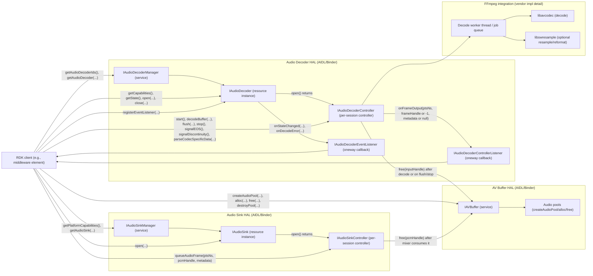

<!--
MongoDB Document Metadata:
- Original File Path: kavia-docs/decoder/decoder-pipeline-components.md
- Operation: write
- Timestamp: 2026-02-10T09:29:52.847884+00:00
- Restored At: 2026-02-23T05:04:11.250794+00:00
- Task ID: cm219d4578
-->

<!--
MongoDB Document Metadata:
- Original File Path: kavia-docs/CodeWiki/Specs/DetailedDesigns/decoder-pipeline-components.md
- Operation: edit
- Timestamp: 2026-02-08T09:09:24.094031+00:00
- Restored At: 2026-02-10T09:03:50.890481+00:00
- Task ID: cm57ecced8
-->

# Audio Decoder Pipeline - Component Architecture

## Purpose

This document provides a high-level component architecture diagram for the current AIDL-based Audio Decoder pipeline, with FFmpeg as the reference decoding engine. The diagram focuses on the externally visible HAL interfaces (Manager, Resource, Controller, and listeners), and the key adjacent HALs involved in practical playback flows (AV Buffer and Audio Sink).

## Scope and assumptions

The diagram reflects the current AIDL surface under `rdk-halif-aidl-17/audiodecoder/current` and the normative behavior described in the Audio Decoder HAL documentation. It also reflects two operational modes described by the HAL documentation.

In non-tunnelled mode, decoded PCM is returned to the client as an AV buffer handle via `IAudioDecoderControllerListener.onFrameOutput(...)`, and is then typically queued into `IAudioSinkController.queueAudioFrame(...)` for mixing and presentation.

In tunnelled mode, decoded audio is consumed within the vendor layer and no decoded PCM handle is returned to the client, meaning `frameBufferHandle = -1` is used when metadata must be sent, and Audio Sink is not necessarily in the critical data path for PCM buffers.

## Configuration-driven bootstrap (HFP YAML)

In this repository, the Audio Decoder service’s static resource inventory is intended to be bootstrapped from the HAL Feature Profile (HFP) YAML file at `rdk-halif-aidl-17/audiodecoder/current/hfp-audiodecoder.yaml`. That profile declares the set of `IAudioDecoder` resources (by numeric ID) and their static capability envelopes (`supportedCodecs` and `supportsSecure`). This aligns with the AIDL requirements that `IAudioDecoderManager.getAudioDecoderIds()` and `IAudioDecoder.getCapabilities()` return stable values that do not change between calls.

The current Audio Decoder HFP YAML does not define per-session tuning such as sample rate, channels, bit depth, DRC parameters, buffer sizing, sink routing, or an explicit tunnelled/non-tunnelled selection flag. In the AIDL design used here, per-session settings are either derived from the elementary stream, constrained by Audio Sink platform mixer capabilities (see `rdk-halif-aidl-17/audiosink/current/hfp-audiosink.yaml`), or controlled via AIDL runtime calls (`open`, `setProperty`, `parseCodecSpecificData`, `flush`, `stop`, `signalEOS`, and `signalDiscontinuity`).

For the explicit YAML-to-AIDL key mapping, validation rules, and warm reconfiguration protocols, see the “Configuration-driven startup and runtime reconfiguration” section in `audiodecoder-current-aidl-api-and-ffmpeg-plan.md`.

## High-level component diagram (Mermaid source)

## Component responsibilities and boundaries

The `IAudioDecoderManager` is the service entry point that enumerates a static list of audio decoder resource IDs and returns `IAudioDecoder` instances for those IDs. The manager is long-lived and does not represent a decode session.

Each `IAudioDecoder` represents a single decoder resource instance. It exposes static `Capabilities` and allows multiple clients to register for events via `IAudioDecoderEventListener`, but only a single client can control the resource by calling `open(...)` and receiving an `IAudioDecoderController`.

The `IAudioDecoderController` represents the per-session control plane. Its `decodeBuffer(nsPresentationTime, bufferHandle, trimStartNs, trimEndNs)` method is the boundary where the client transfers ownership of an encoded AV buffer handle to the decoder implementation, provided the call returns `true`. The controller is also the boundary for lifecycle transitions (`start`, `stop`, `flush`, `signalEOS`) that must follow the Audio Decoder state machine.

The AV Buffer service (`IAVBuffer`) owns the global namespace for pool handles and buffer handles. This is important for the pipeline because both input encoded buffers and output decoded PCM buffers are referenced by handles that must be releasable via `IAVBuffer.free(handle)`, even if they originate from vendor-private “audio frame pool” allocations.

FFmpeg is an implementation detail behind the `IAudioDecoderController` boundary. The current detailed design assumes decoding work is performed asynchronously (not on Binder threads), using `libavcodec` to decode and (optionally) `libswresample` to resample/reformat to match platform mixer requirements. The FFmpeg-facing work typically runs on a dedicated worker thread and processes jobs enqueued from `decodeBuffer(...)`.

The Audio Sink HAL provides the downstream PCM sink for non-tunnelled mode. After the client receives a decoded PCM handle (and frame metadata) through `IAudioDecoderControllerListener.onFrameOutput(...)`, it typically queues the PCM buffer to the sink via `IAudioSinkController.queueAudioFrame(...)`. Once the sink has processed the buffer, it frees the handle through the AV Buffer service.

## Related documents

For API-by-API implementation considerations, see `audiodecoder-current-aidl-api-and-ffmpeg-plan.md`.

For the normative operational semantics (tunnelled vs non-tunnelled, metadata rules, EOS, discontinuity, and buffer freeing on transitory states), see `rdk-halif-aidl-17/docs/halif/audio_decoder/current/audio_decoder.md`.
