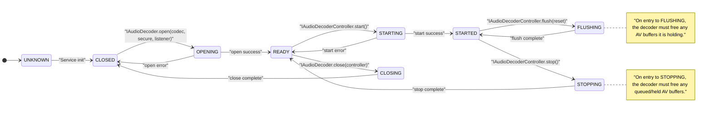
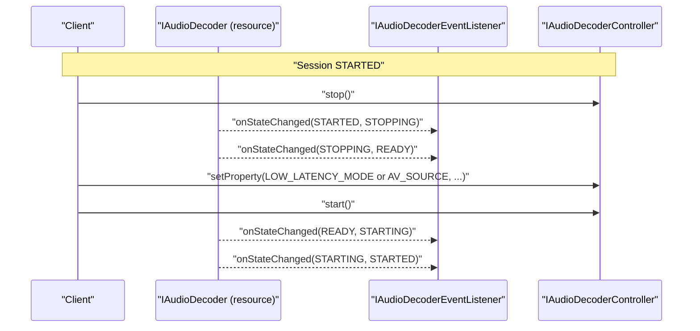

<!--
MongoDB Document Metadata:
- Original File Path: kavia-docs/decoder/decoder-pipeline-control-flow.md
- Operation: write
- Timestamp: 2026-02-10T09:30:30.492582+00:00
- Restored At: 2026-02-23T05:04:11.250920+00:00
- Task ID: cm219d4578
-->

<!--
MongoDB Document Metadata:
- Original File Path: kavia-docs/CodeWiki/Specs/DetailedDesigns/decoder-pipeline-control-flow.md
- Operation: edit
- Timestamp: 2026-02-08T09:09:43.147569+00:00
- Restored At: 2026-02-10T09:03:50.890591+00:00
- Task ID: cm57ecced8
-->

# Audio Decoder Pipeline - Control Flow and State Model

## Purpose

This document describes the control flow for a typical Audio Decoder HAL session, with emphasis on state transitions, permitted operations per state, and how the current AIDL API maps to common media-player lifecycle verbs such as initialize, configure, start, pause/resume, drain/flush, stop, and release.

## State machine overview

The Audio Decoder HAL uses a module-specific `com.rdk.hal.audiodecoder.State` enum that mirrors the general session state management paradigm. The controlling client should expect transitory states (OPENING, STARTING, FLUSHING, STOPPING, CLOSING) and must tolerate the server doing internal work while in those transitory states.

The following state diagram is a practical view of the Audio Decoder’s resource/session lifecycle as defined by the AIDL and the normative Audio Decoder documentation.

## Audio Decoder state diagram (Mermaid source)

## Mapping to common playback lifecycle verbs

Initialization corresponds to service discovery and resource enumeration. In practice, the client obtains `IAudioDecoderManager` from the service manager, calls `getAudioDecoderIds()`, and selects a resource using `getAudioDecoder(id)`.

Configuration corresponds to `IAudioDecoder.open(codec, secure, controllerListener)` and (optionally) early property reads and writes. The AIDL makes `getProperty(...)` available on the resource at any state, and the controller provides `setProperty(...)` for session configuration. Some properties (such as `LOW_LATENCY_MODE` and `AV_SOURCE`) are only writable while the decoder is in `READY`.

Start corresponds to `IAudioDecoderController.start()`, which transitions `READY → STARTING → STARTED` and enables the data-plane methods (`decodeBuffer`, `signalEOS`, `signalDiscontinuity`, and `flush`).

Pause and resume are not explicit operations in the current Audio Decoder AIDL. If a higher layer requires pause/resume semantics, the AIDL surface supports two common strategies. The first strategy is “pause by stop,” where `stop()` is used to quiesce decoding and free held buffers, and `start()` is used to resume. The second strategy is “pause by throttling,” where the client stops feeding `decodeBuffer(...)` inputs and relies on the downstream Audio Sink (and higher-level pipeline) to stop presentation; this can be appropriate when preserving decoder priming state matters, but it must be designed so that EOS and buffer ownership rules are still respected.

Drain and end-of-stream signaling corresponds to `IAudioDecoderController.signalEOS()`. The decoder must continue to output any held frames and then emit a final output notification where `FrameMetadata.endOfStream = true` after all frames have been output.

Flush corresponds to `IAudioDecoderController.flush(reset)`. Flush is only valid in `STARTED`, transitions through `FLUSHING`, and must free any input buffers that were submitted but not yet decoded. The `reset` parameter governs whether the internal decoder should be fully reset back to opened conditions or merely flushed to a clean started state.

Stop corresponds to `IAudioDecoderController.stop()`, which transitions through `STOPPING` and returns to `READY`. Stop implies freeing queued buffers and resetting internal decode state.

Release corresponds to `IAudioDecoder.close(controller)` which transitions `READY → CLOSING → CLOSED` and releases the controller and resource ownership.

## Configuration-driven reconfiguration patterns

This pipeline’s control flow supports two distinct kinds of “reconfiguration”, which should not be conflated.

The first kind is capability and inventory configuration, which is intended to be bootstrapped from `rdk-halif-aidl-17/audiodecoder/current/hfp-audiodecoder.yaml`. Because the AIDL requires that resource IDs and `Capabilities` do not change between calls, changes to the HFP YAML are best treated as cold-start changes that take effect on service restart, not as in-place reconfiguration of an already-published service instance.

The second kind is per-session runtime reconfiguration, which occurs through the AIDL session lifecycle and properties. The warm reconfiguration rules below are derived directly from `Property.aidl` state constraints and from the session state machine semantics.

In-place reconfiguration (no stop required) is limited in this AIDL surface. AC-4 override properties are documented as writable in all states, and can therefore be set while started, although an implementation still needs to define whether the new selection takes effect immediately or at the next boundary (for example, after `flush(reset=false)`).

READY-only reconfiguration (requires `stop()` if currently started) includes `LOW_LATENCY_MODE` and `AV_SOURCE`. The compliant pattern is to transition back to `READY`, apply the property, then restart:

Reopen-required reconfiguration includes changing the session codec or secure-mode selection, because those are selected by `IAudioDecoder.open(codec, secure, ...)` and are only valid when the resource is `CLOSED`. A codec change therefore implies `stop()` (if started), `close(controller)`, then `open(...)` with the new codec and a fresh `start()`.

For the complete YAML-to-AIDL mapping and the detailed validation/fallback rules, see the “Configuration-driven startup and runtime reconfiguration” section in `audiodecoder-current-aidl-api-and-ffmpeg-plan.md`.

## Event callbacks and timing expectations

State transitions are observable through `IAudioDecoderEventListener.onStateChanged(oldState, newState)`. The general session state management documentation also sets expectations that entry to the transitory state occurs promptly and that the final target state is reached within a bounded time for normal operation.

Decode-time errors are reported asynchronously using `IAudioDecoderEventListener.onDecodeError(errorCode, vendorErrorCode)`. Programming errors such as illegal state or invalid arguments are expected to be reported via Binder exceptions on the calling thread, rather than through the event callback mechanism.

## Buffer freeing rules tied to control flow

A key control-flow requirement is that when the session enters `FLUSHING` or `STOPPING`, the decoder must free any AV buffers it is holding. Practically, this means any encoded `bufferHandle` previously accepted by `decodeBuffer(...)` must be returned to its originating pool via `IAVBuffer.free(handle)` even if it was never decoded.

For non-tunnelled operation, output PCM handles are freed downstream, typically by Audio Sink after the buffer has been mixed/presented. This makes output-buffer availability a backpressure signal that can indirectly affect `decodeBuffer(...)` returning `false` when the output frame pool is exhausted.
