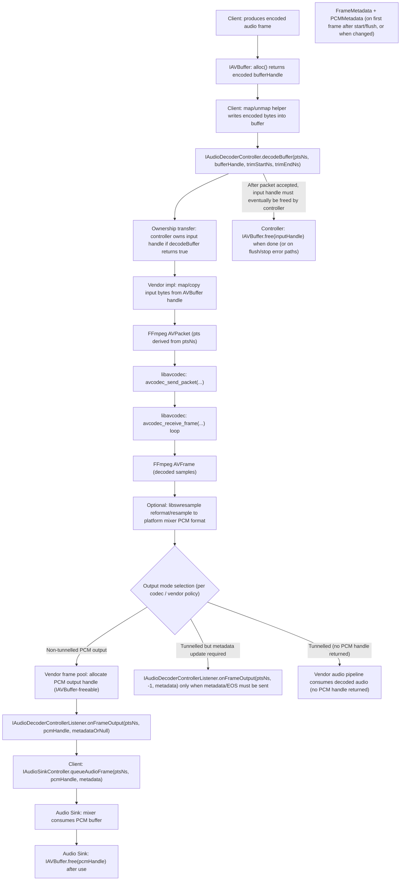

<!--
MongoDB Document Metadata:
- Original File Path: kavia-docs/decoder/decoder-pipeline-data-flow.md
- Operation: write
- Timestamp: 2026-02-10T09:30:09.382969+00:00
- Restored At: 2026-02-23T05:04:11.250856+00:00
- Task ID: cm219d4578
-->

<!--
MongoDB Document Metadata:
- Original File Path: kavia-docs/CodeWiki/Specs/DetailedDesigns/decoder-pipeline-data-flow.md
- Operation: edit
- Timestamp: 2026-02-08T09:09:32.227058+00:00
- Restored At: 2026-02-10T09:03:50.890542+00:00
- Task ID: cm57ecced8
-->

# Audio Decoder Pipeline - Data Flow

## Purpose

This document illustrates the primary data path for audio playback when using the Audio Decoder HAL with a FFmpeg-based implementation. It focuses on how an encoded frame in an `IAVBuffer` allocation flows through decode, how PCM output is produced, and how ownership of AV buffer handles transfers between components.

## Key data contracts

The encoded input frame is passed to the decoder via `IAudioDecoderController.decodeBuffer(nsPresentationTime, bufferHandle, trimStartNs, trimEndNs)`. The timestamp is carried out-of-band as `nsPresentationTime`; the AV buffer handle itself does not embed timestamps.

In non-tunnelled mode, decoded PCM output is returned via `IAudioDecoderControllerListener.onFrameOutput(nsPresentationTime, frameBufferHandle, metadata)` where `frameBufferHandle` is a valid AV buffer handle, and `metadata` is provided for the first frame after `start()` or `flush()` and then only when the metadata changes.

The decoded PCM is typically queued into Audio Sink using `IAudioSinkController.queueAudioFrame(nsPresentationTime, bufferHandle, metadata)`. Audio Sink takes ownership of the PCM buffer handle and frees it after it is consumed.

## Data flow diagram (Mermaid source)

## Configuration inputs that shape the data path

In the repository state reflected by this detailed design, `rdk-halif-aidl-17/audiodecoder/current/hfp-audiodecoder.yaml` configures only the static decoder resource inventory and capability envelopes (supported codecs and secure-path support). Those static capabilities govern which `open(codec, secure, ...)` requests can succeed, but they do not define stream-level parameters such as sample rate, channel count, or PCM bit depth.

The decoded PCM format that appears on the non-tunnelled output path is required (by the Audio Decoder HAL documentation) to match the platform mixer format required for mixing. In the HFP examples checked into this repository, those platform mixer constraints are declared by Audio Sink, for example in `rdk-halif-aidl-17/audiosink/current/hfp-audiosink.yaml` via `platformCapabilities.systemMixerSampleRateHz` and `platformCapabilities.systemMixerPCMFormat`. A FFmpeg-based backend should therefore treat Audio Sink platform capabilities as downstream constraints that may require resampling/reformatting before emitting a PCM AVBuffer handle.

Runtime tuning that *is* exposed by AIDL (for example `LOW_LATENCY_MODE` and `AV_SOURCE`) is applied through `IAudioDecoderController.setProperty(...)` and is reflected in `FrameMetadata` when metadata is emitted.

## Notes on secure vs non-secure buffers

The AV Buffer HAL distinguishes secure and non-secure heaps and pools. Secure buffers cannot be mapped into unprivileged processes. This means a FFmpeg-based implementation can only support `secure=true` sessions if it runs in a sufficiently trusted environment with access to secure buffer contents (or has a platform-specific secure mapping/copy mechanism). If that cannot be guaranteed, the decoder should advertise `Capabilities.supportsSecure=false` and return `null` for `open(codec, secure=true, ...)`, as allowed by the AIDL contract.

## Backpressure points

The AIDL for `decodeBuffer(...)` returns a boolean, and `false` indicates the decoder’s internal resources are full. A common reason is that the vendor-decoder’s output frame pool is exhausted (in non-tunnelled mode) and cannot allocate new PCM output buffers until downstream frees previous outputs. In that condition, it is compliant for the decoder to reject new encoded inputs by returning `false`, which propagates backpressure to the client.

## Ownership and freeing summary

Once `decodeBuffer(...)` returns `true`, the Audio Decoder controller owns the encoded `bufferHandle` and must free it exactly once after it is no longer needed, including on `FLUSHING` and `STOPPING` paths.

In non-tunnelled mode, once the client receives a decoded PCM `frameBufferHandle`, it should treat the handle as owned by the downstream pipeline. When queued to Audio Sink, Audio Sink takes responsibility to free it via `IAVBuffer.free(...)` when consumption is complete.
