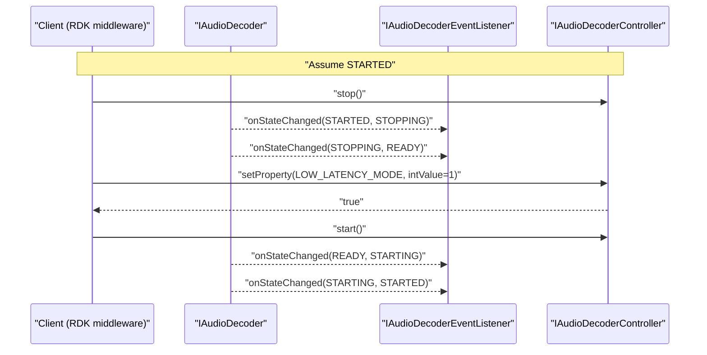
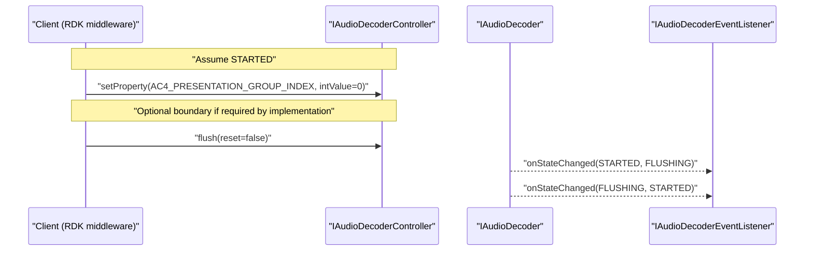

<!--
MongoDB Document Metadata:
- Original File Path: kavia-docs/decoder/decoder-pipeline-sequence.md
- Operation: write
- Timestamp: 2026-02-10T09:30:53.637821+00:00
- Restored At: 2026-02-23T05:04:11.250982+00:00
- Task ID: cm219d4578
-->

<!--
MongoDB Document Metadata:
- Original File Path: kavia-docs/CodeWiki/Specs/DetailedDesigns/decoder-pipeline-sequence.md
- Operation: edit
- Timestamp: 2026-02-08T09:09:53.370984+00:00
- Restored At: 2026-02-10T09:03:50.890644+00:00
- Task ID: cm57ecced8
-->

# Audio Decoder Pipeline - Typical Playback Sequence

## Purpose

This document provides a sequence diagram for a typical playback session using the Audio Decoder HAL, including resource selection and capability negotiation, property reads and writes, steady-state decode, PCM handoff to Audio Sink (non-tunnelled mode), event callbacks, and representative backpressure and error handling behaviors.

## Typical non-tunnelled playback session (Mermaid source)

```mermaid
sequenceDiagram
  participant Client as "Client (RDK middleware)"
  participant ADM as "IAudioDecoderManager"
  participant AD as "IAudioDecoder"
  participant Evt as "IAudioDecoderEventListener"
  participant ADC as "IAudioDecoderController"
  participant CtrlCb as "IAudioDecoderControllerListener"
  participant AVB as "IAVBuffer"
  participant ASM as "IAudioSinkManager"
  participant AS as "IAudioSink"
  participant ASC as "IAudioSinkController"

  Client->>ADM: "getAudioDecoderIds()"
  ADM-->>Client: "Ids[]"

  Client->>ADM: "getAudioDecoder(id)"
  ADM-->>Client: "IAudioDecoder"

  Client->>AD: "getCapabilities()"
  AD-->>Client: "Capabilities(supportedCodecs, supportsSecure)"

  Client->>AD: "registerEventListener(Evt)"
  AD-->>Client: "true"

  Note over Client,AD: "Open session (configure codec and secure mode)"
  Client->>AD: "open(codec, secure=false, CtrlCb)"
  AD-->>Evt: "onStateChanged(CLOSED, OPENING)"
  AD-->>Evt: "onStateChanged(OPENING, READY)"
  AD-->>Client: "IAudioDecoderController"

  Note over Client,ADC: "Optional configuration in READY"
  Client->>AD: "getProperty(RESOURCE_ID)"
  AD-->>Client: "PropertyValue(intValue=...)"
  Client->>ADC: "setProperty(AV_SOURCE, PropertyValue(intValue=...))"
  ADC-->>Client: "true"
  Client->>ADC: "setProperty(LOW_LATENCY_MODE, PropertyValue(intValue=0 or 1))"
  ADC-->>Client: "true"

  Note over Client,ADC: "Prepare Audio Sink for PCM playback"
  Client->>ASM: "getPlatformCapabilities()"
  ASM-->>Client: "PlatformCapabilities(system mixer PCM format/rate, etc.)"
  Client->>ASM: "getAudioSink(id)"
  ASM-->>Client: "IAudioSink"
  Client->>AS: "open(contentType, sinkControllerListener)"
  AS-->>Client: "IAudioSinkController"
  Client->>ASC: "setAudioDecoder(audioDecoderId)"
  ASC-->>Client: "true"

  Note over Client,ADC: "Start decode"
  Client->>ADC: "start()"
  AD-->>Evt: "onStateChanged(READY, STARTING)"
  AD-->>Evt: "onStateChanged(STARTING, STARTED)"

  loop "For each encoded audio frame"
    Note over Client,AVB: "Client allocates encoded input buffer"
    Client->>AVB: "alloc(audioPool, encodedSize)"
    AVB-->>Client: "inputHandle"

    Client->>ADC: "decodeBuffer(ptsNs, inputHandle, trimStartNs, trimEndNs)"

    alt "Backpressure (decoder full)"
      ADC-->>Client: "false"
      Note over Client: "Client retains ownership of inputHandle and may retry later"
    else "Accepted"
      ADC-->>Client: "true"
      Note over Client,ADC: "Ownership transferred to controller; client must not free/modify inputHandle"
    end

    Note over ADC,CtrlCb: "Async decode produces decoded PCM handle and metadata (per metadata rules)"
    ADC-->>CtrlCb: "onFrameOutput(ptsNs, pcmHandle, metadataOrNull)"

    alt "pcmHandle is valid (non-tunnelled)"
      Client->>ASC: "queueAudioFrame(ptsNs, pcmHandle, metadata)"
      ASC-->>Client: "true (or false if sink queue full)"
      Note over ASC,AVB: "Audio Sink eventually frees pcmHandle via IAVBuffer.free(pcmHandle)"
    else "Tunnelled mode (no PCM handle)"
      Note over Client: "Client does not call queueAudioFrame; vendor pipeline consumes audio"
    end
  end

  Note over Client,ADC: "Drain / EOS"
  Client->>ADC: "signalEOS()"
  Note over ADC,CtrlCb: "Decoder drains internal frames"
  ADC-->>CtrlCb: "onFrameOutput(lastPtsNs, -1 or pcmHandle, metadata(endOfStream=true))"

  Note over Client,ADC: "Stop and release"
  Client->>ADC: "stop()"
  AD-->>Evt: "onStateChanged(STARTED, STOPPING)"
  AD-->>Evt: "onStateChanged(STOPPING, READY)"

  Client->>AD: "close(ADC)"
  AD-->>Evt: "onStateChanged(READY, CLOSING)"
  AD-->>Evt: "onStateChanged(CLOSING, CLOSED)"
  AD-->>Client: "true"

  Client->>AD: "unregisterEventListener(Evt)"
  AD-->>Client: "true"
```

## Warm reconfiguration sequences

This section captures common “warm reconfigure” sequences using only the current AIDL surface. These sequences assume that the service’s resource inventory and capability envelopes were created at startup from `rdk-halif-aidl-17/audiodecoder/current/hfp-audiodecoder.yaml`, and are therefore stable for the lifetime of the service instance.

### Reconfigure LOW_LATENCY_MODE (READY-only property)

`Property.LOW_LATENCY_MODE` is documented as writable only in `READY`. A client that needs to change it during playback should stop decoding, apply the property, then restart.



### Reconfigure AC-4 overrides (writable in all states)

AC-4 override properties are documented as writable in all states. If an implementation applies them only at a boundary, a client can follow the `setProperty` with a `flush(reset=false)` to establish a clear application point.



For a more complete discussion of what changes require `stop()/start()`, `flush()`, or a full close/reopen, see the “Configuration-driven startup and runtime reconfiguration” section in `audiodecoder-current-aidl-api-and-ffmpeg-plan.md`.

## Error callback and recovery considerations

Decode failures during asynchronous processing are reported through `IAudioDecoderEventListener.onDecodeError(errorCode, vendorErrorCode)`. In a FFmpeg-based implementation, the vendor error code often carries the underlying FFmpeg `AVERROR_*` value so that diagnostics can be performed while still reporting a stable HAL-level `ErrorCode`.

When `decodeBuffer(...)` returns `false`, the most conservative client strategy is to treat it as backpressure and retry later without freeing or reusing the encoded handle. If the client instead chooses to abandon the frame, it should free the handle itself, because ownership only transfers when `decodeBuffer(...)` returns `true`.

If the client process terminates unexpectedly, the Audio Decoder HAL requires that the server automatically stops and closes any instance controlled by that client. This behavior is typically implemented with Binder death recipient tracking against a client-owned binder (often the controller listener object).
