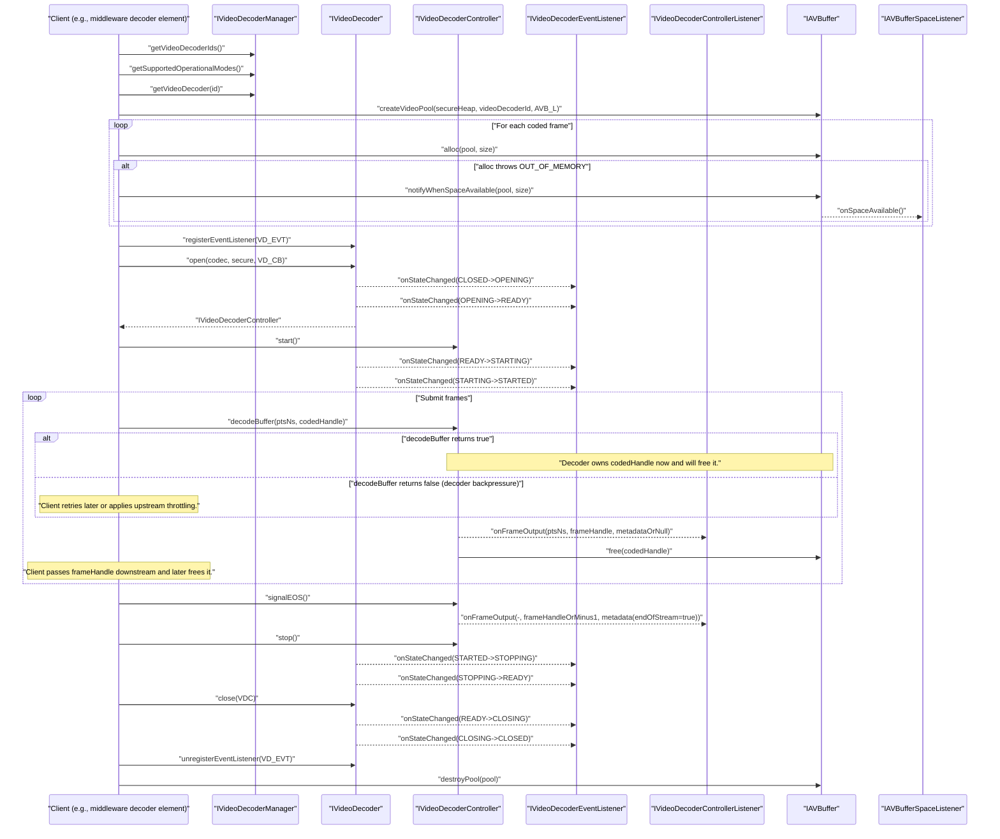

<!--
MongoDB Document Metadata:
- Original File Path: kavia-docs/videodecoder/pipeline_components.md
- Operation: write
- Timestamp: 2026-02-10T12:28:39.915099+00:00
- Restored At: 2026-02-23T05:04:11.251276+00:00
- Task ID: cm219d4578
-->

# Video Decoder Pipeline Components (HALIF AIDL)

## Overview

The HALIF AIDL Video Decoder stack is split into two cooperating subsystems:

The first subsystem is the Video Decoder HAL, which exposes a manager interface for enumerating decoder resources, a per-resource interface for capability queries and session creation, and a per-session controller interface for feeding coded frames and controlling decode state. It also defines two asynchronous callback interfaces for lifecycle and decode feedback.

The second subsystem is the AV Buffer HAL, which provides secure and non-secure heaps, per-client pools, and globally unique buffer handles. These handles are the interoperability mechanism used to move coded input frames into the decoder and, in non-tunnelled mode, to move decoded frame buffers back out to the client. AV Buffer also provides a listener interface for pool space availability notification, which is the primary backpressure mechanism when pools are exhausted.

This document describes the key pipeline components, their responsibilities, how data and control flow between them, and the ownership and lifecycle rules for buffers.

## Component list and responsibilities

### IVideoDecoderManager (service)

The Video Decoder Manager is the entry point for discovery and static platform capabilities:

It returns the list of `IVideoDecoder.Id` values that represent the platform’s video decoder resources via `getVideoDecoderIds()`, and it reports which operational modes are supported system-wide via `getSupportedOperationalModes()`. It also returns an `IVideoDecoder` interface for a valid ID via `getVideoDecoder(id)` (or null if the ID is invalid).

Upstream references:
- HAL overview page: https://rdkcentral.github.io/rdk-halif-aidl/0.12.0/halif/video_decoder/current/video_decoder/
- AIDL: `rdk-halif-aidl-17/videodecoder/current/com/rdk/hal/videodecoder/IVideoDecoderManager.aidl`

### IVideoDecoder (resource instance)

An `IVideoDecoder` represents a single decoder resource instance. It is the boundary for:

Capability and property queries:
- `getCapabilities()` returns a stable `Capabilities` parcelable for the resource.
- `getProperty(property)` and `getPropertyMulti(properties, out kvPairs)` expose resource properties via `PropertyValue`.
- `getState()` reports the current state according to the HAL session-state model.

Session creation and teardown:
- `open(codec, secure, controllerListener)` creates a decode session, returning an `IVideoDecoderController` if the codec and secure-mode are supported and the resource is currently in `CLOSED`. The resource transitions through `OPENING` to `READY` and notifies listeners.
- `close(controller)` closes the open session (precondition: `READY`), transitioning through `CLOSING` to `CLOSED`.

Event listener registration:
- `registerEventListener(eventListener)` / `unregisterEventListener(eventListener)` manage asynchronous events for state transitions and decode errors.

Crash safety:
If the client process that opened the controller crashes, the service implicitly calls `stop()` and `close()` on the controller to clean up. This matters for buffer ownership because any input buffers held by the decoder must be released during cleanup.

Upstream references:
- HAL overview page: https://rdkcentral.github.io/rdk-halif-aidl/0.12.0/halif/video_decoder/current/video_decoder/
- AIDL: `rdk-halif-aidl-17/videodecoder/current/com/rdk/hal/videodecoder/IVideoDecoder.aidl`

### IVideoDecoderController (per-session controller)

An `IVideoDecoderController` is the per-session control/data plane returned by `IVideoDecoder.open(...)`. It is responsible for:

Lifecycle controls:
- `start()` transitions from `READY` to `STARTED` (via `STARTING`).
- `stop()` transitions from `STARTED` to `READY` (via `STOPPING`) and behaves like a flush for pending input buffers.
- `flush(reset)` flushes pending input/output work while in `STARTED`. When `reset=true`, the internal state is fully reset back to the opened `READY` baseline after flush semantics.

Coded frame submission (the primary data plane call):
- `decodeBuffer(nsPresentationTime, bufferHandle)` submits one coded video frame contained in an AV Buffer handle. The controller requires `STARTED`.
- On success, ownership of `bufferHandle` is transferred to the decoder, and the caller must not modify or free it after submission. When the decoder finishes processing the buffer, it is automatically released back to AV Buffer (freed).

Stream boundary/control signalling:
- `signalDiscontinuity()` marks PTS discontinuity boundaries for the subsequent submitted frames.
- `signalEOS()` indicates end-of-stream; after EOS, no more buffers are expected unless the session is flushed/stopped and started again.
- `parseCodecSpecificData(format, codecData)` provides out-of-band codec initialization data required by some streams and must be called in `STARTED` before submitting frames when required.

Properties that affect ongoing decode:
- `setProperty(property, value)` sets session-affecting properties (e.g., operational mode selection is described upstream as controlled by a property).

Backpressure surface:
`decodeBuffer(...)` returns `false` when the “decode buffer is full”. This is distinct from AV Buffer out-of-memory: it is decoder-side backpressure (for example, when internal queues or output-frame pool capacity is exhausted).

Upstream references:
- HAL overview page: https://rdkcentral.github.io/rdk-halif-aidl/0.12.0/halif/video_decoder/current/video_decoder/
- AIDL: `rdk-halif-aidl-17/videodecoder/current/com/rdk/hal/videodecoder/IVideoDecoderController.aidl`

### IVideoDecoderEventListener (client callback)

`IVideoDecoderEventListener` is a oneway callback interface used for:

Error reporting:
- `onDecodeError(errorCode, vendorErrorCode)` notifies decoder errors, separating a standardized `ErrorCode` from an implementation-specific `vendorErrorCode`.

State transitions:
- `onStateChanged(oldState, newState)` notifies state changes for the resource/session.

Because it is declared `oneway`, callbacks are asynchronous and do not block the server.

Upstream references:
- AIDL: `rdk-halif-aidl-17/videodecoder/current/com/rdk/hal/videodecoder/IVideoDecoderEventListener.aidl`

### IVideoDecoderControllerListener (client callback)

`IVideoDecoderControllerListener` is a oneway callback interface used for decoded output and sideband data:

Frame output:
- `onFrameOutput(nsPresentationTime, frameBufferHandle, metadata)` is invoked when a frame is decoded and/or metadata needs to be delivered.
- `metadata` is nullable, and upstream requirements state it must be non-null on the first frame after `start()` or `flush()`, and when metadata changes; otherwise it may be null to reduce CPU load.
- `frameBufferHandle` is the handle to a decoded 2D frame buffer in non-tunnelled mode. In tunnelled mode, upstream requirements state no decoded frame handle is returned; when metadata must be delivered anyway, `frameBufferHandle = -1` is used.

User data output:
- `onUserDataOutput(nsPresentationTime, userData)` delivers picture user data in presentation order.

Upstream references:
- HAL overview page (frame metadata rules and tunnelled behavior): https://rdkcentral.github.io/rdk-halif-aidl/0.12.0/halif/video_decoder/current/video_decoder/
- AIDL: `rdk-halif-aidl-17/videodecoder/current/com/rdk/hal/videodecoder/IVideoDecoderControllerListener.aidl`

### IAVBuffer (service)

`IAVBuffer` is the central memory service used by the pipeline:

Heaps:
- The platform provides secure and non-secure heaps. Metrics can be retrieved via `getHeapMetrics(secureHeap)`.

Pools:
- Clients create pools targeted to a specific decoder resource using `createVideoPool(secureHeap, videoDecoderId, listener)`. This targets pool sizing and accounting to a decoder resource and heap type.
- Pools are destroyed via `destroyPool(poolHandle)` but only when empty; if buffers remain outstanding, `HALError::NOT_EMPTY` is returned as a service-specific error.

Allocations:
- Coded input buffers are allocated by clients using `alloc(poolHandle, size)`. Handles are globally unique in the system.
- The last allocation can be trimmed down using `trimSize(handle, newSize)` (useful for broadcast-like “allocate-then-know-size” cases).
- Buffers are released using `free(handle)`.

Validation/debug:
- `isValid(handle)` checks if a handle is currently allocated.
- `getAllocList(poolHandle)` lists allocations for debug.

Out-of-memory behavior and notification:
- When `alloc()` fails due to pool exhaustion, it throws a service-specific `HALError::OUT_OF_MEMORY`.
- Clients can call `notifyWhenSpaceAvailable(poolHandle, size)` to request a callback on the pool’s `IAVBufferSpaceListener` when enough space becomes available.

Optional debug-only hashing:
- `calculateSHA1(handle)` is optional and intended for developer builds; if not implemented it must return `EX_UNSUPPORTED_OPERATION`.

Upstream references:
- HAL overview page: https://rdkcentral.github.io/rdk-halif-aidl/0.12.0/halif/av_buffer/current/av_buffer/
- AIDL: `rdk-halif-aidl-17/avbuffer/current/com/rdk/hal/avbuffer/IAVBuffer.aidl`
- Common errors (service-specific codes): `rdk-halif-aidl-17/common/current/com/rdk/hal/HALError.aidl`

### IAVBufferSpaceListener (client callback)

`IAVBufferSpaceListener` is a oneway callback interface used for pool space notifications:

- `onSpaceAvailable()` is invoked in response to a prior `IAVBuffer.notifyWhenSpaceAvailable()` call when enough pool space exists for the requested allocation size.

A key lifetime rule from upstream AV Buffer documentation is that the listener object must remain valid for the entire lifetime of the pool it is associated with and must not be destroyed until after `destroyPool()` returns.

Upstream references:
- HAL overview page: https://rdkcentral.github.io/rdk-halif-aidl/0.12.0/halif/av_buffer/current/av_buffer/
- AIDL: `rdk-halif-aidl-17/avbuffer/current/com/rdk/hal/avbuffer/IAVBufferSpaceListener.aidl`

### Pools and handles (conceptual components)

Pool handle (`Pool`):
A pool is referenced by a small handle (`Pool.handle`) which is unique across all heaps and clients. In AIDL it is represented as a parcelable `Pool` containing a `byte handle`, with `INVALID_POOL = -1`.

Buffer handle (`long`):
Each allocation returns a `long` handle, unique across the entire system, across all pools and heaps, including vendor-private video/audio frame pools. This “single global handle namespace” is the mechanism that enables one component to free a buffer allocated by another component.

Upstream references:
- `Pool.aidl`: `rdk-halif-aidl-17/avbuffer/current/com/rdk/hal/avbuffer/Pool.aidl`
- AV Buffer system context: https://rdkcentral.github.io/rdk-halif-aidl/0.12.0/halif/av_buffer/current/av_buffer/

## Interactions and data flow between components

### Typical non-tunnelled flow (coded handles in, decoded frame handles out)

In non-tunnelled mode, the client receives decoded frame buffer handles and is responsible for releasing them when downstream processing is complete.

### Typical tunnelled flow (coded handles in, no decoded frame handles out)

In tunnelled mode, decoded frames are consumed inside the vendor layer. The client still submits coded buffers via `decodeBuffer()`. The decoder still must free coded input handles after consumption. The controller listener can still be used to deliver metadata updates, but upstream requirements state that if operating exclusively in tunnelled mode and there is no metadata to deliver, no `onFrameOutput()` call should be made. When metadata must be delivered without a frame handle, `frameBufferHandle = -1` is used.

Upstream reference:
- Operational modes and frame metadata rules: https://rdkcentral.github.io/rdk-halif-aidl/0.12.0/halif/video_decoder/current/video_decoder/

### Control-plane vs data-plane separation

The design encourages a clear separation:

The control plane consists of `open/close`, `start/stop/flush`, and `signalEOS/signalDiscontinuity/parseCodecSpecificData`. These calls drive state transitions and decode policy and have explicit preconditions (for example, `decodeBuffer()` requires `STARTED`).

The data plane consists of the repeated `decodeBuffer(ptsNs, codedBufferHandle)` calls and the output callbacks to `onFrameOutput(...)` and `onUserDataOutput(...)`. Buffer ownership transfer primarily happens on the data plane boundary.

## Ownership and lifecycle rules for buffers

### Coded input AV buffers (allocated by client, freed by decoder)

A coded input buffer is an AV Buffer allocation from a client-created pool. After the client fills the buffer, it submits the buffer handle to `IVideoDecoderController.decodeBuffer(...)`.

If `decodeBuffer(...)` succeeds (`true`), the caller must treat the handle as transferred and must not free it or modify it. The decoder must eventually call `IAVBuffer.free(handle)` after consumption. Upstream AIDL comments explicitly state the handle is automatically released once processing is complete.

If `decodeBuffer(...)` fails (`false`), ownership is not transferred. The client must not assume the decoder will free it; the client typically retries submission later or frees/reuses the buffer according to its own buffering strategy.

During transitory control operations:
Upstream documentation states that when the video decoder enters `FLUSHING` or `STOPPING`, it must free any AV buffers it is holding. This is the key “no coded buffers leaked during control transitions” guarantee.

Upstream references:
- `decodeBuffer()` ownership statement: `rdk-halif-aidl-17/videodecoder/current/com/rdk/hal/videodecoder/IVideoDecoderController.aidl`
- “FLUSHING / STOPPING must free buffers” statement: https://rdkcentral.github.io/rdk-halif-aidl/0.12.0/halif/video_decoder/current/video_decoder/

### Decoded output frame buffers (allocated by decoder, freed by client) in non-tunnelled mode

In non-tunnelled mode, decoded output frames are returned to the client as `frameBufferHandle` values via `onFrameOutput(...)`. Upstream documentation describes these as coming from a vendor-private decoded-frame pool whose size is reported via a property (`OUTPUT_FRAME_POOL_SIZE`).

The client is responsible for freeing these decoded frame handles when it is done with them (for example, after queuing/presenting them downstream). This is crucial on pipeline stop/flush: upstream AV Buffer documentation explicitly notes that the client may still be holding decoded frame handles in non-tunnelled mode when a pipeline is stopped or flushed, and must free them with `IAVBuffer.free()`.

Backpressure coupling:
If the decoded frame pool is empty, the decoder cannot output the next decoded frame. Upstream guidance states it is reasonable for the decoder to either buffer additional coded input or to reject new `decodeBuffer()` calls with `false`. In practice, clients should expect bursts of `false` returns under downstream congestion until frame handles are freed.

Upstream references:
- Decoded frame buffer pool behavior: https://rdkcentral.github.io/rdk-halif-aidl/0.12.0/halif/video_decoder/current/video_decoder/
- “client must free frame handles in non-tunnelled mode” statement: https://rdkcentral.github.io/rdk-halif-aidl/0.12.0/halif/av_buffer/current/av_buffer/

### Pool lifecycle constraints

Pools are long-lived objects owned by the client that created them. `destroyPool(pool)` can only succeed when the pool is empty; otherwise it fails with a service-specific `HALError::NOT_EMPTY`. This design forces correct pipeline teardown: all coded input buffers must be freed (either by the client if never submitted, or by the decoder after submission), and all outstanding decoded frame handles must be freed before attempting pool destruction.

Upstream reference:
- `destroyPool()` semantics: `rdk-halif-aidl-17/avbuffer/current/com/rdk/hal/avbuffer/IAVBuffer.aidl`

## Secure vs non-secure considerations

### Secure heap vs non-secure heap

AV Buffer provides two heap types:

Non-secure heap buffers can be mapped into unprivileged processes (e.g., middleware) and are suitable for encrypted or clear data that does not require secure path guarantees.

Secure heap buffers are secure SoC memory and cannot be mapped into unprivileged processes. They are used for decrypted media content when DRM or conditional access requires a secure video path.

Upstream reference:
- Secure/non-secure heap requirements and mapping constraints: https://rdkcentral.github.io/rdk-halif-aidl/0.12.0/halif/av_buffer/current/av_buffer/

### Secure decode session coupling

The decoder is opened with a `secure` boolean flag in `IVideoDecoder.open(codec, secure, ...)`. Upstream requirements state secure video processing must not expose secure coded/decoded content outside the secure pipeline, and secure coded input must always be output as secure decoded frames (either in secure buffers in non-tunnelled mode or within the vendor tunnelled path).

Client implication:
Clients must create secure pools (`createVideoPool(true, ...)`) and feed secure handles when operating a secure decode session; mixing secure and non-secure handles in a session is not valid pipeline behavior. Additionally, in tunnelled secure playback, decoded frames should never be observable as mappable buffers in the client process.

Upstream reference:
- Secure video processing requirements: https://rdkcentral.github.io/rdk-halif-aidl/0.12.0/halif/video_decoder/current/video_decoder/

### Debug-only operations

`IAVBuffer.calculateSHA1(handle)` is explicitly described as a debug/developer-build facility and must not be available in production builds. If not implemented, it returns `EX_UNSUPPORTED_OPERATION`. This is relevant for secure pipelines because hashing decrypted content is inherently sensitive and must remain gated to non-production environments.

Upstream reference:
- `calculateSHA1()` comment: `rdk-halif-aidl-17/avbuffer/current/com/rdk/hal/avbuffer/IAVBuffer.aidl`

## Common error and edge cases (and where they originate)

### Invalid decoder IDs and resource acquisition failures

Origin:
- `IVideoDecoderManager.getVideoDecoder(id)` returns null if the ID is invalid.

Typical cause:
- Client did not use IDs obtained from `getVideoDecoderIds()` or is using stale IDs.

Mitigation:
- Always enumerate IDs at runtime and treat the list as authoritative and stable for that boot.

Upstream reference:
- `IVideoDecoderManager.aidl`

### Open/close state violations

Origin:
- `IVideoDecoder.open(...)` throws `EX_ILLEGAL_STATE` if the resource is not in `CLOSED`.
- `IVideoDecoder.close(controller)` throws `EX_ILLEGAL_STATE` if not in the expected opened state (the method contract specifies `READY` as the precondition).

Typical cause:
- Attempting to open a decoder already in use by another client, or calling close while still started.

Mitigation:
- Follow the state machine: open in `CLOSED`, start/stop via controller, and close only once returned to `READY`.

Upstream reference:
- `IVideoDecoder.aidl` and upstream session state documentation section in the Video Decoder page.

### Decoder-side backpressure: `decodeBuffer()` returns false

Origin:
- `IVideoDecoderController.decodeBuffer(...)` returns false “if the decode buffer is full”.

Typical causes:
- Internal coded-input queue is full due to compute constraints.
- Output frame pool exhaustion in non-tunnelled mode because the client has not freed decoded frame handles fast enough.
- Downstream tunnelled pipeline congestion (vendor path) indirectly causing the decoder to stop accepting input.

Mitigation:
- Implement retry with pacing, and ensure downstream frees happen promptly. Treat this as a normal flow-control mechanism rather than a fatal error.

Upstream reference:
- `IVideoDecoderController.aidl` and decoded-frame pool behavior in the Video Decoder documentation.

### AV Buffer out-of-memory during `alloc()`

Origin:
- `IAVBuffer.alloc(...)` throws a service-specific `HALError::OUT_OF_MEMORY` when pool capacity is exhausted.

Typical cause:
- Client is holding too many coded buffers, decoder has not freed submitted buffers yet, or pool sizing is insufficient for workload.

Mitigation:
- Use `notifyWhenSpaceAvailable(pool, size)` and listen for `onSpaceAvailable()` before retrying. Reduce buffering depth. Ensure the decoder is actually consuming and freeing buffers (watch for stuck started sessions).

Upstream references:
- AV Buffer “Handling Out of Memory Conditions” section: https://rdkcentral.github.io/rdk-halif-aidl/0.12.0/halif/av_buffer/current/av_buffer/
- `IAVBuffer.aidl` and `HALError.aidl`

### Destroying a pool while buffers are still outstanding

Origin:
- `IAVBuffer.destroyPool(pool)` throws service-specific `HALError::NOT_EMPTY` if allocations remain outstanding.

Typical cause:
- Client attempted teardown without freeing all coded buffers it allocated but never submitted, or without freeing all decoded frame handles it received from the decoder (non-tunnelled).

Mitigation:
- On teardown, track and free all outstanding handles, then destroy pools. In non-tunnelled mode, ensure downstream components release decoded frame handles even when stopping/flushing the pipeline.

Upstream references:
- `IAVBuffer.destroyPool(...)` behavior: `rdk-halif-aidl-17/avbuffer/current/com/rdk/hal/avbuffer/IAVBuffer.aidl`
- AV Buffer “Audio & Video Frame Pools” note about client-held handles in non-tunnelled mode: https://rdkcentral.github.io/rdk-halif-aidl/0.12.0/halif/av_buffer/current/av_buffer/

### Listener lifetime violations (space listener)

Origin:
- AV Buffer requires the `IAVBufferSpaceListener` to remain available for the lifetime of the pool.

Typical cause:
- Client destroys or garbage-collects the listener object while the pool still exists.

Mitigation:
- Bind listener lifetime to pool lifetime and only release the listener after `destroyPool()` returns.

Upstream reference:
- AV Buffer “Handling Out of Memory Conditions” section: https://rdkcentral.github.io/rdk-halif-aidl/0.12.0/halif/av_buffer/current/av_buffer/

### Client crash cleanup

Origin:
- Video Decoder explicitly states that if the client that opened the controller crashes, the controller has `stop()` and `close()` implicitly called.

Typical cause:
- Client process termination during playback.

Mitigation:
- Server-side implementation must treat crash cleanup similarly to explicit stop/close, including freeing any held coded input buffers. Client-side implementations should assume submitted handles may be freed after crash; do not attempt to reuse handles across process restarts.

Upstream reference:
- `IVideoDecoder.open(...)` comment: `rdk-halif-aidl-17/videodecoder/current/com/rdk/hal/videodecoder/IVideoDecoder.aidl`

## Reference links (deep links)

### Upstream HALIF docs
- Video Decoder (current): https://rdkcentral.github.io/rdk-halif-aidl/0.12.0/halif/video_decoder/current/video_decoder/
- AV Buffer (current): https://rdkcentral.github.io/rdk-halif-aidl/0.12.0/halif/av_buffer/current/av_buffer/

### Local repository sources used to ground this document
- `rdk-halif-aidl-17/docs/halif/video_decoder/current/video_decoder.md`
- `rdk-halif-aidl-17/docs/halif/av_buffer/current/av_buffer.md`
- `rdk-halif-aidl-17/videodecoder/current/com/rdk/hal/videodecoder/IVideoDecoderManager.aidl`
- `rdk-halif-aidl-17/videodecoder/current/com/rdk/hal/videodecoder/IVideoDecoder.aidl`
- `rdk-halif-aidl-17/videodecoder/current/com/rdk/hal/videodecoder/IVideoDecoderController.aidl`
- `rdk-halif-aidl-17/videodecoder/current/com/rdk/hal/videodecoder/IVideoDecoderEventListener.aidl`
- `rdk-halif-aidl-17/videodecoder/current/com/rdk/hal/videodecoder/IVideoDecoderControllerListener.aidl`
- `rdk-halif-aidl-17/avbuffer/current/com/rdk/hal/avbuffer/IAVBuffer.aidl`
- `rdk-halif-aidl-17/avbuffer/current/com/rdk/hal/avbuffer/IAVBufferSpaceListener.aidl`
- `rdk-halif-aidl-17/avbuffer/current/com/rdk/hal/avbuffer/Pool.aidl`
- `rdk-halif-aidl-17/common/current/com/rdk/hal/HALError.aidl`
