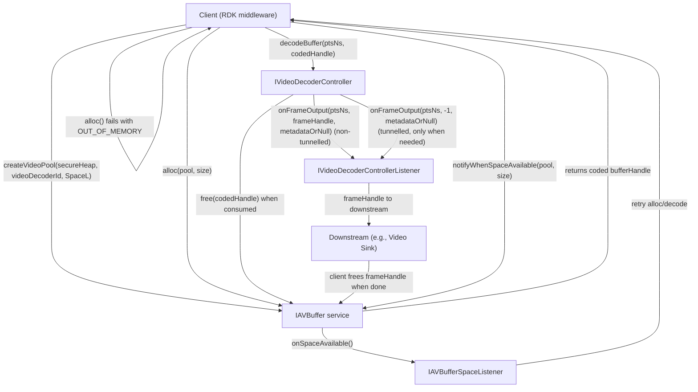

<!--
MongoDB Document Metadata:
- Original File Path: kavia-docs/videodecoder/pipeline_dataflow.md
- Operation: write
- Timestamp: 2026-02-10T12:51:22.906252+00:00
- Restored At: 2026-02-23T05:04:11.251429+00:00
- Task ID: cm219d4578
-->

# Video Decoder Pipeline Data Flow (HALIF AIDL)

## Overview

This document describes the Video Decoder pipeline data flow from coded (compressed) input to decoded output, as defined by the HALIF AIDL Video Decoder and AV Buffer specifications.

The Video Decoder consumes coded video frames as `IAVBuffer` handles submitted via `IVideoDecoderController.decodeBuffer(nsPresentationTime, bufferHandle)` and outputs decoded frames in presentation order. In **non-tunnelled** mode the decoded frame is returned to the client as an AV Buffer handle (to be queued to a sink and later freed). In **tunnelled** mode decoded frames are not returned to the client; the vendor layer passes decoded frames directly to the linked sink/plane, while still reporting frame metadata under specific rules.

Because the coded data itself travels via AV Buffer handles and the presentation time travels out-of-band as `nsPresentationTime` (nanoseconds), correct handling of timing, ownership transfer, and backpressure requires coordinating both HALs.

## Actors and data objects

### Main actors

The data path involves the following logical actors:

The client is typically an RDK middleware element (for example, a GStreamer Video Decoder element). It allocates coded frame buffers, fills them, submits them for decode, and (in non-tunnelled mode) receives decoded output handles and manages downstream lifetime.

The Video Decoder service consists of a resource instance (`IVideoDecoder`) and a per-session controller (`IVideoDecoderController`), with output delivered via `IVideoDecoderControllerListener`.

The AV Buffer service (`IAVBuffer`) provides secure/non-secure heaps, per-client pools, globally unique buffer handles, and an out-of-memory notification mechanism via `IAVBufferSpaceListener`.

### Primary data objects

A coded input frame is represented by an AV Buffer handle (`long bufferHandle`) allocated from a client-created pool via `IAVBuffer.alloc(pool, size)`.

A decoded output frame (non-tunnelled mode) is represented by an AV Buffer handle (`long frameBufferHandle`) delivered by `IVideoDecoderControllerListener.onFrameOutput(...)`.

Frame timing is represented by `long nsPresentationTime`, in nanoseconds, which is supplied to `decodeBuffer(...)` and echoed back in `onFrameOutput(...)` for the corresponding output.

Frame metadata is carried in the nullable `FrameMetadata` parcelable. The decoder does not necessarily send metadata with every frame; instead it follows “first frame after start/flush or metadata change” rules.

## High-level pipeline: coded input to decoded output

### Stage 1: Create pools and allocate coded input buffers

The client creates a video pool from the AV Buffer service with `createVideoPool(secureHeap, videoDecoderId, spaceListener)`. The pool sizing is vendor-defined, and the pool is targeted to a particular video decoder resource ID.

For each coded frame, the client allocates a buffer from that pool using `IAVBuffer.alloc(poolHandle, size)`.

For non-secure pools, the client can map/unmap the allocation and copy bytes into the mapped pointer using a vendor-provided helper library (the AV Buffer spec requires such a helper library). For secure pools, the buffer cannot be mapped by unprivileged processes, so the client must use vendor mechanisms to write into secure buffers (for example, helper “write”/copy operations that do not expose secure memory to the client).

### Stage 2: Submit coded input buffers to the decoder (ownership transfer)

Once the decoder session is `STARTED`, the client submits coded frames one frame at a time in stream order by calling:

`IVideoDecoderController.decodeBuffer(nsPresentationTime, bufferHandle)`

If this call returns `true`, the Video Decoder has accepted the frame, and ownership of `bufferHandle` transfers to the decoder. From that point, the client must not modify or free the buffer. The AIDL contract states that once processing completes, the buffer is “automatically released and returned to the AV Buffer Manager,” which in practice means the decoder must eventually free it via `IAVBuffer.free(bufferHandle)` (or an equivalent vendor-internal mechanism with the same effect).

If the call returns `false`, it indicates decoder-side backpressure (“decode buffer is full”). Ownership does not transfer in this case; the client remains responsible for the handle and must decide whether to retry later, reuse it, or free it.

### Stage 3: Decode and output in presentation order

The Video Decoder outputs decoded frames in presentation order regardless of the order of input frames (which follows encoder order). Output is delivered asynchronously to the client over the oneway `IVideoDecoderControllerListener` callback interface.

The primary output callback is:

`onFrameOutput(nsPresentationTime, frameBufferHandle, @nullable FrameMetadata metadata)`

The semantics of `frameBufferHandle` depend on operational mode:

In **non-tunnelled** mode, `frameBufferHandle` is a valid handle to a decoded 2D video frame buffer. It is returned in the same callback as any metadata for that frame, and the client is expected to pass it downstream (for example, to Video Sink) and later free it.

In **tunnelled** mode, decoded frames are not returned as handles. If a callback is made (for example, to deliver metadata), `frameBufferHandle` is `-1` to indicate “no frame handle.”

The secondary output callback is `onUserDataOutput(nsPresentationTime, userData)` which delivers picture user data in the same frame presentation order as the output frames. The frame output itself may be delivered before or after the corresponding user data callback.

### Stage 4: Release decoded output buffers (non-tunnelled mode)

In non-tunnelled mode, decoded output handles are finite resources, typically allocated from a vendor-managed output frame pool whose size is reported by the `OUTPUT_FRAME_POOL_SIZE` property. The client must free these frame handles via `IAVBuffer.free(frameBufferHandle)` once downstream consumption is complete.

The AV Buffer documentation explicitly calls out that in non-tunnelled mode, the client might still be holding decoded frame handles when a pipeline is stopped or flushed; in that case, the client still must free them.

## Data flow diagrams

### End-to-end dataflow (non-tunnelled and tunnelled)

## Ownership, handle transitions, and lifecycle invariants

### Global handle namespace enables cross-component freeing

The AV Buffer specification requires that buffer handles be globally unique across all pools and heaps, including vendor-private audio/video frame pools. This is what makes the pipeline ownership transfers viable:

The client allocates coded buffers and the decoder frees them after consumption.

The decoder allocates decoded frame buffers (non-tunnelled mode) and the client frees them after downstream consumption.

Because `IAVBuffer.free(handle)` is not restricted to the session that originally allocated the handle, these ownership transfers are safe and intentional.

### Ownership rules for coded input handles

When `decodeBuffer(...)` returns `true`, the coded input handle is owned by the decoder. The client must not free or modify it, and the decoder must free it exactly once when done.

When `decodeBuffer(...)` returns `false`, the decoder did not accept ownership. The client must not assume the decoder will free it, and the client must manage it as still owned.

During `stop()` and `flush(reset)`, the contract requires that any coded input buffers that have been passed for decode but have not yet been decoded are automatically freed. This provides a defined “release boundary” that clients can use to recover pool capacity and avoid leaks.

### Ownership rules for decoded output handles (non-tunnelled mode)

In non-tunnelled mode, `onFrameOutput(...)` delivers a decoded frame handle to the client. The client is responsible for freeing it once it is no longer needed downstream.

A common downstream pattern is to queue the handle into a sink component that eventually frees it. Regardless of which downstream component calls `free`, the pipeline must ensure that every decoded frame handle is eventually freed, including on teardown or flush scenarios.

### Pool lifecycle ordering

Pools can only be destroyed when empty. If any allocations remain outstanding, `destroyPool(pool)` throws a service-specific error `HALError::NOT_EMPTY`. A correct teardown therefore requires that:

The decoder is stopped/closed so it no longer holds coded input handles.

Any client-held coded input handles that were never submitted are freed.

All decoded output handles held by the client/downstream (non-tunnelled mode) are freed.

Only then is `destroyPool(pool)` expected to succeed.

## Timing and PTS considerations

### Nanosecond time base and out-of-band timestamps

The presentation time base units are nanoseconds, represented as a 64-bit integer (`long`). The time is not embedded in the AV Buffer handle; it is carried out-of-band:

The client passes `nsPresentationTime` to `decodeBuffer(...)` for each coded frame.

The decoder uses the same `nsPresentationTime` in output callbacks, including `onFrameOutput(...)` for frame handles and/or metadata.

### Presentation order vs submission order

The decoder is required to output frames in presentation order, even though coded frames are submitted in encoder order. This is relevant for B-frame reorder and other codec reordering behaviors.

Client implication: the client should not assume that output callbacks are in the same order as decode submissions. Any downstream queuing logic should treat callback order as authoritative for presentation.

### Discontinuities

If the client has knowledge of PTS discontinuities in the stream, it calls `signalDiscontinuity()` between `decodeBuffer()` submissions.

For the first input frame submitted after this call, the decoder is required to indicate the discontinuity in the next output `FrameMetadata` by setting `FrameMetadata.discontinuity` appropriately.

### End-of-stream (EOS)

When the client knows it has delivered the final coded frame, it calls `signalEOS()`.

After EOS is signaled, no more AV buffers should be delivered unless the decoder is first flushed or stopped and started again.

After all frames have been output, the decoder must emit a `FrameMetadata` with `endOfStream=true` via an `onFrameOutput(...)` callback.

## Backpressure and flow control

### Backpressure point 1: Decoder internal queue / output pool (decodeBuffer returns false)

The Video Decoder controller expresses decoder-side backpressure through the return value of `decodeBuffer(...)`:

`false` means the decode buffer is full.

One common reason is output congestion in non-tunnelled mode: decoded frame handles come from a vendor-managed output frame pool. If the pool is empty because downstream has not freed frames, the decoder cannot output the next frame. While output is blocked, the spec states it is reasonable for the decoder to either buffer additional coded inputs or reject new `decodeBuffer()` calls by returning `false`.

Client implication: clients should treat `false` as a normal flow-control signal. They should retry later with pacing and ensure downstream is freeing decoded frame handles promptly.

### Backpressure point 2: AV Buffer pool exhaustion (alloc throws OUT_OF_MEMORY)

The AV Buffer service expresses memory pressure through `alloc(...)` raising a service-specific out-of-memory status: `HALError::OUT_OF_MEMORY`.

The specified recovery mechanism is:

The client requests notification when enough space becomes available for an allocation of a given size using `notifyWhenSpaceAvailable(pool, size)`.

The AV Buffer service later calls `onSpaceAvailable()` on the `IAVBufferSpaceListener` that was provided when the pool was created.

The client retries allocation only after it receives that callback, or at least when it believes space has become available.

A critical lifetime requirement is that the `IAVBufferSpaceListener` object must remain valid for the entire lifetime of the pool and can only be destroyed after `destroyPool()` returns.

### Coordinating both backpressure mechanisms

Both backpressure mechanisms can apply simultaneously:

The client might be able to allocate coded buffers but not submit them because `decodeBuffer(...)` returns `false`.

The client might want to submit frames but cannot allocate new coded buffers because `alloc(...)` fails due to out-of-memory.

Robust pipelines usually treat these as two layers of flow control and apply throttling in both the allocation path and the submission path.

## Error and recovery paths

### Programming/contract violations (synchronous errors)

The AIDL contracts specify common Binder exceptions for invalid usage:

`decodeBuffer(...)` requires the decoder to be in `STARTED` and can throw `EX_ILLEGAL_STATE` otherwise.

`decodeBuffer(...)` can throw `EX_ILLEGAL_ARGUMENT` for invalid parameters.

`createVideoPool(...)` can throw `EX_ILLEGAL_ARGUMENT` for invalid decoder IDs.

`trimSize(...)` can throw `EX_ILLEGAL_STATE` if the buffer handle is not the last allocation from the pool.

Client implication: these are typically “programming errors” and should be treated as immediate failures requiring fixing call ordering or inputs.

### Runtime decode errors (asynchronous onDecodeError)

Runtime decode failures are signaled asynchronously via `IVideoDecoderEventListener.onDecodeError(errorCode, vendorErrorCode)`.

The `ErrorCode` enum is defined by the video decoder HAL, and a `vendorErrorCode` provides implementation-specific detail. The specific set of errors depends on the `ErrorCode` definition (in this workspace it is currently a placeholder), but the callback path is normative: decode failures are reported out-of-band from `decodeBuffer()`.

Client implication: on decode error, the client generally needs to decide whether to continue, flush, stop/start, or close/reopen depending on severity and vendor guidance. Buffer cleanup rules still apply: the decoder must free any queued coded buffers during flush/stop, and the client must free any decoded outputs it still holds.

### Flush/stop as cleanup boundaries

Both `flush(reset)` and `stop()` are explicitly required to automatically free coded input buffers that were submitted but not yet decoded. Additionally, flush returns pending decoded frames due for callback back to the output frame pool.

Client implication: if the pipeline suspects it is stuck due to resource pressure (for example, coded buffers accumulating and pool space not returning), `flush(...)` or `stop()` provides a defined boundary that forces the decoder to release queued inputs.

### Client crash and implicit cleanup

The Video Decoder requirements state that if a client process exits, the Video Decoder server must automatically stop and close any instance controlled by that client.

Service implication: the server implementation must ensure that implicit stop/close performs buffer cleanup equivalent to explicit calls, so that coded buffers accepted by the decoder are not leaked and pool resources are returned.

## Secure vs non-secure pipeline considerations

### Secure heaps and secure sessions

AV Buffer provides secure and non-secure heaps. Secure heap allocations cannot be mapped into unprivileged processes, and must meet secure video path requirements.

The Video Decoder open call includes a `secure` boolean flag. The secure pipeline requirement states that encoded and decoded data in secure buffers must not be exposed outside of the secure video pipeline, and secure coded input buffers must always be output as secure decoded frames.

Client implication: secure playback typically requires:

Using `createVideoPool(true, ...)` for coded buffers intended for a secure decoder session.

Opening the decoder with `secure=true`.

Ensuring downstream components (in non-tunnelled mode) can accept and correctly free secure decoded frame handles without mapping them in untrusted contexts.

### Tunnelled mode and exposure boundaries

In tunnelled mode, decoded frames are never returned to the client as buffers. This reduces exposure of decoded video data and places AV sync responsibilities inside the vendor layer when audio and video are linked.

The metadata rules still apply, but when operating exclusively in tunnelled mode and there is no metadata to be passed, no `onFrameOutput()` call should be made.

## References

### Upstream HALIF documentation (deep links)

1. Video Decoder HALIF (current)  
   https://rdkcentral.github.io/rdk-halif-aidl/0.12.0/halif/video_decoder/current/video_decoder/

2. AV Buffer HALIF (current)  
   https://rdkcentral.github.io/rdk-halif-aidl/0.12.0/halif/av_buffer/current/av_buffer/

### Local repository sources used to ground this document

1. Video Decoder HAL markdown  
   `rdk-halif-aidl-17/docs/halif/video_decoder/current/video_decoder.md`

2. AV Buffer HAL markdown  
   `rdk-halif-aidl-17/docs/halif/av_buffer/current/av_buffer.md`

3. Video Decoder controller interface  
   `rdk-halif-aidl-17/videodecoder/current/com/rdk/hal/videodecoder/IVideoDecoderController.aidl`

4. Video Decoder controller listener interface  
   `rdk-halif-aidl-17/videodecoder/current/com/rdk/hal/videodecoder/IVideoDecoderControllerListener.aidl`

5. Video Decoder frame metadata definition  
   `rdk-halif-aidl-17/videodecoder/current/com/rdk/hal/videodecoder/FrameMetadata.aidl`

6. AV Buffer interface and space listener  
   `rdk-halif-aidl-17/avbuffer/current/com/rdk/hal/avbuffer/IAVBuffer.aidl`  
   `rdk-halif-aidl-17/avbuffer/current/com/rdk/hal/avbuffer/IAVBufferSpaceListener.aidl`
