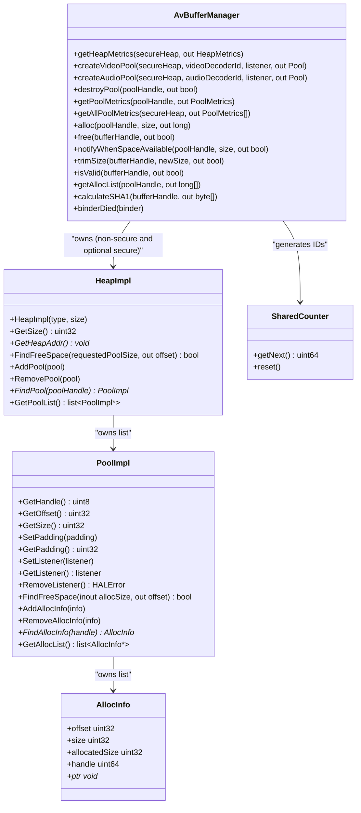

<!--
MongoDB Document Metadata:
- Original File Path: 10002556%2FTEVDevice/docs/tevdevice-avbuffer-implementation-design.md
- Operation: write
- Timestamp: 2026-02-19T08:51:34.361543+00:00
- Restored At: 2026-02-23T05:04:11.254010+00:00
- Task ID: cm219d4578
-->

# VDevice_AVBuffer Implementation Design

## Overview

The vDevice repository implements the HALIF AVBuffer HAL as a Binder service that publishes the AIDL interface `com.rdk.hal.avbuffer.IAVBuffer` under the service name `"AVBuffer"`. The service manages a backing heap (currently non-secure shared memory) and allocates pool regions within that heap. Clients create pools for audio or video and then allocate/free buffers by handle.

The design has three main layers:

1. A **service entrypoint** that validates configuration and publishes the binder service.
2. The **AIDL binder service implementation** (`AvBufferManager`) that implements the `IAVBuffer` methods, manages heaps, pools, and callback lifecycle, and performs most policy decisions.
3. **Heap and pool helper classes** (`HeapImpl`, `PoolImpl`, `AllocInfo`) that implement the memory-region and allocation bookkeeping.

## Code locations

The VDevice_AVBuffer implementation is located in the following files:

- Service entrypoint: `../src/service/vcomponent_BufferService.cpp`
- AIDL service implementation:
  - `../include/avbuffer/vcomponent_AvBufferManager.h`
  - `../src/aidl/vcomponent_AvBufferManager.cpp`
- Heap implementation:
  - `../include/avbuffer/vcomponent_HeapHal.h`
  - `../src/utility/vcomponent_HeapHal.cpp`
- Pool and allocation implementation:
  - `../include/avbuffer/vcomponent_PoolHal.h`
  - `../src/utility/vcomponent_PoolHal.cpp`
- Logging:
  - `../include/avbuffer/vcomponent_HalLogger.h`
  - `../src/utility/vcomponent_HalLogger.cpp`
- Configuration (HFP YAML):
  - `../vcomponent_configurations/hfp-avbuffer.yaml`

## High-level architecture

### Component diagram

```mermaid
flowchart TD
  Client["Client process<br/>RDK MW or vendor client"] -->|Binder IPC| SM["Service Manager"]
  SM -->|getService('AVBuffer')| Client
  SM -->|publish service| Svc["RDKAVBufferService process<br/>vcomponent_BufferService.cpp"]

  Svc --> Mgr["AvBufferManager<br/>BnAVBuffer implementation"]

  Mgr --> HeapNS["HeapImpl (non-secure)<br/>shared memory heap"]
  Mgr -->|creates/removes| Pool["PoolImpl<br/>pool region in heap"]
  Pool --> Alloc["AllocInfo<br/>allocation bookkeeping"]
  HeapNS --> SHM["POSIX shm_open + mmap<br/>AVBUFFER_SHARED_MEMORY_NAME"]
```

### Responsibilities

The `AvBufferManager` is responsible for:

- Publishing under the correct AIDL service name.
- Parsing the HFP YAML configuration (heap sizes and “DecoderID”).
- Creating a non-secure heap mapping using `HeapImpl`.
- Creating pools (`PoolImpl`) with a globally unique pool handle.
- Allocating and freeing buffers by handle, and computing pool/heap metrics.
- Managing per-pool `IAVBufferSpaceListener` lifetime and binder death cleanup.
- Managing pending “space available” notification requests and firing callbacks.

The heap and pool helpers are responsible for:

- Heap: shared memory creation/mapping, pool list ordering, and free-space search.
- Pool: tracking allocations, computing offsets and pointers for allocations, and basic allocation free-space search.

## Service entrypoint design

The service entrypoint is `main()` in `vcomponent_BufferService.cpp`. It performs:

- `signal(SIGPIPE, SIG_IGN)` to avoid termination on SIGPIPE.
- CLI validation: the service requires one argument, the path to the AVBuffer HFP YAML.
- Readability check for that file (using `access(path, R_OK)`).
- Setting `com::rdk::hal::avbuffer::AvBufferManager::_avbufferHFPPath` with the provided path.
- Publishing the binder service and joining the binder thread pool via `AvBufferManager::publishAndJoinThreadPool()`.

This structure ensures the configuration path is available to the manager before the service is published.

## Configuration: HFP YAML

The default configuration file in this repository is:

- `../vcomponent_configurations/hfp-avbuffer.yaml`

It contains keys such as:

- `avbuffer/nonSecureHeapBytes`
- `avbuffer/secureHeapBytes`
- `avbuffer/DecoderID`

The “DecoderID” key is used by this implementation as a decoder-count parameter. It influences:

- pool sizing (heap divided by the decoder-count), and
- audio/video decoder-id validation (a simple range check against the decoder-count).

The manager can also read the config path from the environment variable `AVBUFFER_HFP_PATH`, but the service entrypoint explicitly sets the static member `_avbufferHFPPath` from argv.

## Internal classes and relationships

### Class diagram



### Thread-safety model

The `AvBufferManager` serializes most binder-visible operations using a **global recursive mutex** (`_avb_lock`). This lock is used heavily to protect heap/pool/allocation state.

The `PoolImpl` has its own recursive mutex (`_lock`) intended to guard **listener-related state** (`_listener` and `_notifyWhenSpaceAvailable`) only. Allocation-list operations are documented as expected to be protected by the higher-level manager lock.

One important design detail is that the implementation tries to avoid invoking binder callbacks while holding `_avb_lock` during space-available notifications, to reduce the risk of deadlock or re-entrancy issues.

## Heap and memory model

### Non-secure heap implementation

`HeapImpl` creates a non-secure heap backed by POSIX shared memory:

- `shm_open(AVBUFFER_SHARED_MEMORY_NAME, O_CREAT | O_EXCL | O_RDWR, 0666)`
- `ftruncate(fd, heapSize)`
- `mmap(..., MAP_SHARED, fd, 0)`

If the shared memory object already exists (for example after a previous crash), the implementation unlinks it and retries once.

Pools are placed as contiguous regions in the heap mapping. `HeapImpl::FindFreeSpace()` scans gaps between existing pools (ordered by offset) and then checks the tail region.

### Secure heap implementation status

`HeapImpl` currently logs that secure heaps are not supported and returns early without creating a mapping. Additionally, `AvBufferManager::createVideoPool(true, ...)` and `createAudioPool(true, ...)` reject secure pools with `EX_ILLEGAL_ARGUMENT`.

In practice, this means secure heap support is present as API shape but not implemented as a usable data path in VDevice_AVBuffer today.

## Pool design

A pool is represented by:

- A `Pool` AIDL parcelable handle (`byte handle` in AIDL), and
- A `PoolImpl` server-side object which tracks:
  - heap offset and pool size,
  - a pool-specific listener (`IAVBufferSpaceListener`),
  - allocation padding policy,
  - allocation list and usage stats.

Pool handles are selected to be globally unique across heaps in the range 0..127, which aligns with the recommendation in the HALIF `av_buffer.md` document.

## Allocation design

Allocations are represented by `AllocInfo` records stored inside the owning `PoolImpl`.

When allocating:

- `AvBufferManager::alloc()` looks up the `PoolImpl`.
- The pool applies:
  - per-pool padding (`PoolImpl::GetPadding()`; video pools set padding to 64 bytes), and
  - pool-wide minimum size and alignment (`PoolImpl::minAllocSize` and `PoolImpl::byteAllignment`).
- `PoolImpl::FindFreeSpace()` selects an offset.
- The manager generates a handle using `SharedCounter` and encodes the pool id in the top byte.

When freeing:

- `AvBufferManager::free()` scans pools in the non-secure heap and removes the allocation record by handle.

## Logging and observability

Logging is performed via:

- `LOG(level, ...)` macro in `vcomponent_HalLogger.h`, which calls `HALUTIL_Logger_Message(...)`.
- The logger prints PID and TID, source file, function, line, and message.

The logger filters out `eTrace` messages by default (only `eWarning` and above are printed) unless `s_VerboseLog` is enabled.

## Known gaps and implementation notes

This section summarizes notable deviations or partial implementations that clients should be aware of.

### Secure heap is not supported

The AIDL supports secure heaps, and HALIF documentation expects them. VDevice_AVBuffer currently rejects secure pool creation and does not map a secure heap.

### `trimSize()` does not enforce “must be last allocation”

The AIDL contract states that trimming is only legal for the last allocated buffer in a pool, and should raise `EX_ILLEGAL_STATE` otherwise. VDevice_AVBuffer implements trimming as a best-effort size reduction without enforcing the “last allocated” requirement.

### `getAllPoolMetrics(secureHeap)` does not use the parameter

The implementation chooses the heap based on whether `_secureHeap` is non-null, rather than the `secureHeap` argument, which can lead to unexpected results.

### HFP parsing naming vs behavior

The manager method `loadHfpConfigNoThrow()` is named as if it never throws, but the current implementation contains `throw std::runtime_error(...)` on missing or invalid required keys. This means configuration errors can terminate the service during construction.

## Sources

This document is based on:

- `../src/service/vcomponent_BufferService.cpp`
- `../include/avbuffer/vcomponent_AvBufferManager.h`
- `../src/aidl/vcomponent_AvBufferManager.cpp`
- `../include/avbuffer/vcomponent_HeapHal.h`
- `../src/utility/vcomponent_HeapHal.cpp`
- `../include/avbuffer/vcomponent_PoolHal.h`
- `../src/utility/vcomponent_PoolHal.cpp`
- `../include/avbuffer/vcomponent_HalLogger.h`
- `../src/utility/vcomponent_HalLogger.cpp`
- `../vcomponent_configurations/hfp-avbuffer.yaml`
- `rdk-halif-aidl-17/docs/halif/av_buffer/current/av_buffer.md`
