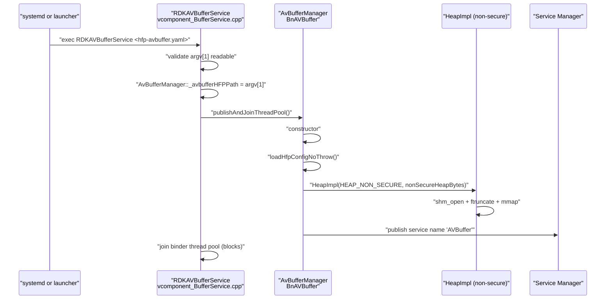
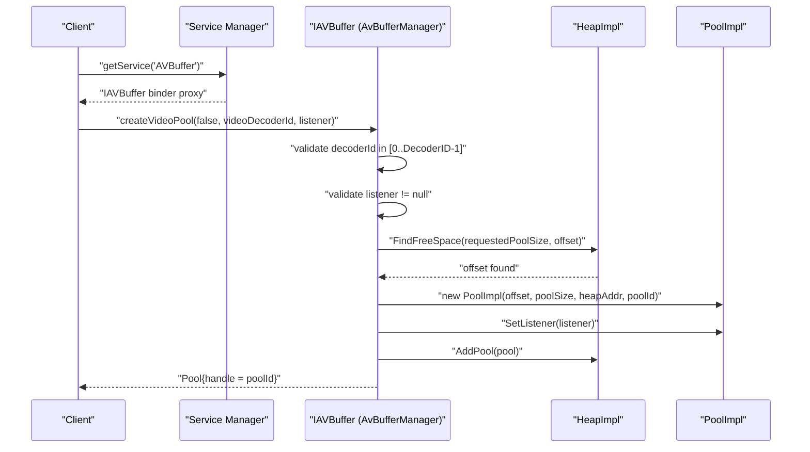
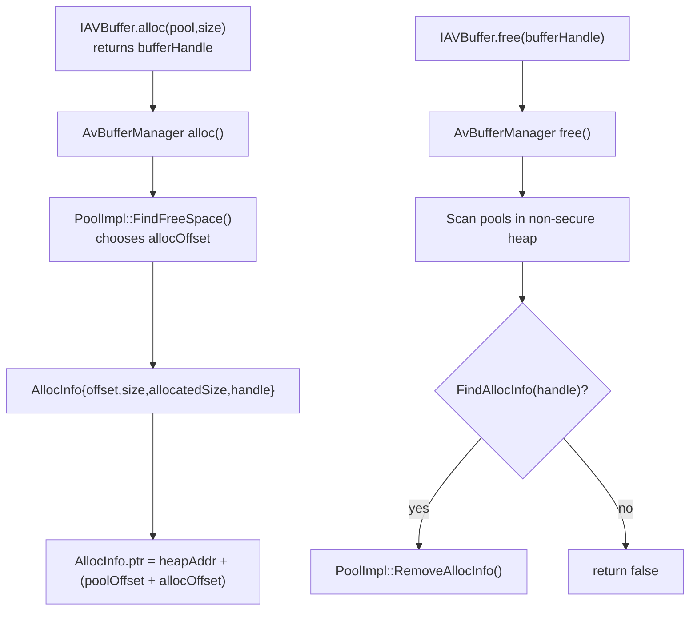
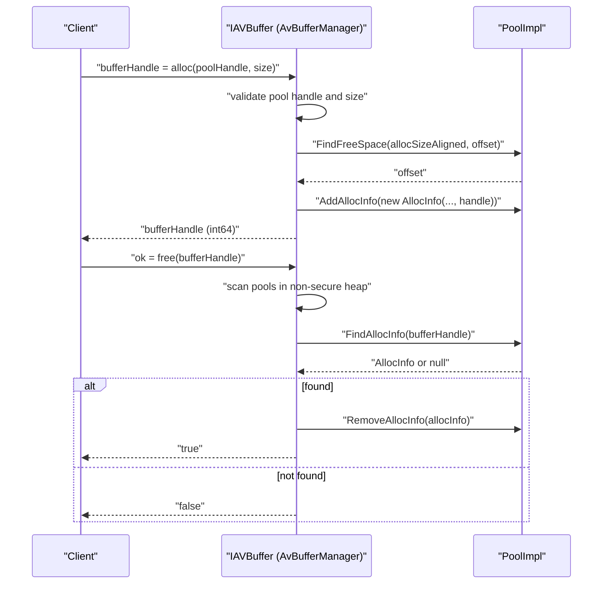
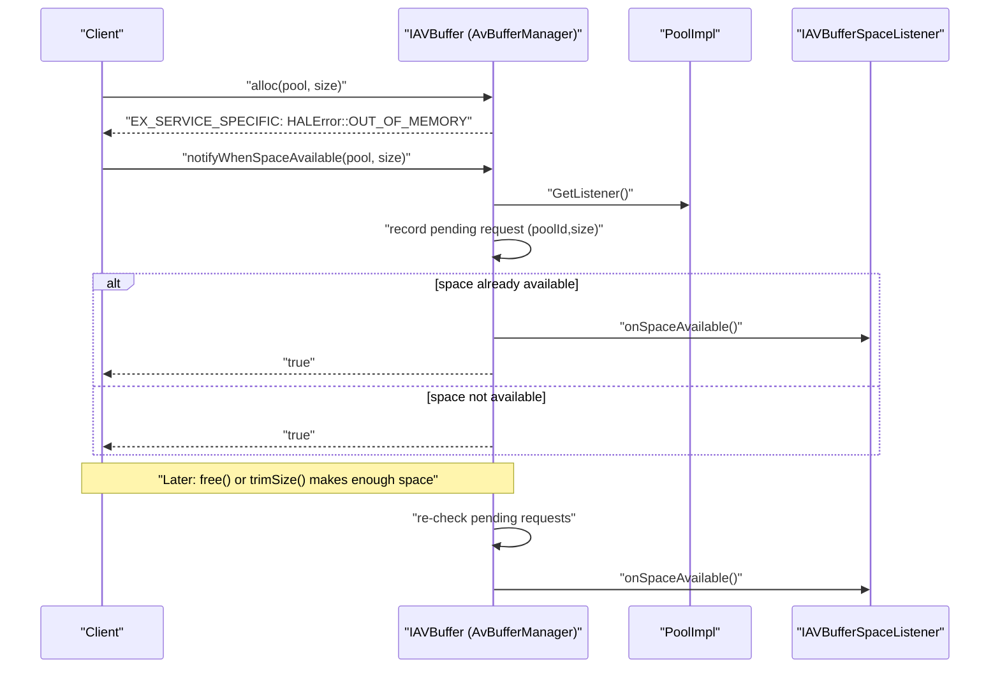
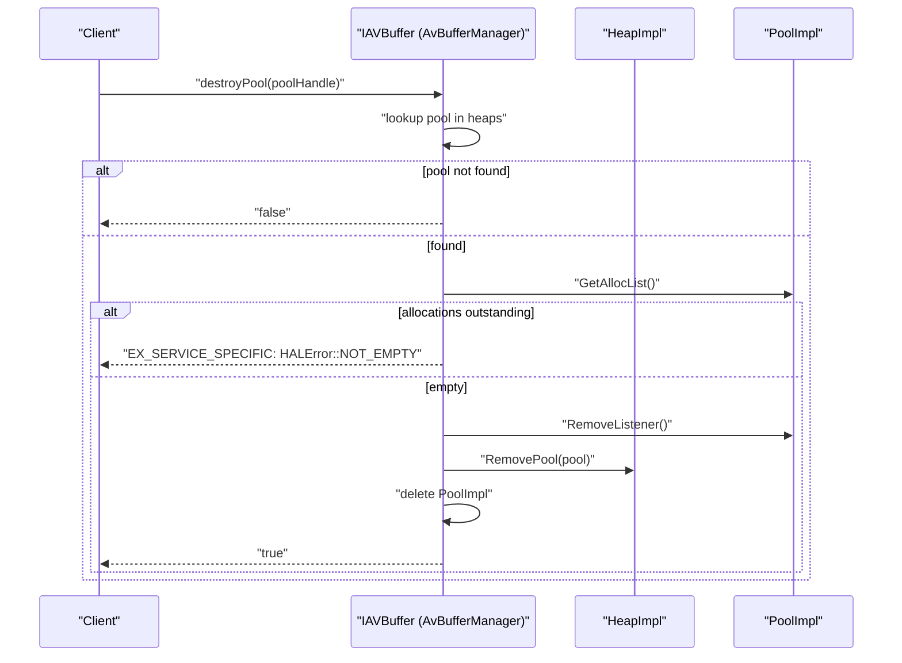
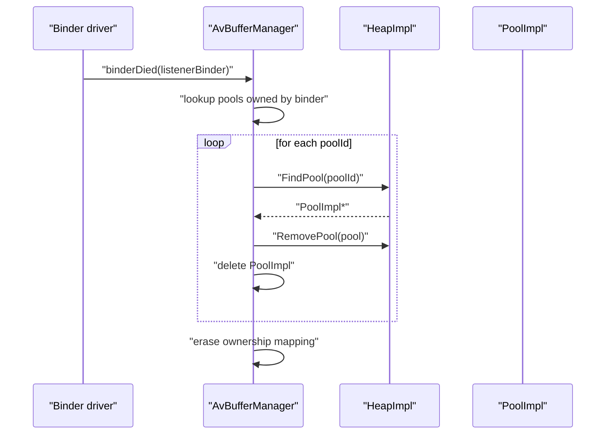

<!--
MongoDB Document Metadata:
- Original File Path: 10002556%2FTEVDevice/docs/tevdevice-avbuffer-runtime-flows.md
- Operation: write
- Timestamp: 2026-02-19T08:51:59.148260+00:00
- Restored At: 2026-02-23T05:04:11.254126+00:00
- Task ID: cm219d4578
-->

# VDevice_AVBuffer Runtime Flows

## Overview

This document describes runtime behavior of VDevice_AVBuffer’s AVBuffer service in terms of:

- sequence diagrams (control flow),
- data-flow diagrams (buffer/handle lifecycle), and
- notes on how these flows relate to the HALIF AVBuffer AIDL contract.

The upstream AVBuffer contract and reference behavior are defined by:

- `rdk-halif-aidl-17/avbuffer/current/com/rdk/hal/avbuffer/IAVBuffer.aidl`
- `rdk-halif-aidl-17/docs/halif/av_buffer/current/av_buffer.md`

The VDevice_AVBuffer implementation is defined by:

- `../src/service/vcomponent_BufferService.cpp`
- `../src/aidl/vcomponent_AvBufferManager.cpp`
- heap/pool helpers in `../src/utility/`

## Startup and service publication

### Sequence: startup, configuration, binder publish

### Notes

The service name is derived from the upstream AIDL constant `IAVBuffer.serviceName` which is `"AVBuffer"`. VDevice_AVBuffer uses this string via `IAVBuffer::serviceName()` in `AvBufferManager::getServiceName()`.

## Pool lifecycle

### Sequence: create a non-secure pool

In VDevice_AVBuffer’s current implementation, pool creation is supported only for the non-secure heap. Requests for `secureHeap=true` return an illegal argument exception.

### VDevice_AVBuffer pool sizing policy

HALIF states that pool sizes are vendor-defined. VDevice_AVBuffer uses a simple policy:

- `requestedPoolSize = heapSize / DecoderID` (where `DecoderID` is read from HFP YAML and treated as a decoder-count parameter).

## Buffer lifecycle

### Data flow: handle-to-memory mapping in VDevice_AVBuffer

VDevice_AVBuffer’s heap is an `mmap()`-ed shared memory region, and allocations are represented by handles. Internally:

- the allocation record (`AllocInfo`) stores `offset` (pool-relative), `size` and `allocatedSize`,
- the pool computes `ptr = heapAddr + (poolOffset + allocOffset)`.

The allocation pointer is used within the service process for bookkeeping and validation. The upstream HALIF design expects a helper library (`libavbufferhelper`) for mapping/unmapping non-secure buffers in client processes, but that helper library is not implemented in the vDevice code in this repository.

### Sequence: allocation and free

## Out-of-memory and notifyWhenSpaceAvailable

### Contract intent (HALIF)

HALIF describes that when `alloc()` fails with out-of-memory, the client can call `notifyWhenSpaceAvailable(pool,size)`. When enough space becomes available to satisfy an allocation of that size, the service should invoke `IAVBufferSpaceListener.onSpaceAvailable()` on the listener that was passed during pool creation.

### VDevice_AVBuffer design

VDevice_AVBuffer stores a per-pool set of pending requested sizes. It attempts to:

- fire the callback immediately if the pool can already satisfy the request, and
- fire callbacks after operations that can create space (for example `trimSize()`, and potentially after frees depending on call sites).

The code avoids calling binder callbacks while holding the global lock.

### Sequence: OOM then notify then callback

## Trimming behavior

### Contract intent (AIDL)

The AIDL contract states:

- only the last allocated block from a pool may be trimmed, and
- if a non-last buffer is passed, `EX_ILLEGAL_STATE` should be returned.

### VDevice_AVBuffer behavior

VDevice_AVBuffer updates `AllocInfo::size` and may reduce `AllocInfo::allocatedSize` with alignment and padding constraints, but it does not enforce the “must be last allocation” rule. After trimming, VDevice_AVBuffer re-checks pending notify requests and may fire callbacks.

## Pool destruction

### Sequence: destroyPool

## Binder death cleanup

VDevice_AVBuffer uses binder death notifications to clean up pools when the client process that provided the listener dies unexpectedly. The manager tracks pools by the listener binder pointer and then force-destroys those pools on `binderDied()`.

This cleanup is best-effort and does not enforce the “pool must be empty” AIDL requirement that normally applies to `destroyPool()`.

## Sources

This document is based on:

- `../src/service/vcomponent_BufferService.cpp`
- `../src/aidl/vcomponent_AvBufferManager.cpp`
- `../include/avbuffer/vcomponent_AvBufferManager.h`
- `../include/avbuffer/vcomponent_HeapHal.h`
- `../src/utility/vcomponent_HeapHal.cpp`
- `../include/avbuffer/vcomponent_PoolHal.h`
- `../src/utility/vcomponent_PoolHal.cpp`
- `rdk-halif-aidl-17/avbuffer/current/com/rdk/hal/avbuffer/IAVBuffer.aidl`
- `rdk-halif-aidl-17/avbuffer/current/com/rdk/hal/avbuffer/IAVBufferSpaceListener.aidl`
- `rdk-halif-aidl-17/docs/halif/av_buffer/current/av_buffer.md`
