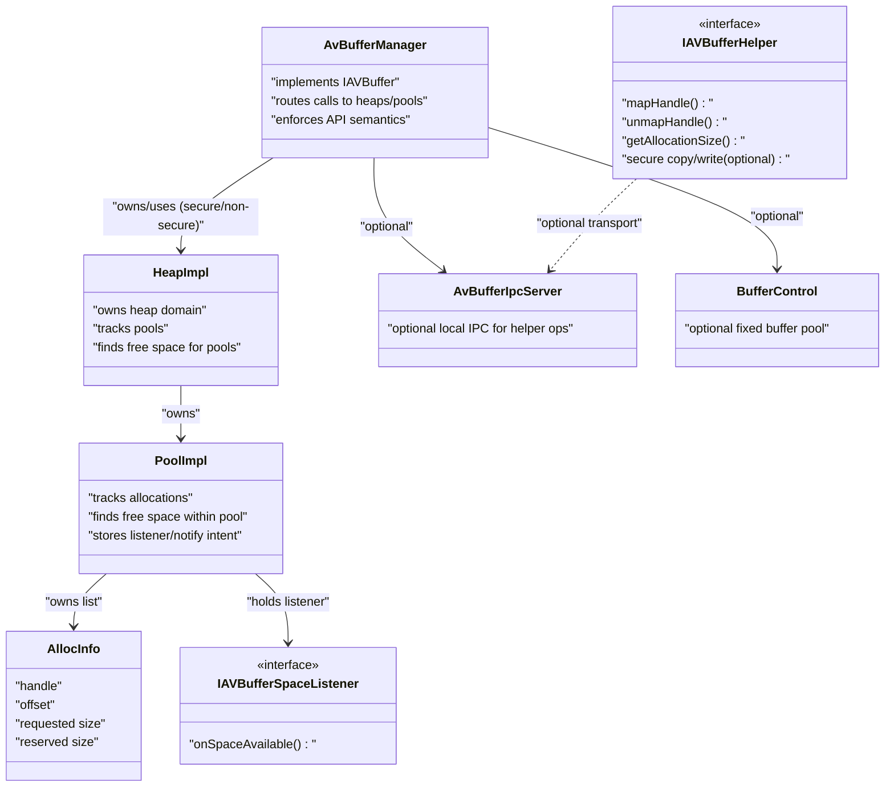
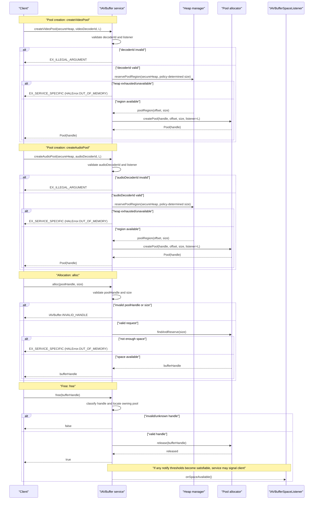

<!--
MongoDB Document Metadata:
- Original File Path: kavia-docs/CodeWiki/Specs/DetailedDesigns/vDevice_AVBuffer.md
- Operation: write
- Timestamp: 2026-01-27T11:48:20.357142+00:00
- Restored At: 2026-02-23T05:04:11.249077+00:00
- Task ID: cm219d4578
-->

# AVBuffer Design Document

## Table of Contents

- [Overview](#overview)
- [Core Concepts](#core-concepts)
- [Architecture and Responsibilities](#architecture-and-responsibilities)
- [Sequence Diagram (create pools, alloc, free)](#sequence-diagram-create-pools-alloc-free)
- [Public API: IAVBuffer Overrides (Signatures, Purpose, Examples)](#public-api-iavbuffer-overrides-signatures-purpose-examples)
- [Allocation/Free Algorithm Trace (Worked Example)](#allocationfree-algorithm-trace-worked-example)
- [Lifecycle and Error Semantics](#lifecycle-and-error-semantics)
- [Thread Safety and Callback Guidance](#thread-safety-and-callback-guidance)
- [References](#references)

## Overview

### Purpose and scope

This document describes an implementation-agnostic design for the vDevice AVBuffer HAL service that conforms to the `com.rdk.hal.avbuffer.IAVBuffer` AIDL contract. It focuses on the key runtime concepts (heaps, pools, allocation handles), lifecycle rules, error semantics, and the expected responsibilities of the main service components.

Where it helps clarity, the document uses the concrete class names used in the current workspace (for example `AvBufferManager`, `HeapImpl`, and `PoolImpl`) as representative roles. This is intended to support readers who will navigate the current reference implementation, but the design itself does not depend on any single backing-store or locking strategy.

### Normative references

The normative AVBuffer public contract is defined by the AIDL interface and related parcelables:

- `https://github.com/rdkcentral/rdk-halif-aidl/tree/develop/avbuffer/current/com/rdk/hal/avbuffer/IAVBuffer.aidl`
- `https://github.com/rdkcentral/rdk-halif-aidl/tree/develop/avbuffer/current/com/rdk/hal/avbuffer/Pool.aidl`
- `https://github.com/rdkcentral/rdk-halif-aidl/tree/develop/avbuffer/current/com/rdk/hal/avbuffer/PoolMetrics.aidl`
- `https://github.com/rdkcentral/rdk-halif-aidl/tree/develop/avbuffer/current/com/rdk/hal/avbuffer/HeapMetrics.aidl`
- `https://github.com/rdkcentral/rdk-halif-aidl/tree/develop/avbuffer/current/com/rdk/hal/avbuffer/IAVBufferSpaceListener.aidl`

## Core Concepts

### Heaps

A heap is a vendor-managed memory domain from which pools are created. The `IAVBuffer` API distinguishes:

- A non-secure heap (`secureHeap=false`) intended to support client mapping.
- A secure heap (`secureHeap=true`) intended to restrict direct mapping and to enforce handle-only semantics.

In the vDevice MVP context, secure video (and therefore “secure buffer” behavior needed for protected video paths) may be out of scope; however, the API surface still includes secure heap selection and the design must remain compatible with the AIDL contract.

### Pools

A pool is a reserved subrange of a heap used to satisfy allocations. Pools are represented in the AIDL API by:

- `Pool` parcelable containing `byte handle`.
- `Pool.INVALID_POOL = -1` as the invalid handle sentinel.

Pools exist to:

- Isolate allocation and fragmentation within a bounded memory region.
- Associate a single `IAVBufferSpaceListener` with a specific pool for out-of-memory recovery flows.

### Allocation handles

Allocations are returned as 64-bit handles (`long` in AIDL). The API contract treats handles as opaque tokens; an implementation may encode routing information (for example pool ID) inside the handle, but clients must not depend on that encoding.

Handles are used for:

- `free(handle)` to release memory.
- `isValid(handle)` to validate an existing handle.
- Helper operations such as mapping a non-secure handle to bytes, or copying into/out of secure handles (if implemented).

### Space-available listener

A client supplies an `IAVBufferSpaceListener` when creating a pool. After an out-of-memory allocation failure, the client can call `notifyWhenSpaceAvailable(pool, size)` so the service can later deliver:

- `oneway void onSpaceAvailable()`

This callback acts as a “wake up and retry allocation” signal; it is not required to include the pool handle in the callback per the current AIDL definition.

## Architecture and Responsibilities

This section describes the responsibilities and relationships for the relevant classes/roles referenced in this workspace. Even when names are taken from the current implementation, these should be treated as roles that any conforming implementation should fulfill.

### AvBufferManager (service implementation role)

`AvBufferManager` is the binder-exposed implementation of the `IAVBuffer` interface. Its responsibilities include:

- Implementing every `IAVBuffer` method with correct return semantics, including when to return booleans/invalid handles vs throwing binder exceptions vs returning service-specific errors.
- Coordinating heap and pool objects (selecting secure vs non-secure heap, ensuring pool-handle uniqueness, tracking pool ownership/lifetime).
- Serializing access to heap/pool state such that concurrent Binder calls cannot corrupt allocator metadata.
- Managing the “space available” notification intent recorded via `notifyWhenSpaceAvailable()` and ensuring `onSpaceAvailable()` callbacks are delivered without deadlocking allocator state.

Relationship summary:

- Owns (or references) two heaps (`HeapImpl`) representing secure and non-secure memory domains.
- Creates and destroys pools (`PoolImpl`) within those heaps.
- Creates and deletes per-allocation metadata (`AllocInfo`) owned by a pool.
- Holds (directly or indirectly) a reference to `IAVBufferSpaceListener` per pool.
- Optionally cooperates with a helper/IPC subsystem to support mapping and size/offset queries.

### HeapImpl (heap manager role)

`HeapImpl` represents a heap and is responsible for:

- Owning or referencing the heap backing-store (for example shared memory, anonymous memory, or a secure broker mechanism).
- Reserving space for pools by finding free heap offsets for pool-sized regions.
- Tracking the set of pools carved from the heap and keeping that set in a consistent order (often sorted by offset) to support deterministic space searches and reproducible behavior in tests.

Relationship summary:

- Owns a list of pool objects (`PoolImpl*`) created within this heap.
- Provides “find free region” functionality that returns a heap-relative offset for a new pool.

Implementation note (agnostic): the backing store can be shared memory, a memory-mapped file, anonymous pages, or a handle-only secure domain. The AIDL contract does not require a specific approach, but it does require deterministic and correct behavior.

### PoolImpl (pool allocator role)

`PoolImpl` represents a pool and is responsible for:

- Tracking allocations inside the pool (commonly via a list of `AllocInfo` entries).
- Finding free space for new allocations, including supporting out-of-order frees and reusing holes (fragmentation-aware placement).
- Enforcing minimum allocation size and alignment behavior (as required by platform ABI rules and vendor policies).
- Tracking pool usage metrics (bytes used, bytes total) consistent with the AIDL definitions.
- Managing the space-available listener registration and any recorded “notify thresholds”.

Relationship summary:

- Owns a list of allocations (`AllocInfo*`) within the pool.
- Holds a strong reference to the pool’s listener (`IAVBufferSpaceListener`) and any notify threshold state used by `notifyWhenSpaceAvailable()`.

### AllocInfo (allocation metadata role)

`AllocInfo` is per-allocation metadata. Regardless of internal representation, the allocator typically needs to track:

- Pool-relative offset.
- Client-requested size.
- Internally reserved size (after padding/alignment), if applicable.
- Allocation handle token.
- (Optionally) a pointer into a mapped heap region for service-side access.

Clients should not assume internal fields exist, but tests often implicitly rely on consistent behavior: for example, that “bytes used” metrics count the requested sizes, not the padded sizes.

### HandleGenerator (handle codec role)

`HandleGenerator` represents the handle encoding/decoding logic. In a conforming design, responsibilities are:

- Provide a deterministic way to identify the pool (or allocation class) associated with a handle so `free()` and `isValid()` can route efficiently.
- Distinguish “heap-backed pool allocations” from any other allocation classes (for example frame pools) if the implementation supports multiple handle types.

Design constraint: handle encoding must remain opaque to clients. Any handle bits are internal to the vendor layer and can change as long as API behavior remains stable.

### BufferControl (frame-pool / fixed-buffer allocator role)

`BufferControl` represents a separate allocator strategy commonly used for pre-sized “frame pools” rather than variable-sized heap allocations. If present, its responsibilities typically include:

- Managing a fixed set of buffers (often via a shared control structure and a status array).
- Validating that a handle belongs to this pool and that it is currently allocated.
- Freeing a handle by marking an entry as free.

Relationship summary:

- `AvBufferManager` may route `free()` for certain handles to this path, depending on handle classification rules.

### AvBufferIpcServer (optional helper IPC role)

Some implementations include a local IPC service (for example over a Unix domain socket) to support “helper” operations such as:

- Translating a handle to an offset and/or allocation size (for mapping shared memory).
- Supporting specialized allocation/free operations in non-Binder contexts, if required.

In this workspace, this role is represented by `AvBufferIpcServer` with a versioned protocol header and opcodes. The design intent is:

- Keep the protocol versioned and reject incompatible clients early (magic + version).
- Keep request/response payload sizes explicit for forward compatibility.

### IAVBufferSpaceListener (client callback role)

The client listener exists to:

- Receive `onSpaceAvailable()` callbacks after `notifyWhenSpaceAvailable()` has been called and sufficient space becomes available due to other allocations being freed.

Because it is a `oneway` interface, callbacks should be treated as asynchronous signals. Clients are expected to retry allocations when notified.

### IAVBufferHelper (client helper library role)

`IAVBufferHelper` (from `avbufferhelper.h`) represents the client-side API for:

- Mapping and unmapping non-secure handles (e.g., shared memory view).
- Determining allocation size.
- Secure copy/write operations (optional; default implementations in the header return false).

The design intent is to keep “secure buffer contents” inaccessible via direct mapping and to implement secure operations via controlled primitives.

### Relationships diagram (role-level)



## Sequence Diagram (create pools, alloc, free)

This diagram focuses on the user-requested calls: `createVideoPool`, `createAudioPool`, `alloc`, and `free`. Lifelines represent logical roles, not threads or concrete classes.



## Public API: IAVBuffer Overrides (Signatures, Purpose, Examples)

This section lists the public `IAVBuffer` methods (as defined by AIDL) that a service implementation (for example `AvBufferManager`) must override, along with brief purpose and illustrative usage/response examples. Method signatures below are copied from `IAVBuffer.aidl` (AIDL form), then examples show typical client behavior.

### API overview table (AIDL signatures)

| AIDL method signature | Purpose (short) |
|---|---|
| `HeapMetrics getHeapMetrics(in boolean secureHeap);` | Query heap capacity and heap-level usage. |
| `Pool createVideoPool(in boolean secureHeap, in IVideoDecoder.Id videoDecoderId, in IAVBufferSpaceListener listener);` | Create a video pool associated with a decoder ID and listener. |
| `Pool createAudioPool(in boolean secureHeap, in IAudioDecoder.Id audioDecoderId, in IAVBufferSpaceListener listener);` | Create an audio pool associated with a decoder ID and listener. |
| `boolean destroyPool(in Pool poolHandle);` | Destroy a pool (must be empty). |
| `PoolMetrics getPoolMetrics(in Pool poolHandle);` | Query pool capacity and pool-level allocation usage. |
| `PoolMetrics[] getAllPoolMetrics(in boolean secureHeap);` | List metrics for all pools in a heap. |
| `long alloc(in Pool poolHandle, in int size);` | Allocate `size` bytes from a pool and return a handle. |
| `boolean notifyWhenSpaceAvailable(in Pool poolHandle, in int size);` | Ask for callback when `size` bytes become available. |
| `boolean trimSize(in long bufferHandle, in int newSize);` | Shrink an allocation (subject to last-allocation constraint per AIDL). |
| `boolean free(in long bufferHandle);` | Free an allocation handle. |
| `boolean isValid(in long bufferHandle);` | Validate whether a handle is currently allocated. |
| `long[] getAllocList(in Pool poolHandle);` | Debug API: list active allocation handles in a pool. |
| `byte[] calculateSHA1(in long bufferHandle);` | Debug-only API: hash buffer contents (optional; may be unsupported). |

### Examples: pool creation

#### `createVideoPool(...)`

Purpose: Create a pool for video allocations, tied to a video decoder ID and a listener that will receive `onSpaceAvailable()` callbacks.

Example (pseudocode):

```cpp
IAVBuffer avb = getService("AVBuffer");
IAVBufferSpaceListener listener = new MyListener();

Pool p = avb.createVideoPool(
  /* secureHeap */ false,
  /* videoDecoderId */ someVideoDecoderId,
  /* listener */ listener
);
// On success, p.handle != Pool.INVALID_POOL (-1).
```

Possible responses:

- Success: returns `Pool(handle)` where `handle != Pool.INVALID_POOL`.
- Invalid `videoDecoderId`: throws `EX_ILLEGAL_ARGUMENT`.
- Heap exhausted: throws `EX_SERVICE_SPECIFIC` with `HALError.OUT_OF_MEMORY`.
- Non-exceptional failure: returns `Pool(handle = Pool.INVALID_POOL)` (the AIDL describes this sentinel on failure; clients should treat it as failure even if no exception is thrown).

#### `createAudioPool(...)`

Purpose: Create a pool for audio allocations, tied to an audio decoder ID (or `IAudioDecoder.Id.UNDEFINED` for non-decoder audio use cases) and a listener.

Example (pseudocode):

```cpp
Pool p = avb.createAudioPool(
  /* secureHeap */ false,
  /* audioDecoderId */ IAudioDecoder.Id.UNDEFINED,
  /* listener */ listener
);
```

Possible responses:

- Success: returns `Pool(handle != INVALID_POOL)`.
- Invalid `audioDecoderId`: throws `EX_ILLEGAL_ARGUMENT`.
- Heap exhausted: throws `EX_SERVICE_SPECIFIC` with `HALError.OUT_OF_MEMORY`.

### Examples: alloc/free and typical recovery

#### `alloc(pool, size)`

Purpose: Allocate immediately; returns an allocation handle or fails.

Example (pseudocode):

```cpp
long h = avb.alloc(p, 4096);
if (h == IAVBuffer.INVALID_HANDLE) {
  // Invalid pool handle or invalid size (contract violation-ish, but non-exceptional).
}
```

Possible responses:

- Success: returns `h >= 0` (a valid handle).
- Invalid input: returns `IAVBuffer.INVALID_HANDLE` (invalid pool handle, or `size <= 0`, or `size > pool size`).
- Out of memory: throws `EX_SERVICE_SPECIFIC` with `HALError.OUT_OF_MEMORY`.

#### `free(handle)`

Purpose: Release a previously allocated handle.

Example (pseudocode):

```cpp
bool ok = avb.free(h);
if (!ok) {
  // Handle was invalid/unknown or already freed.
}
```

Possible responses:

- Success: returns `true`.
- Invalid handle: returns `false` (no exception required by the contract).

#### `notifyWhenSpaceAvailable(pool, size)` + listener callback

Purpose: After `alloc()` fails with out-of-memory, request a callback when the pool has enough space again.

Example (pseudocode):

```cpp
try {
  long h = avb.alloc(p, bytesNeeded);
} catch (ServiceSpecificException e) {
  if (e.errorCode == HALError.OUT_OF_MEMORY) {
    bool registered = avb.notifyWhenSpaceAvailable(p, bytesNeeded);
    // Later (asynchronously): listener.onSpaceAvailable() is invoked
    // and client can retry alloc().
  }
}
```

Possible responses:

- Success: returns `true` (callback should happen later when the condition is met).
- Invalid pool/size: returns `false`.

### Examples: metrics and debug APIs

#### `getPoolMetrics(pool)`

Purpose: Observe the pool’s `bytesTotal` and `bytesUsed`.

Example:

```cpp
PoolMetrics m = avb.getPoolMetrics(p);
// m.bytesTotal is the pool capacity.
// m.bytesUsed is the total bytes used by active allocations.
```

Possible responses:

- Success: returns `PoolMetrics`.
- Invalid pool handle: throws `EX_ILLEGAL_ARGUMENT`.

#### `getAllocList(pool)`

Purpose: Debug-only list of active allocation handles.

Example:

```cpp
long[] handles = avb.getAllocList(p);
```

Possible responses:

- Success: returns array (possibly empty).
- Invalid pool handle: throws `EX_ILLEGAL_ARGUMENT`.

#### `calculateSHA1(handle)`

Purpose: Debug-only integrity/hash check of buffer contents. AIDL permits `EX_UNSUPPORTED_OPERATION` when not implemented.

Example:

```cpp
try {
  byte[] sha1 = avb.calculateSHA1(h);
} catch (UnsupportedOperationException) {
  // Expected in production builds or when feature not implemented.
}
```

Possible responses:

- Success: returns SHA-1 bytes.
- Invalid handle: throws `EX_ILLEGAL_ARGUMENT`.
- Not implemented: throws `EX_UNSUPPORTED_OPERATION`.

## Allocation/Free Algorithm Trace (Worked Example)

This section preserves the previously documented “alloc/free trace” and the “box-and-pointer” explanation by keeping the same conceptual model and cross-referencing the existing artifacts in `kavia-docs/`.

### Cross-references to the existing artifacts

- Detailed alloc/free trace document: `kavia-docs/avbuffer-manager-design.md`
- Annotated “box-and-pointer” figure: `kavia-docs/avbuffer-worked-example-annotated.svg.md`

The remainder of this section summarizes those artifacts so that readers can understand the allocator behavior without leaving this document, while still preserving a single source of truth for deeper detail.

### Key behaviors (consistent with the trace)

A conforming pool allocator (represented by `PoolImpl`) should exhibit the following behaviors:

1. The pool tracks each active allocation in an allocation list/table keyed by handle, with at least `(offset, requestedSize, reservedSize)`.
2. The allocator must support out-of-order frees. Freeing an allocation creates a hole that later allocations may reuse.
3. The allocator chooses placement by scanning gaps between allocations ordered by increasing offset. This ordering requirement is what makes “box-and-pointer” diagrams useful: the pool can display the list in insertion order for debug, but the actual allocation scan depends on an offset-sorted view.
4. Reserved size may be larger than requested size due to padding and alignment policy. Pool metrics (`PoolMetrics.bytesUsed`) should remain consistent with the AIDL definition (typically counting “bytes used by allocations” in a documented way; the current workspace trace counts requested size).

### Mini worked example (out-of-order free and hole reuse)

Assume a single pool capacity of 256 bytes (small for illustration). Also assume an allocator aligns reserved sizes to 16 bytes.

1. Client allocates A = 40 bytes requested.
   - Reserved size becomes 48 (aligned).
   - Allocated at offset 0.

2. Client allocates B = 32 bytes requested.
   - Reserved size becomes 32.
   - Allocated at offset 48.

3. Client allocates C = 24 bytes requested.
   - Reserved size becomes 32.
   - Allocated at offset 80.

At this point, the pool has a single tail gap after C.

Now the client frees B (out of order). A hole appears between A and C:

- A: [0..48)
- Hole: [48..80)
- C: [80..112)

If the client next allocates D = 16 bytes requested:

- Reserved size becomes 16 (aligned).
- The pool’s gap scan sees the hole [48..80) can satisfy 16 bytes.
- D is placed at offset 48 (reusing freed space).

This is the same qualitative behavior illustrated in `kavia-docs/avbuffer-manager-design.md`, and the ordering rationale (why a sorted-by-offset list matters) matches the annotated figure.

### Box-and-pointer interpretation

The annotated SVG in `kavia-docs/avbuffer-worked-example-annotated.svg.md` highlights two views of the allocation list:

- A: a “recent insertion” or debug view of allocations as they were created/inserted.
- B: the “sorted by offset” view used by `FindFreeSpace()` gap scanning.

The design requirement is not that the implementation keeps two lists, but that the allocator must have an offset-ordered way to reason about gaps; whether this is achieved by sorting on insertion, sorting before a scan, or using an ordered container is an implementation detail.

## Lifecycle and Error Semantics

This section consolidates the client-visible behaviors that must remain stable across implementations.

### Returned sentinels vs exceptions vs service-specific errors

The `IAVBuffer` contract intentionally mixes:

- Return-value sentinels (for example `INVALID_HANDLE` and boolean returns).
- Binder exceptions (for example `EX_ILLEGAL_ARGUMENT`).
- Service-specific errors (for example `EX_SERVICE_SPECIFIC` with `HALError.OUT_OF_MEMORY`).

Implementations must preserve these observable semantics because VTS and client logic use them as control-flow signals.

### Focused mapping for the calls in the sequence diagram

| Operation | Condition | Client-visible result |
|---|---|---|
| `createVideoPool(...)` | invalid decoder ID | `EX_ILLEGAL_ARGUMENT` |
| `createVideoPool(...)` | heap exhausted/unavailable | `EX_SERVICE_SPECIFIC` + `HALError.OUT_OF_MEMORY` |
| `createAudioPool(...)` | invalid decoder ID | `EX_ILLEGAL_ARGUMENT` |
| `createAudioPool(...)` | heap exhausted/unavailable | `EX_SERVICE_SPECIFIC` + `HALError.OUT_OF_MEMORY` |
| `alloc(pool, size)` | invalid pool or invalid size | returns `IAVBuffer.INVALID_HANDLE` |
| `alloc(pool, size)` | out of memory | `EX_SERVICE_SPECIFIC` + `HALError.OUT_OF_MEMORY` |
| `free(handle)` | invalid/unknown handle | returns `false` |
| `free(handle)` | success | returns `true` |

### Pool destruction constraint

`destroyPool(pool)` must enforce that the pool is empty (no outstanding allocations). If not empty, it must fail with:

- `EX_SERVICE_SPECIFIC` + `HALError.NOT_EMPTY`

Invalid pool handles return `false` (no exception) per the AIDL contract.

## Thread Safety and Callback Guidance

### Concurrency model (role-level)

The AVBuffer service is called concurrently from multiple Binder threads. A conforming implementation must ensure that:

- Pool creation/destruction cannot race with allocation/free in a way that corrupts heap/pool state.
- Allocation list structures are protected against concurrent mutation.
- Handle validation and freeing are safe under concurrency.

### Callback safety (`onSpaceAvailable()`)

Because `IAVBufferSpaceListener.onSpaceAvailable()` is a Binder call into client code, it can re-enter the service or block unexpectedly. Recommended design practices are:

- Capture the listener reference under a lock, then release allocator locks before invoking the callback.
- Avoid calling the listener while holding global allocator locks to prevent deadlocks and lock-order inversion.

## References

### AIDL contract (normative)

- `https://github.com/rdkcentral/rdk-halif-aidl/tree/develop/avbuffer/current/com/rdk/hal/avbuffer/IAVBuffer.aidl`
- `https://github.com/rdkcentral/rdk-halif-aidl/tree/develop/avbuffer/current/com/rdk/hal/avbuffer/IAVBufferSpaceListener.aidl`
- `https://github.com/rdkcentral/rdk-halif-aidl/tree/develop/avbuffer/current/com/rdk/hal/avbuffer/Pool.aidl`
- `https://github.com/rdkcentral/rdk-halif-aidl/tree/develop/avbuffer/current/com/rdk/hal/avbuffer/PoolMetrics.aidl`
- `https://github.com/rdkcentral/rdk-halif-aidl/tree/develop/avbuffer/current/com/rdk/hal/avbuffer/HeapMetrics.aidl`


### Current workspace reference implementation files (informative)

- `include/avbuffer/AvBufferManager.h`
- `src/aidl/AvBufferManager.cpp`
- `include/avbuffer/heapHal.h`
- `src/utility/heapHal.cpp`
- `include/avbuffer/poolHal.h`
- `src/utility/poolHal.cpp`
- `include/avbuffer/AvBufferIpcServer.h`
- `src/aidl/AvBufferIpcServer.cpp`
- `include/avbuffer/BufferControl.h`
- `src/utility/BufferControl.cpp`
