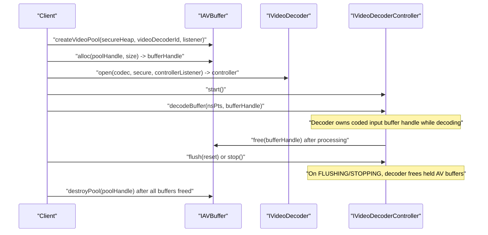

<!--
MongoDB Document Metadata:
- Original File Path: kavia-docs/videodecoder_documents/video-decoder-pipeline-buffer-lifecycle.md
- Operation: write
- Timestamp: 2026-02-12T04:36:35.611417+00:00
- Restored At: 2026-02-23T05:04:11.251774+00:00
- Task ID: cm219d4578
-->

# Video Decoder Pipeline Buffer Lifecycle (HALIF AIDL)

## Sources

This document is derived only from these sources:

- Video Decoder documentation (including “Video Decoder States”): `rdk-halif-aidl-17/docs/halif/video_decoder/current/video_decoder.md`
- AV Buffer documentation: `rdk-halif-aidl-17/docs/halif/av_buffer/current/av_buffer.md`
- Video Decoder AIDL interfaces: `rdk-halif-aidl-17/videodecoder/current/com/rdk/hal/videodecoder/*.aidl` (notably `IVideoDecoder.aidl`, `IVideoDecoderController.aidl`)

The state enum used by `IVideoDecoder.getState()` is defined in:
- `rdk-halif-aidl-17/common/current/com/rdk/hal/State.aidl`

## Entities and handle types

The lifecycle centers on two handle types managed by the AV Buffer HAL:

1. Pool handle (`com.rdk.hal.avbuffer.Pool.handle`)
   - Created by the client using `IAVBuffer.createVideoPool(...)`.
   - Destroyed by the client using `IAVBuffer.destroyPool(...)`.
   - Pools exist for secure or non-secure heaps.

2. Buffer handle (`long`)
   - Allocated from a pool using `IAVBuffer.alloc(poolHandle, size)`.
   - Freed using `IAVBuffer.free(bufferHandle)`.
   - Used as the transport mechanism between middleware and HAL components.

The Video Decoder consumes coded (compressed) input buffers by handle via `IVideoDecoderController.decodeBuffer(nsPresentationTime, bufferHandle)`.

## Lifecycle overview

A typical lifecycle has four phases:

### Phase 1: Pool creation (client → AV Buffer)

The client creates one or more video pools via AV Buffer:

- `IAVBuffer.createVideoPool(secureHeap, IVideoDecoder.Id videoDecoderId, IAVBufferSpaceListener listener)`

From the AV Buffer documentation:

- Pools are created from secure or non-secure heaps.
- Pool sizing is determined by the vendor layer implementation, based on platform/product needs.
- Pool and buffer handles are expected to be globally unique, and immediate handle reuse is discouraged.

### Phase 2: Buffer allocation and ownership transfer (client → Video Decoder)

The client allocates an AV buffer from a pool:

- `bufferHandle = IAVBuffer.alloc(poolHandle, size)`

The client then passes ownership of that buffer handle to the video decoder controller:

- `IVideoDecoderController.decodeBuffer(nsPresentationTime, bufferHandle)`

From `IVideoDecoderController.decodeBuffer()`:

- The decoder must be in `State::STARTED`.
- “Once the decoder has finished processing the buffer, it is automatically released and returned to the AV Buffer Manager. The caller must not modify or free the buffer after submission.”
- The method returns `false` if the “decode buffer is full”.

### Phase 3: Decoder frees input buffers (Video Decoder → AV Buffer)

Input buffers are freed by the video decoder once they are no longer needed.

From the Video Decoder documentation (“Video Decoder States” section):

- “When an Video Decoder session enters a FLUSHING or STOPPING transitory state it shall free any AV buffers it is holding.”

From the “Video Decoder States” sequence diagram example:

- After a decoded frame output callback, the controller frees the corresponding coded input:
  - `IAVBuffer.free(bufferHandle=1)`
- During `flush()`, pending coded input buffers are freed:
  - `IAVBuffer.free(bufferHandle=2)`
- During `stop()`, coded input buffers are freed:
  - `IAVBuffer.free(bufferHandle=3)`

From `IVideoDecoderController.stop()`:

- The decoder enters `STOPPING`, and “any input data buffers that have been passed for decode but have not yet been decoded are automatically freed”.

From `IVideoDecoderController.flush(reset)`:

- “Any input data buffers that have been passed for decode but have not yet been decoded are automatically freed.”

### Phase 4: Pool cleanup (client → AV Buffer)

After playback ends and all buffer handles have been freed, the client destroys the pool(s):

- `IAVBuffer.destroyPool(poolHandle)`

From `IAVBuffer.destroyPool()`:

- The pool must be empty; otherwise, the call fails with a service-specific “not empty” error.

## Video Decoder session states and buffer freeing points

The state names used by Video Decoder follow the common HAL session state enum:

- `CLOSED`, `OPENING`, `READY`, `STARTING`, `STARTED`, `FLUSHING`, `STOPPING`, `CLOSING` (from `common/current/com/rdk/hal/State.aidl`)

From the Video Decoder documentation:

- `open()` transitions `CLOSED -> OPENING -> READY`
- `start()` transitions `READY -> STARTING -> STARTED`
- `flush()` transitions `STARTED -> FLUSHING -> STARTED`
- `stop()` transitions `STARTED -> STOPPING -> READY`
- `close()` transitions `READY -> CLOSING -> CLOSED`

Buffer lifecycle implications called out in the same documentation:

- When entering `FLUSHING` or `STOPPING`, the video decoder frees any AV buffers it is holding.

## Input buffer lifecycle (coded frames)

This is the lifecycle for coded (compressed) input buffers submitted to the decoder.

1. Client allocates an AV buffer handle from a (secure or non-secure) pool using `IAVBuffer.alloc(...)`.
2. Client submits the handle to `IVideoDecoderController.decodeBuffer(...)` in `STARTED`.
3. Decoder holds the handle while decoding.
4. Decoder frees the handle by calling `IAVBuffer.free(handle)` when finished, or frees it during `flush()` / `stop()` if still pending.

## Notes on frame outputs and “frame buffer handles”

The Video Decoder documentation distinguishes coded input AV buffers from decoded frame buffer handles:

- In non-tunnelled mode, decoded frames are returned to the client via `IVideoDecoderControllerListener.onFrameOutput(...)` with a `frameBufferHandle`.
- The documentation states: “The frame buffer handle is later passed to the Video Sink for queuing before presentation and is then freed.”
- The AV Buffer documentation states that “audio and video frame pools are allocated from privately inside the vendor layer by the audio and video decoders,” and that in non-tunnelled mode “the client is passed these handles back from the decoder” and “must free the frame buffer handles by calling IAVBuffer.free().”

This means two distinct freeing responsibilities exist in the overall pipeline:

- Coded input buffer handles submitted via `decodeBuffer()` are freed by the decoder after processing, including on `flush()` / `stop()`.
- Decoded frame buffer handles returned to the client in non-tunnelled mode are later freed by the client using `IAVBuffer.free()` (as described in the AV Buffer documentation).

## Minimal lifecycle diagram (buffer ownership)

