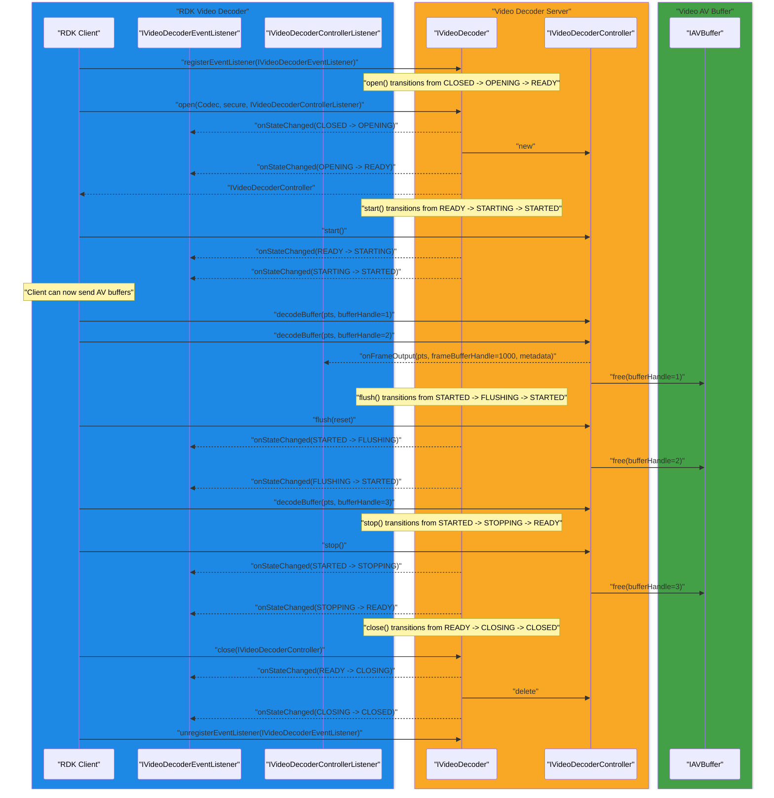

<!--
MongoDB Document Metadata:
- Original File Path: kavia-docs/videodecoder_documents/video-decoder-sequence-diagram.md
- Operation: write
- Timestamp: 2026-02-12T04:51:54.964105+00:00
- Restored At: 2026-02-23T05:04:11.251982+00:00
- Task ID: cm219d4578
-->

# Video Decoder Sequence Diagram (HALIF AIDL)

This document is derived only from the following sources:

- Video Decoder states: https://rdkcentral.github.io/rdk-halif-aidl/0.13.0/halif/video_decoder/current/video_decoder/#video-decoder-states
- AV Buffer: https://rdkcentral.github.io/rdk-halif-aidl/0.13.0/halif/av_buffer/current/av_buffer/
- Video decoder AIDL definitions: https://github.com/rdkcentral/rdk-halif-aidl/tree/main/videodecoder/current/com/rdk/hal/videodecoder

